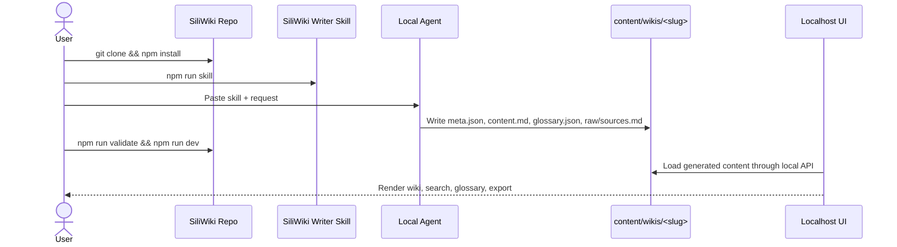
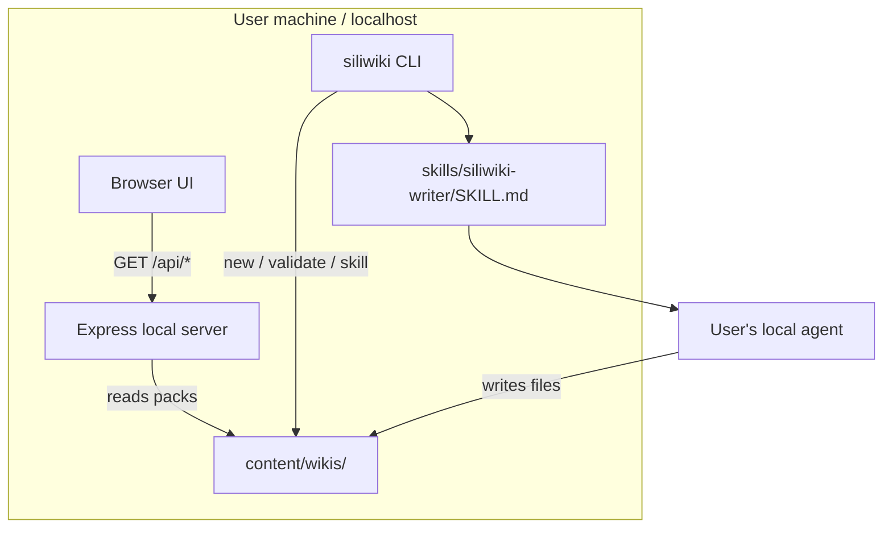
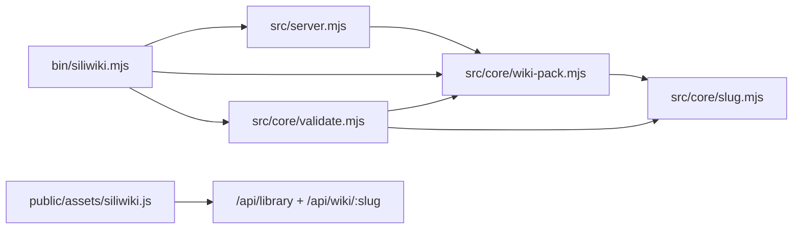

# SiliWiki / 硅基笔记

> Local-first agent-generated wiki workbench: give a writing skill to your local agent, let it generate structured wiki/glossary content packs, and view the result at `localhost`.

Built and maintained with support from the WhiteMirror AI Team.

## Features

- **Local-first UI** — content stays in `content/wikis/` and renders at `http://localhost:3000`.
- **Agent harness included** — `npm run skill` prints the SiliWiki writer skill for your local agent.
- **Structured content packs** — every wiki is a folder with `meta.json`, `content.md`, optional `glossary.json`, raw sources, and images.
- **Glossary overlay** — canonical terms, aliases, definitions, and auto-linking.
- **No build step UI** — Express + browser ESM + Markdown rendering.
- **Validation and smoke tests** — catch broken nav anchors, invalid glossary entries, and secret-looking files.
- **Open-source ready** — docs, CI, issue templates, PR template, license, contributing and security policy.

## Installation

```bash
git clone <your-siliwiki-repo-url>
cd siliwiki
npm install
npm run dev
```

Open:

```text
http://localhost:3000
```

## 中文使用说明 / V1 Sample

- 中文完整使用说明：[`docs/USAGE_ZH.md`](docs/USAGE_ZH.md)
- 本地可打开的 V1 样例：`http://localhost:3000/wiki/siliwiki-v1`
- 样例内容包：[`content/wikis/siliwiki-v1/`](content/wikis/siliwiki-v1/)

## Quick Start

```bash
# 1. Print the skill and give it to your local agent
npm run skill > siliwiki-skill.md

# 2. Create a new local wiki pack
npm run new -- my-topic --title "My Topic"

# 3. Ask your agent to write into content/wikis/my-topic/
# 4. Validate and preview
npm run validate
npm run dev
```

Your generated wiki will be available at:

```text
http://localhost:3000/wiki/my-topic
```

## User Flow



## What is a Wiki?

In SiliWiki, a **Wiki** is a local content pack:

```text
content/wikis/<slug>/
├── meta.json       # title, version, theme, navigation
├── content.md      # main Markdown article
├── glossary.json   # optional canonical term registry
├── raw/            # optional sources, transcripts, evidence
└── images/         # optional local images
```

The folder is intentionally simple: agents can edit it, humans can review diffs, and git can version it.

## What is a Glossary?

A **Glossary** is the concept compression layer for one wiki. It defines canonical terms and aliases so the reader and future agents use stable vocabulary.

A term looks like this:

```json
{
  "slug": "glossary",
  "display": "Glossary",
  "aliases": ["term registry", "词条"],
  "category": "core",
  "short": "The canonical term registry for one wiki.",
  "definition": "A glossary standardizes terms, aliases, definitions, relationships, and sources.",
  "related": ["wiki"],
  "sources": ["raw/sources.md#design-note"]
}
```

## Architecture



SiliWiki does not require a cloud backend. The server reads local files and exposes a small localhost API for the browser UI.

## Module Dependency Graph



## CLI Reference

```bash
siliwiki dev [--port 3000]
siliwiki new <slug> [--title "My Wiki"]
siliwiki validate
siliwiki skill [--out ./siliwiki-skill.md]
siliwiki doctor
```

NPM wrappers:

```bash
npm run dev
npm run new -- my-topic --title "My Topic"
npm run validate
npm run skill
npm run doctor
```

## API Reference

When `npm run dev` is running:

| Endpoint | Description |
|---|---|
| `GET /api/health` | Health check and version. |
| `GET /api/library` | List wiki packs and summaries. |
| `GET /api/wiki/:slug` | Return `meta`, Markdown `content`, optional `glossary`, and summary. |

## Configuration

Environment variables:

| Variable | Default | Description |
|---|---|---|
| `PORT` | `3000` | Local server port. |
| `HOST` | `127.0.0.1` | Local server host. |
| `SILIWIKI_CONTENT_DIR` | `content/wikis` | Override wiki content directory. |

## Testing / Reproducibility

```bash
npm run lint
npm run typecheck
npm run validate
npm test
npm run build
npm run smoke
npm run pack:check
```

See [`docs/TEST_RESULTS.md`](docs/TEST_RESULTS.md) for the latest recorded local run.

## Contributing

See [`CONTRIBUTING.md`](CONTRIBUTING.md). Please keep content-pack changes source-backed and run `npm run build && npm run smoke` before opening a PR.

## License

MIT. See [`LICENSE`](LICENSE).

## Support

Use GitHub Issues / Discussions for public support until official WhiteMirror contact channels are added.
