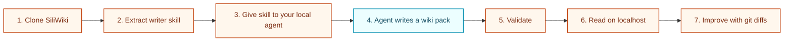
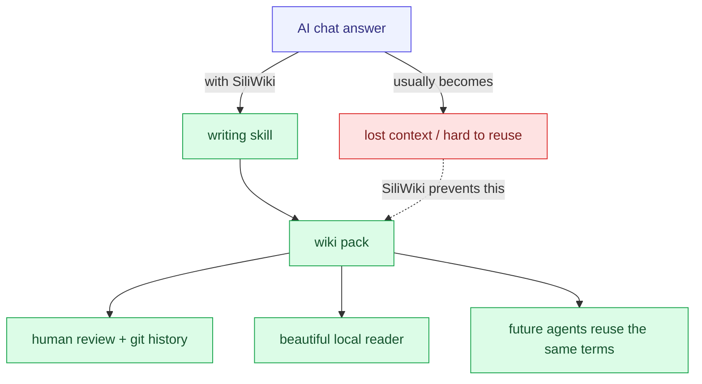
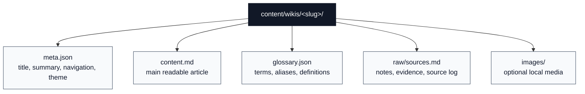
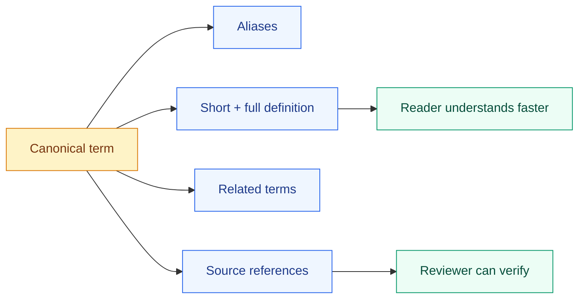
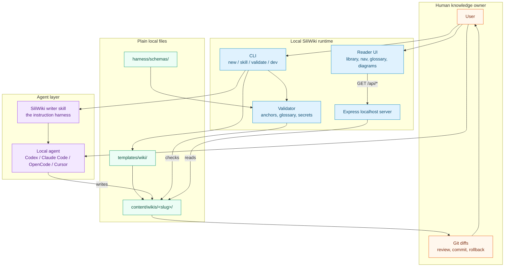
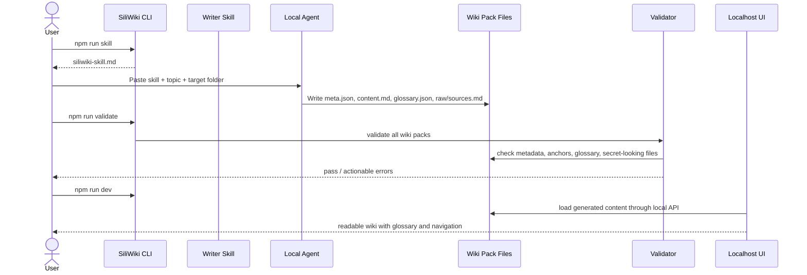
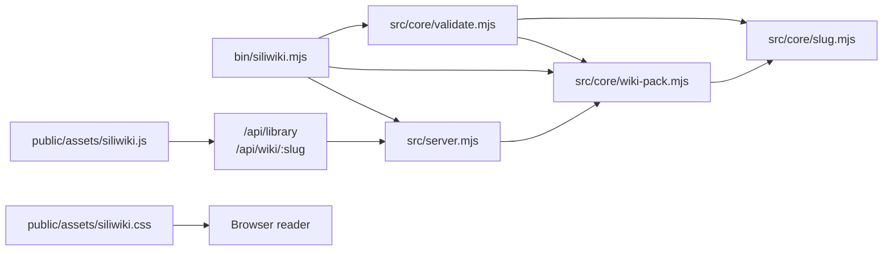

# SiliWiki / 硅基笔记

<p align="center">
  <strong>把 AI 生成的内容，变成可验证、可阅读、可持续演化的本地 Wiki。</strong>
</p>

<p align="center">
  <a href="https://github.com/Yvnminc/SiliWiki/actions/workflows/ci.yml"></a>
  <a href="LICENSE"></a>
  = 20" src="https://img.shields.io/badge/Node.js-%3E%3D20-43853d.svg">
  
  
</p>

<p align="center">
  <a href="#quick-start">Quick Start</a> ·
  <a href="docs/USAGE_ZH.md">中文小白说明</a> ·
  <a href="docs/CONTENT_SPEC.md">Content Spec</a> ·
  <a href="docs/ARCHITECTURE.md">Architecture</a>
</p>

---

## What is SiliWiki?

**SiliWiki（硅基笔记）** is a local-first wiki workbench for agent-generated knowledge.

Most AI-generated articles disappear into chat history. SiliWiki turns them into a living knowledge object:

- a **writing skill** that tells your local agent how to write;
- a **plain-file wiki pack** that humans can review in git;
- a **glossary layer** that keeps vocabulary stable;
- a **localhost reader UI** that makes the result feel like a small product, not a pile of Markdown.

> **The point:** SiliWiki is not “another note app”. It is a harness that makes agent-written knowledge structured, inspectable, local, and reusable.

Built and maintained with support from the WhiteMirror AI Team.

---

## The core loop



SiliWiki separates **generation** from **ownership**. Your agent can draft, but the output lives in your local files, passes validation, and can be reviewed like normal source code.

---

## Why it matters



SiliWiki is designed for people who want AI to help write serious knowledge bases without surrendering control to a cloud product or an invisible prompt chain.

---

## Features

| Area | What SiliWiki provides |
|---|---|
| 🧠 Agent harness | `npm run skill` prints the writer skill you can hand to Codex, Claude Code, OpenCode, Cursor, or another local agent. |
| 📚 Wiki definition | A wiki is a local content pack with metadata, navigation, Markdown content, sources, and optional images. |
| 🧩 Glossary definition | A glossary is the concept layer: canonical terms, aliases, definitions, related terms, and sources. |
| 🏠 Local-first UI | Content stays in `content/wikis/` and renders in a localhost reader. No cloud backend required. |
| ✅ Validation | Broken anchors, invalid glossary terms, missing metadata, and secret-looking files are caught before reading. |
| 🔎 Reader experience | Library shelf, wiki reader, side navigation, search-friendly structure, glossary overlay, and responsive diagrams. |
| 🧪 Reproducibility | Lint, typecheck, validation, tests, smoke test, package dry-run, and GitHub Actions CI. |

---

## Quick Start

```bash
git clone https://github.com/Yvnminc/SiliWiki.git
cd SiliWiki
npm install
npm run dev
```

Open:

```text
http://localhost:3000
```

Try the live sample:

```text
http://localhost:3000/wiki/siliwiki-v1
```

中文新手版：[`docs/USAGE_ZH.md`](docs/USAGE_ZH.md)

---

## Write your first AI-generated wiki

### 1. Take out the writing skill

```bash
npm run skill > siliwiki-skill.md
```

Give `siliwiki-skill.md` to your local agent.

### 2. Create an empty wiki pack

```bash
npm run new -- battery-recycling --title "Battery Recycling 101"
```

### 3. Ask your agent to write into the pack

Example prompt:

```text
Please follow the SiliWiki writer skill.
Write a beginner-friendly wiki about battery recycling.
Target folder: content/wikis/battery-recycling/
Use a glossary for important terms.
Mark uncertain facts as TODO instead of pretending they are verified.
```

### 4. Validate and read

```bash
npm run validate
npm run dev
```

Open:

```text
http://localhost:3000/wiki/battery-recycling
```

---

## What exactly is a Wiki?

In SiliWiki, a **Wiki** is not a remote website. It is a small local folder that has enough structure for both humans and agents.



Equivalent file tree:

```text
content/wikis/<slug>/
├── meta.json       # title, version, summary, theme, navigation
├── content.md      # main Markdown article
├── glossary.json   # optional canonical term registry
├── raw/            # optional sources, transcripts, evidence
└── images/         # optional local images
```

This shape is intentionally boring. Boring files are easy to diff, easy to validate, easy to back up, and easy for agents to edit.

---

## What exactly is a Glossary?

A **Glossary** is the vocabulary contract for one wiki.

It prevents the same idea from being called five different names across drafts. It also gives future agents a stable concept map to build on.



Example:

```json
{
  "slug": "glossary",
  "display": "Glossary",
  "aliases": ["term registry", "词条"],
  "category": "core",
  "short": "The canonical term registry for one wiki.",
  "definition": "A glossary standardizes terms, aliases, definitions, relationships, and sources.",
  "related": ["wiki"],
  "sources": ["raw/sources.md#design-note"]
}
```

---

## Architecture



**Design choice:** SiliWiki keeps the brain of the system in visible files and visible instructions. The “AI magic” is deliberately turned into a repeatable workflow.

---

## Generation sequence



---

## Module dependency graph



---

## CLI reference

```bash
siliwiki dev [--port 3000]
siliwiki new <slug> [--title "My Wiki"]
siliwiki validate
siliwiki skill [--out ./siliwiki-skill.md]
siliwiki doctor
```

NPM wrappers:

```bash
npm run dev
npm run new -- my-topic --title "My Topic"
npm run validate
npm run skill
npm run doctor
```

---

## Local API

When `npm run dev` is running:

| Endpoint | Description |
|---|---|
| `GET /api/health` | Health check and version. |
| `GET /api/library` | List wiki packs and summaries. |
| `GET /api/wiki/:slug` | Return metadata, Markdown content, optional glossary, and summary. |

---

## Configuration

| Variable | Default | Description |
|---|---:|---|
| `PORT` | `3000` | Local server port. |
| `HOST` | `127.0.0.1` | Local server host. Use `0.0.0.0` only when you intentionally want LAN/Tailscale access. |
| `SILIWIKI_CONTENT_DIR` | `content/wikis` | Override wiki content directory. |

---

## Testing / reproducibility

```bash
npm run lint
npm run typecheck
npm run validate
npm test
npm run build
npm run smoke
npm run pack:check
```

See [`docs/TEST_RESULTS.md`](docs/TEST_RESULTS.md) for the latest recorded local run.

---

## Roadmap ideas

- More writer skills for research notes, course notes, product specs, and ontology pages.
- Optional export to static HTML.
- Better glossary graph visualization.
- Theme presets for education, research, and product documentation.
- Import adapters for existing Markdown folders.

---

## Contributing

PRs are welcome. Please keep the project simple, local-first, and agent-friendly.

Before opening a PR:

```bash
npm run build
npm run smoke
npm run pack:check
```

Read [`CONTRIBUTING.md`](CONTRIBUTING.md) and [`SECURITY.md`](SECURITY.md).

---

## License

MIT. See [`LICENSE`](LICENSE).

---

## Links

- GitHub: <https://github.com/Yvnminc/SiliWiki>
- X / Twitter: [@yvnminc](https://x.com/yvnminc)
- RedBook / 小红书: `@yvnminc`

## Support

Use GitHub Issues / Discussions for public support until official WhiteMirror contact channels are added.
