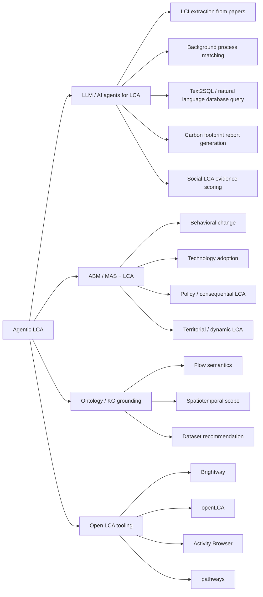
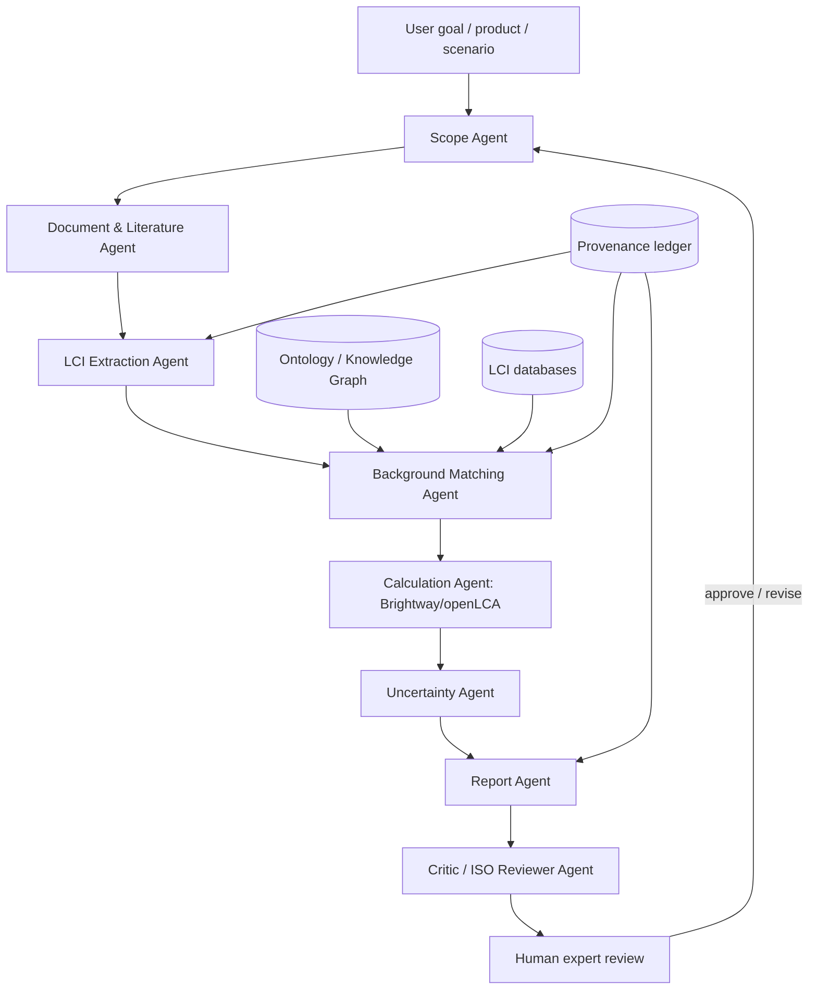

# Agentic LCA Literature Review / 代理式生命周期评价文献综述

本页把 2024–2026 年快速出现的 **LLM / AI-agent 辅助 Life Cycle Assessment (LCA)** 研究，与 2009 年以来较成熟的 **Agent-Based Modeling / Multi-Agent Systems + LCA** 研究放在同一张地图里，目标读者是想把 AI agents、知识图谱、Brightway/openLCA 与 LCA 方法论结合起来做研究或系统原型的人。

<strong>TL;DR</strong> 
“Agentic LCA” 这个术语还没有稳定成型，但相关研究已经存在：一条线是 LLM/RAG/工具调用辅助 LCI、数据库匹配和报告生成；另一条线是 ABM/MAS 与 LCA 结合，用 agents 捕捉行为、政策、空间和时间动态。当前最大机会是做一个可审计、provenance-first、human-in-the-loop 的端到端 Agentic LCA 框架。

## 结论先行 {#executive-summary}

**结论 1：严格叫 “Agentic LCA” 的论文还很少，但研究版图已经很清晰。** 直接检索 “agentic LCA” 或 “agentic life cycle assessment” 时，命中很少且噪声很大；但用 “large language model + life cycle assessment / life cycle inventory”、“LLM agent + LCA”、“agent-based modeling + LCA”、“multi-agent system + dynamic LCA” 检索，可以得到一批直接相关文献。完整检索记录和代表文献放在 [`raw/sources.md`](raw/sources.md) 与 [`raw/literature-review-full.md`](raw/literature-review-full.md)。

**结论 2：LLM-LCA 方向从 2024 年开始明显加速。** 代表工作包括 Preuss et al. 对 LLM-LCA 的机会与风险综述、Tu et al. 对 LLM 缓解 LCI 建模挑战的路线图、Zhang et al. 的 RAG + Text2SQL + code-interpreter agent LCA 工作流、Kumar et al. 的 Sustain-LLaMA 文献抽取框架，以及 ARIA 这类基于 Brightway2 的 LLM 数据集匹配工具。见来源锚点 [`#preuss-2024`](raw/sources.md#preuss-2024)、[`#tu-2024`](raw/sources.md#tu-2024)、[`#zhang-2025`](raw/sources.md#zhang-2025)、[`#kumar-2025`](raw/sources.md#kumar-2025)、[`#aria-2025`](raw/sources.md#aria-2025)。

**结论 3：ABM/MAS-LCA 是更早也更成熟的 “agent + LCA” 传统。** Davis et al. 2009 已经把 LCA 信息接入 agent-based energy infrastructure model；后续在 mobility policy、smart homes、agriculture、territorial LCA、plastic recycling、biorefinery placement、PV end-of-life 等场景都有案例。见 [`#davis-2009`](raw/sources.md#davis-2009)、[`#querini-2015`](raw/sources.md#querini-2015)、[`#walzberg-2019`](raw/sources.md#walzberg-2019)、[`#lan-yao-2019`](raw/sources.md#lan-yao-2019)、[`#fuortes-2025`](raw/sources.md#fuortes-2025)。

**结论 4：真正缺的是端到端、可审计、符合 LCA 规范的 Agentic LCA。** 现有研究大多解决单点任务：抽取、匹配、问答、报告生成、动态行为模拟。还没有公认框架能从 goal/scope 到 LCI、LCIA、interpretation、uncertainty、critical review 全流程执行，并且让每个数字、flow、数据库映射和假设都有可追溯证据。

## 定义与范围 {#definition-scope}

这里把 **Agentic LCA** 定义为：

> 使用具备任务分解、检索、工具调用、记忆/上下文管理、计算执行、反思/审核能力的 AI agent 或 multi-agent system，辅助或自动执行 LCA 工作流中的一个或多个环节。

它可以覆盖 ISO 14040/14044 的四个阶段：

| LCA 阶段 | Agentic LCA 可承担的任务 | 主要风险 |
| --- | --- | --- |
| Goal and scope | 解释研究问题、草拟功能单位、系统边界、cut-off、allocation、地理/时间范围 | 目标误解、系统边界遗漏 |
| LCI | 从文献、BOM、BoQ、EPD、报告、数据库中抽取 flows、数量、单位、地点、工艺 | hallucination、单位错误、数据来源不透明 |
| LCIA | 调用 Brightway/openLCA、选择 EF/ReCiPe/TRACI 等方法、运行 scenario / Monte Carlo | 方法选择不当、数据库版本漂移 |
| Interpretation | 热点分析、敏感性、不确定性、报告生成、critical review checklist | 过度自信、忽略异常值、缺少专家判断 |

本页把相关研究分成四类：

1. **LLM / AI-agent 辅助 LCA**：RAG、Text2SQL、code interpreter、LLM-based matching、report generation。
2. **ABM / MAS + LCA**：用 agent-based modeling 捕捉行为、空间、时间、政策反馈。
3. **Ontology / KG-grounded LCA**：用知识图谱和语义层约束数据库匹配与过程建模。
4. **Human-in-the-loop Agentic LCA**：agent 负责候选与证据链，专家确认关键判断。

## 研究地图 {#landscape-map}

这张图背后的判断是：**LLM-agent 线解决“知识与工具调用”，ABM/MAS 线解决“动态系统和行为反馈”，KG/ontology 线解决“可验证语义”，Brightway/openLCA 线解决“计算执行”。** 真正有研究价值的 Agentic LCA 应该把四者合成一个可审计系统。

## LLM / AI agents for LCA {#llm-ai-agents}

### 1. 概念性综述：LLM 可做什么，不能做什么

Preuss, Alshehri & You (2024) 是 LLM-LCA 方向的关键 perspective。文章认为 LLM 可降低 LCA 时间成本，提高 LCA 对非专家的可及性，尤其适用于 LCI 数据收集和 LCIA 结果解释；但同时强调 hallucination、错误信息、偏见、透明度不足、责任归属缺失和 LLM 本身环境负担等风险。它的价值不是提供一个系统，而是把 LLM 潜力映射到 LCA 全流程，并呼吁 LCA 社区制定负责任使用标准。来源：[`#preuss-2024`](raw/sources.md#preuss-2024)。

Tu et al. (2024) 更聚焦 LCI 的两个核心难题：**missing foreground flow data** 和 **background data matching inconsistency**。他们认为 LLM 通过 RAG、knowledge graph、prompt engineering、fine-tuning 和 multimodal analysis，有潜力支持 scalable and automated LCI modeling。来源：[`#tu-2024`](raw/sources.md#tu-2024)。

Gkousis, Vasilaki & Katsou (2025) 综述 ML、NLP 和 LLM 在 LCI compilation 中的应用，并用 car-driving、power plants、geothermal energy systems 等案例讨论数据补全和文献抽取。结论很现实：AI/ML/LLM 潜力很大，但大规模、准确、可解释、可部署的 AI-assisted LCA 仍处于 infancy。来源：[`#gkousis-2025`](raw/sources.md#gkousis-2025)。

### 2. LLM-agentic LCA 工作流：RAG、Text2SQL、code interpreter

Zhang et al. (2025) 是目前最接近 “LLM agentic LCA workflow” 的论文之一。它提出三个模块：

- **Chat-LCA**：基于 LCA 知识库和 RAG 做专业问答，缓解 hallucination；
- **LCI database retrieval**：用 Text2SQL、few-shot Chain-of-Thought 和 Chain-of-Code，把自然语言转为数据库查询；
- **Report generation**：借助 code-interpreter agent 自动生成 carbon footprint report。

该文评估显示：QA BERTScore 达 0.85；LCI 数据库查询 execution accuracy 最高达 0.9692；报告生成在五个评价维度中四项表现最好。它直接说明：LCA agent 可以不只是聊天，而是能调用数据库、写代码、生成报告。来源：[`#zhang-2025`](raw/sources.md#zhang-2025)。

Kumar et al. (2025) 提出 **Sustain-LLaMA**，用于从科学文献中检索 LCI 和 environmental impact data。流程包括 fine-tuned classifier 筛选相关文献、对 LLaMA-2-7B 做领域继续训练/知识注入、再用 fine-tuned Q&A + RAG 抽取数据。案例覆盖 methanol production 和 plastic packaging end-of-life；分类 accuracy 分别为 0.850 和 0.952，Q&A/RAG F1 分别为 0.823 和 0.855。来源：[`#kumar-2025`](raw/sources.md#kumar-2025)。

### 3. LLM + Brightway/openLCA：数据库匹配与自动计算

ARIA 是一个开源 Python package，基于 Brightway2。它让用户输入 foreground flows，然后用 LLM 辅助把这些 flows 映射到 ecoinvent/background datasets：先搜索数据库，找不到直接匹配时调用 OpenAI API 生成 alternative search terms，再由 ChatGPT 根据规则和 goal/scope context 从候选中选最合适数据集，最后调用 Brightway2 执行 LCIA 并生成 waterfall charts。来源：[`#aria-2025`](raw/sources.md#aria-2025)。

Peng et al. (2024) 不是 LLM-agent，但它展示了 LCA 数据库匹配的关键基础设施：knowledge graph-based mapping and recommendation。该方法推荐 background datasets，包括 flows 和 processes，并自动化 life cycle modeling 和 calculation；flow recommendation Precision@10 达 79.52%，比普通 search engine 高 4.26 倍，Top-10 响应时间降低 2.45 倍，并结合 OpenLCA 做验证。来源：[`#peng-2024`](raw/sources.md#peng-2024)。

### 4. 产品碳足迹、建筑与 Social LCA

AutoPCF 把 product carbon footprint 拆成五阶段：Emission Inventory Determination、Activity Data Collection、Emission Factor Matching、Carbon Emission Estimation、Estimation Verification and Evaluation。它用 deep learning 与 LLM 减少主观判断，提高 steel、textile、battery products 的 cradle-to-gate PCF 估算效率。来源：[`#autopcf-2024`](raw/sources.md#autopcf-2024)。

PCF-RWKV 更明确使用 multi-agent technology：基于 RWKV 与 task-specialized LoRA，自动构建生产过程 LCI、对齐 emission factors、计算 product carbon footprint，并强调可在消费级 GPU 部署，降低企业数据安全风险。来源：[`#pcf-rwkv-2025`](raw/sources.md#pcf-rwkv-2025)。

Cole et al. (2025) 把 LLM 用于 Social LCA 的 reference-scale assessment。AI 与人工 S-LCA 结果的 agreement rate 为 50%，差异主要来自：人类使用 tacit knowledge，人工评估更重视 negative evidence，以及 stakeholder perspective 不同。这篇对 Agentic Social LCA 很重要，因为它说明多 stakeholder persona agents 与 human-in-the-loop review 不是装饰，而是方法论必要条件。来源：[`#cole-2025`](raw/sources.md#cole-2025)。

## ABM / MAS + LCA {#abm-mas-lca}

### 1. 早期基础：LCA 信息进入 agent 决策

Davis, Nikolić & Dijkema (2009) 是 ABM-LCA 的早期关键论文。作者把 energy conversion facilities 表示为 agents，每个 agent 有 owner，并可根据经济与环境信息进行决策。模型能模拟基础设施在几十年中的 assembly、disassembly 和 use dynamics，并分析 LCA 信息进入决策后的影响。来源：[`#davis-2009`](raw/sources.md#davis-2009)。

Wu et al. (2017) 指出传统 LCSA 在 inventory stage 难以同时处理 spatial、temporal 和 emergent behavioral dynamics，并提出将 ABM 集成进 building LCA/LCSA 的概念框架。来源：[`#wu-2017`](raw/sources.md#wu-2017)。

Marvuglia et al. (2018) 对 agriculture and land use 中的 ABM 做综述，并专门讨论 ABM-LCA coupling。文章强调 ABM 可以表示人类行为、validity、uncertainty、parameter sensitivity、agent definition 和 data provision；但 practical user-friendly tools 仍明显不足。来源：[`#marvuglia-2018`](raw/sources.md#marvuglia-2018)。

### 2. 交通、建筑与行为变化

Querini & Benetto (2015) 将 ABM 用于 Luxembourg 车辆市场，模拟 2013–2020 年 sales、use、dismantling 与 mobility policies，再把车队组成和车辆使用输出接入 consequential LCA。关键启示是：不能简单把单车 LCA 放大成 national fleet LCA，因为政策会造成 emergent effects。来源：[`#querini-2015`](raw/sources.md#querini-2015)。

Walzberg et al. (2019) 将 ABM 与 LCA 结合评估 smart homes 行为变化与 nudges。结果显示 conformity 等态度因素能带来约 30% 的环境收益差异；peak shaving 这类策略若忽略行为动态，容易误判。来源：[`#walzberg-2019`](raw/sources.md#walzberg-2019)。

Su et al. (2025) 将 multi-agent system 与 dynamic LCA tight-coupled，用于 neighborhood/campus 尺度。MAS 模拟 climate、people、built environment agents 的互动并生成动态 foreground elementary flows，DLCA 提供 impact assessment framework。来源：[`#su-2025`](raw/sources.md#su-2025)。

### 3. 农业、土地、供应链与循环经济

Lan & Yao (2019) 集成 LCA、ABM 和 TEA，模拟美国 1000 个农场 30 年的作物选择、收益、成本、价格、气候变化与 GHG 影响。研究发现 farmer information exchange、environmental awareness、environmental information access 和 farm size 是系统环境影响的关键驱动。来源：[`#lan-yao-2019`](raw/sources.md#lan-yao-2019)。

Ding & Achten (2022) 提出 dynamic territorial LCA，把 ABM 与 territorial LCA、GIS 结合，模拟农民采纳 bioenergy crops 的行为和 site-specific environmental impacts。案例显示 demonstration farms 的初始位置会导致不同的动态结果。来源：[`#ding-achten-2022`](raw/sources.md#ding-achten-2022)。

Kerdlap et al. (2020) 在新加坡塑料回收案例中，用 ABM 模拟 waste generation、collection、sorting、recycling、transportation，再把 material/transport outputs 作为 LCI。结果显示分布式系统可能增加或降低 GHG，关键取决于运输车辆类型和吨公里排放。来源：[`#kerdlap-2020`](raw/sources.md#kerdlap-2020)。

Fuortes et al. (2025) 是近期 ABM-LCA 方法论重点文献。作者区分 soft coupling、tight coupling 与 hard coupling / LCA-ABM symbiosis，并提出用 metamodel 近似 LCA，使 ABM 在每个 timestep 中能快速调用 environmental impacts。PV end-of-life 案例中，metamodel 对 abiotic depletion 的 R² 为 0.95，对 climate change 的 R² 为 0.82。来源：[`#fuortes-2025`](raw/sources.md#fuortes-2025)。

## 基础设施：KG、ontology、ML/NLP 与 LCA 工具 {#enabling-infrastructure}

Agentic LCA 不能只靠 LLM。要让结果可审计，需要三层基础设施：语义层、数据层、计算层。

| 层 | 代表方法 | 对 Agentic LCA 的作用 |
| --- | --- | --- |
| 语义层 | ontology, knowledge graph, spatiotemporal scope | 防止 flow、unit、location、technology scope 错配 |
| 数据层 | LCI extraction, ML imputation, uncertainty methods | 支持数据补全、质量评分和不确定性传播 |
| 计算层 | Brightway, Activity Browser, openLCA, pathways | 让 agent 真正执行 LCIA，而不是只写自然语言 |

Janowicz et al. (2015) 提出 LCA data 的 minimal ontology pattern，解决 LCI 数据来源异构、粒度不同、语义不一致和复现困难。Yan et al. (2015) 关注 LCA spatiotemporal scopes 的 ontology 表示，适合 dynamic LCA、territorial LCA 与 ABM-LCA。来源：[`#janowicz-2015`](raw/sources.md#janowicz-2015)、[`#yan-2015`](raw/sources.md#yan-2015)。

Algren et al. (2021) 与 Romeiko et al. (2023) 总结 ML 可用于 characterization factors、sensitivity analysis、surrogate LCA、LCI data cleaning、unit process flow estimation、impact estimation 和 interpretation。Romeiko et al. 综述 40 篇 ML+LCA 研究，指出超过 70% 的监督学习研究训练数据少于 1500 个样本，因此数据质量、报告规范、bias 和 uncertainty 是后续重点。来源：[`#algren-2021`](raw/sources.md#algren-2021)、[`#romeiko-2023`](raw/sources.md#romeiko-2023)。

Brightway、Activity Browser、openLCA 和 pathways 则是 agent 的执行层。Brightway 是 Python open-source LCA backbone；Activity Browser 是建立在 Brightway 上的 GUI；pathways 适合 energy transition scenarios。来源：[`#brightway-2017`](raw/sources.md#brightway-2017)、[`#activity-browser-2020`](raw/sources.md#activity-browser-2020)、[`#pathways-2024`](raw/sources.md#pathways-2024)。

## 综合：现在缺什么 {#synthesis-gaps}

### 已经比较明确的能力

1. **文献抽取和 LCI 数据检索**：Sustain-LLaMA、Gkousis et al.、Chen et al. 已经验证 LLM/RAG 可以从论文中抽取 LCI 或相关方法信息。
2. **背景数据库匹配**：Tu et al. 提出路线图；ARIA 与 Peng et al. 已给出 Brightway/KG/OpenLCA 原型或算法验证。
3. **自然语言查询数据库**：Zhang et al. 用 Text2SQL + CoT/CoC 做 LCI database retrieval，execution accuracy 接近 0.97。
4. **自动报告生成**：Zhang et al. 展示了 code-interpreter agent 生成 carbon footprint report 的可能性。
5. **动态行为建模**：ABM-LCA 文献已覆盖交通、农业、建筑、智能家居、回收、供应链、PV EoL 等场景。

### 仍然明显缺失的部分

| 缺口 | 为什么重要 | 可能研究贡献 |
| --- | --- | --- |
| 端到端 benchmark | 单点任务指标无法说明完整 LCA 是否可靠 | 构建 Agentic LCI / Agentic LCA benchmark |
| Provenance-first workflow | LCA 数字必须可追溯到文献、数据库或专家判断 | 每个 flow、unit、mapping、assumption 都带证据 |
| Uncertainty propagation | LLM 抽取和 matching 不确定性会影响 LCIA 结果 | 把 confidence、pedigree、Monte Carlo 合并 |
| KG + RAG + fine-tuning 比较 | 不知道哪种技术组合最适合哪类 LCI 任务 | 横向实验和 ablation study |
| LLM-agent 与 ABM-LCA 融合 | 一边会读写工具，一边会模拟动态行为，但两条线分离 | LLM-assisted ABM-LCA / Agentic Prospective LCA |
| Human-in-the-loop review | Social LCA 已显示 tacit knowledge 与 stakeholder perspective 很关键 | 多专家/多 stakeholder 审核协议 |

## 推荐系统架构 {#proposed-architecture}

一个可发表、可实现的 Agentic LCA 系统不应该是“问 ChatGPT 算 LCA”，而应该是 **可审计 workflow artifact generator**：

建议的 agent 分工：

1. **Scope Agent**：草拟 goal/scope、functional unit、system boundary、allocation、geography/timeframe。
2. **Document & Literature Agent**：检索论文、EPD、BoQ、BOM、ESG 报告、技术报告。
3. **LCI Extraction Agent**：结构化 foreground process tree，做单位换算和缺失项标记。
4. **Background Matching Agent**：用 KG/ontology/RAG 匹配 ecoinvent/openLCA/Brightway processes。
5. **Calculation Agent**：调用 Brightway/openLCA 执行 LCIA。
6. **Uncertainty Agent**：处理 extraction confidence、mapping uncertainty、database uncertainty、scenario uncertainty。
7. **Critic / ISO Reviewer Agent**：按 ISO 14040/14044、PEF 或 critical review checklist 做审核。
8. **Report Agent**：生成报告，但必须带 provenance、版本、假设和 uncertainty。
9. **Human Review Interface**：功能单位、系统边界、关键数据、数据库映射、解释结论必须允许专家确认。

## 研究议程 {#research-agenda}

### RQ1：LLM agents 能否显著降低 LCI compilation 的人工时间，同时保持专家级准确性？

实验可选 20–50 个公开 LCA case studies，构建 gold-standard foreground LCI；比较 expert baseline、RAG-only、KG+RAG、fine-tuned model、multi-agent pipeline。指标包括 flow recall/precision、unit accuracy、quantity error、database matching accuracy、time saved、expert correction effort。

### RQ2：KG-grounded LCA agent 是否优于普通 RAG/embedding search？

基于 Peng et al. 的 KG mapping 思路，测试 ecoinvent/openLCA/Brightway mapping。指标包括 Precision@k、MRR、top-1 accuracy、geographic/technological/temporal scope consistency。

### RQ3：如何把 LLM-agentic LCA 与 ABM-LCA 合流？

在建筑、交通、农业、产品回收中，让 LLM agent 负责文献/报告抽取、参数生成和 LCI mapping，让 ABM 模拟 adoption/use/recycling behavior，让 LCA engine 计算 dynamic/prospective/consequential impacts。

### RQ4：Agentic LCA 的不确定性如何建模和传递？

把每个 agent 输出都作为 probabilistic artifact：抽取置信度、数据库匹配置信度、数据质量评分、scenario uncertainty，最后传入 Monte Carlo LCIA。

### RQ5：Social LCA 是否适合 multi-perspective agents？

基于 Cole et al.，设计 worker、local community、NGO、company、regulator、expert reviewer 等 stakeholder agents；比较 multi-agent deliberation 与人工 S-LCA 的一致性、偏差和可解释性。

## 如何使用这页 {#how-to-use}

如果你要把它变成论文或项目，可以按下面顺序推进：

1. **先做 benchmark，而不是先做大系统。** Agentic LCA 的核心说服力来自可复现实验。
2. **优先攻 LCI。** LCI 是最耗时、最适合 LLM、也最容易评估的阶段。
3. **把 ontology/KG 放到第一版设计里。** 如果只有 RAG，很难保证 flow、unit、location、technology scope 不错配。
4. **每个数字都要有 provenance。** 没有来源锚点的 flow 不进入正式 LCIA，只能进入“开放问题 / 待专家确认”状态。
5. **把 ABM-LCA 作为第二阶段。** 先完成 static/process LCA agent，再扩展到 prospective/consequential/dynamic LCA。

优先推荐的论文题目：

- *Agentic Life Cycle Inventory: Benchmarking LLM Agents for Foreground Data Extraction and Background Process Matching.*
- *Ontology-grounded LCA Agents for Reproducible and Auditable Life Cycle Inventory Modeling.*
- *LLM-assisted Multi-agent Prospective LCA for Dynamic Policy and Technology Adoption Assessment.*
- *Multi-perspective LLM Agents for Social Life Cycle Assessment: A Human-in-the-loop Evaluation Framework.*

## 代表文献 {#references}

完整引用清单见 [`raw/sources.md`](raw/sources.md)，原始完整调研稿见 [`raw/literature-review-full.md`](raw/literature-review-full.md)。优先阅读顺序：

### LLM / AI-agent LCA

- Preuss, Alshehri & You (2024), *Large language models for life cycle assessments: Opportunities, challenges, and risks.* DOI: 10.1016/j.jclepro.2024.142824.
- Tu et al. (2024), *Mitigating Grand Challenges in Life Cycle Inventory Modeling through the Applications of Large Language Models.* DOI: 10.1021/acs.est.4c07634.
- Zhang et al. (2025), *Intelligent application of large language model to life cycle assessment methodology.* DOI: 10.1016/j.jclepro.2025.146776.
- Kumar et al. (2025), *A Large Language Model-based Framework to Retrieve Life Cycle Inventory and Environmental Impact Data from Scientific Literature.* DOI: 10.1021/acs.est.5c05955.
- Kallitsis, Offer & Edge (2025), *ARIA: Artificial Intelligence for Sustainability Assessment.* DOI: 10.31223/x5jf17.
- Cole et al. (2025), *Towards AI-augmented sustainability assessments: integrating large language models in the case of product social life cycle assessment.* DOI: 10.1007/s11367-025-02508-w.

### ABM / MAS + LCA

- Davis, Nikolić & Dijkema (2009), *Integration of Life Cycle Assessment Into Agent-Based Modeling.* DOI: 10.1111/j.1530-9290.2009.00122.x.
- Querini & Benetto (2015), *Combining Agent-Based Modeling and Life Cycle Assessment for the Evaluation of Mobility Policies.* DOI: 10.1021/es5060868.
- Wu et al. (2017), *Agent-Based Modeling of Temporal and Spatial Dynamics in Life Cycle Sustainability Assessment.* DOI: 10.1111/jiec.12666.
- Marvuglia et al. (2018), *Implementation of Agent-Based Models to support Life Cycle Assessment: A review focusing on agriculture and land use.* DOI: 10.3934/agrfood.2018.4.535.
- Lan & Yao (2019), *Integrating Life Cycle Assessment and Agent-Based Modeling: A Dynamic Modeling Framework for Sustainable Agricultural Systems.* DOI: 10.1016/j.jclepro.2019.117853.
- Fuortes et al. (2025), *Framework for metamodel-driven integration of life cycle assessment and agent-based modeling.* DOI: 10.1016/j.spc.2025.06.005.

## Changelog

- 2026-05-06: Imported Agentic LCA literature review into SiliWiki as a local-first content pack. Added meta navigation, glossary, source registry, and raw full review.
