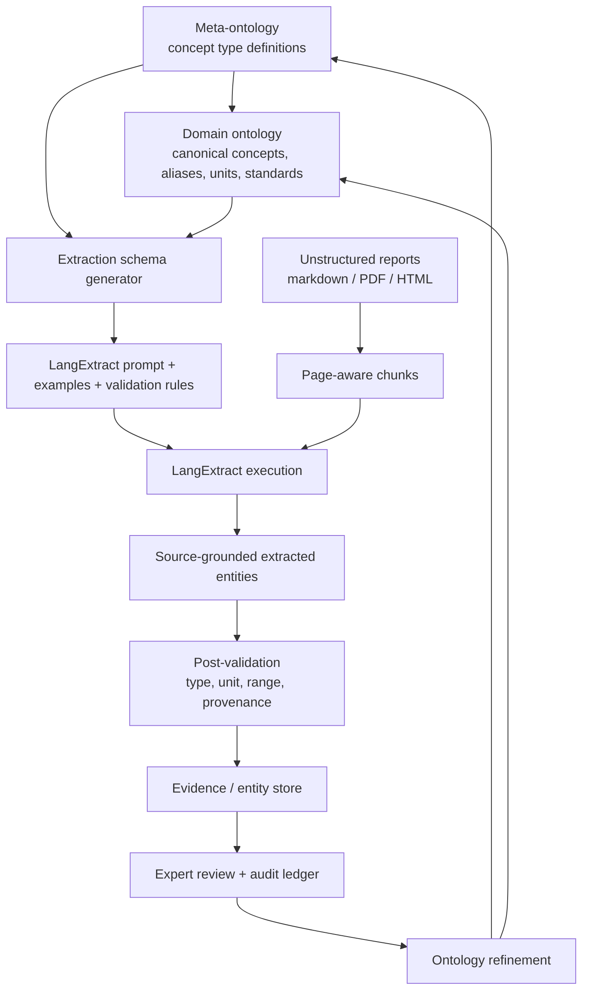
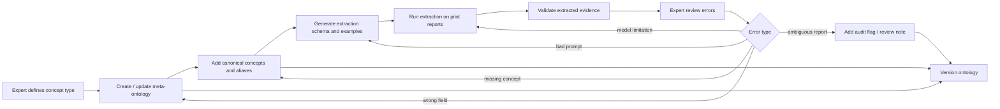

# Ontology Extraction Framework / 本体驱动信息抽取框架

这篇 wiki 解释如何理解 **LangExtract-style source-grounded extraction**，以及如何把它升级为一个可维护、可审计、可扩展的 **Ontology Extraction Framework**。它面向 Report-to-LCA Evidence Engine，但方法本身适用于很多 unstructured data → structured expert knowledge 的任务。

<div class="tldr">
<strong>TL;DR</strong><br>
LangExtract 不是“自动理解一切”的框架，而是一个 <strong>source-grounded structured extraction harness</strong>：我们先定义要抽取的概念类型、字段、约束和例子，模型再从非结构化文本中抓取具体实例，并保留原文证据。真正的核心不是 LangExtract 本身，而是上层的 <strong>ontology design</strong>：用 <strong>meta-ontology</strong> 管理“有哪些实体概念、每类概念应该长什么样、如何验证”；用 <strong>domain ontology</strong> 定义 Scope、Unit、Boundary、Indicator、S-LCA topic 等专业概念；用 <strong>entity/evidence store</strong> 保存抽取到的具体实例。这个设计把 expert heuristic 固化进 schema、validation、prompt、review 和 storage，是从通用 agent 走向专业化 agent 的第一步。
</div>

## 一句话答案 {#one-sentence-answer}

你对 LangExtract 的理解基本正确，但需要补一层：

> **LangExtract 负责“按照我们给定的类别和字段，从文本中抓取 source-grounded instances”；Ontology Framework 负责“定义这些类别、字段、约束、版本、验证规则、存储方式和专家知识”。**

换句话说：

- LangExtract 是 **抽取执行层**；
- ontology 是 **专业概念定义层**；
- meta-ontology 是 **概念定义的管理层**；
- evidence/entity store 是 **抽取结果的事实层**；
- audit/review ledger 是 **可信度与维护层**。

如果只用 LangExtract，而没有 ontology，就会变成一次性的 prompt engineering：今天抽 Scope 1，明天抽 supplier engagement，每次都重写字段、口径不一致、结果无法合并。  
如果有 ontology + meta-ontology，LangExtract 就变成一个专业数据生产工具：它不是随便总结，而是在被专业 schema 约束下生产 evidence objects。

## 背景问题 {#problem}

上周和马老师讨论后，Report-to-LCA 的核心定位已经变得更清楚：我们不能直接声称从 sustainability report 自动生成完整 product-level LCA；更稳的研究对象是：

> **如何把企业报告中的非结构化 sustainability disclosure，转化为可计算、可追溯、可复核的 LCA-relevant evidence layer。**

这里真正难的问题不是“LLM 会不会读文本”。LLM 当然能读文本。难点在于：

1. **概念边界不稳定**：Scope 1、Scope 2 market-based、Scope 3 Category 1、energy consumption、water withdrawal、supplier engagement、human rights due diligence，这些都不是普通关键词，而是有专业定义的实体概念。
2. **字段结构不统一**：有些概念有 `value + unit + year`；有些有 `boundary + method + assurance`；有些只有 qualitative claim；有些是 missing evidence。
3. **同义表达很多**：`purchased goods and services`、`upstream procurement emissions`、`supplier-related emissions` 可能指向相近概念，但不能无条件等同。
4. **专业规则隐藏在专家脑中**：例如“没有 functional unit 就不能说 product LCA ready”，“只报 intensity 没报 absolute emissions 要打 audit flag”，“Scope 3 materiality statement 不等于 quantified Scope 3 inventory”。
5. **抽取结果需要长期维护**：今天定义的 schema，未来要扩展到更多报告、更多行业、更多标准；不能每次实验都散落在 notebook 和 prompt 里。

所以这个问题本质是 unstructured data 中的一个关键问题：

> **如何把非结构化文本中的专业概念，转化为可治理的、版本化的、可验证的结构化知识对象。**

这就是 ontology extraction framework 要解决的问题。

## 核心判断 {#core-judgement}

我认为你的方向是对的：

> **先严格定义每种概念的标准，再用算法抓具体实体；用 meta-ontology 管理 ontology；用 ontology 管理 extraction；用 provenance 和 review 管理可信度。**

但我会把你提的两层 CSV 设计稍微扩展成四层，否则后续会遇到管理困难：

| 层级 | 作用 | 典型对象 | 存储 |
| --- | --- | --- | --- |
| Meta-ontology | 管理“概念类型如何被定义” | `ConceptTypeDefinition`, `FieldDefinition`, `ValidationRule` | CSV / JSON / database |
| Domain ontology | 定义领域内有哪些标准概念 | `Scope 3 Category 1`, `kgCO2e`, `operational boundary` | CSV / JSON / graph |
| Extraction ontology | 定义抽取任务要输出什么 | `ghg_emission`, `scope3_category_evidence`, `missing_disclosure` | prompt schema / examples / JSON Schema |
| Evidence/entity store | 保存从文本抓到的具体实例 | 某公司 2022 年 Scope 2 market-based = 83 ktCO2e | JSONL / SQL / vector index |

你原来写的：

```text
meta-ontology：严格定义每种需要的实体概念，csv（概念名称 str，定义 json，描述）
ontology：每种具体实体概念，csv（概念名称，value json，source）
```

这是正确雏形。但为了工程化和论文严谨性，我建议命名上拆开：

- **Concept Type Definition**：定义“某类概念应有哪些字段”；
- **Canonical Concept**：定义“领域里的一个标准概念”；
- **Extracted Entity / Evidence Object**：保存“某篇报告里出现的一个具体实例”。

这样就不会把“概念定义”和“抽取实例”混在同一张 ontology 表里。

## LangExtract 的正确定位 {#langextract-positioning}

LangExtract 可以理解成一个带 source grounding 的结构化抽取框架。它通常需要我们提供：

1. **extraction class**：要抽什么类别，例如 `ghg_emission`、`scope3_evidence`、`missing_disclosure`；
2. **attributes / columns**：每个类别输出哪些字段，例如 `value`、`unit`、`year`、`boundary`、`schema_match`；
3. **few-shot examples**：给模型几个“原文 → 结构化输出”的例子；
4. **prompt rules**：告诉模型不要改写原文、缺失时如何标记、哪些字段不能乱填；
5. **source grounding**：抽取结果要保留原文 span / char interval，后续可追溯到页码和句子。

因此它不是完整 ontology system。它更像：

> **一个把 ontology definition 转化为 extraction operation 的执行器。**

最好的架构不是“每次写一个 LangExtract prompt”，而是：



这个闭环很关键：抽取不是一次性的。每次错误都会反过来改进 ontology、examples、validation rules 和 review guideline。

## 四层本体架构 {#four-layer-architecture}

### 1. Meta-ontology：定义“如何定义概念”

Meta-ontology 不是直接定义 Scope 1 或单位 kgCO2e，而是定义：

- 一个 `ConceptType` 应该包含哪些 metadata；
- 一个字段 `FieldDefinition` 应该如何声明类型、必填性、枚举值、单位约束；
- 一个概念如何绑定标准、别名、验证规则、抽取策略和 review 规则；
- 一个 ontology 版本如何演化。

也就是：

> **Meta-ontology 管 ontology；ontology 管 extraction；extraction 产生 entity instances。**

推荐最小字段：

| 字段 | 含义 |
| --- | --- |
| `concept_type_id` | 稳定 ID，例如 `ghg_emission_metric` |
| `display_name` | 人类可读名称 |
| `definition` | 严格定义 |
| `description` | 解释、适用范围、边界 |
| `fields_json` | 该类概念应有哪些字段 |
| `required_fields` | 必填字段 |
| `validation_rules` | 单位、数值、枚举、逻辑约束 |
| `extraction_classes` | 对应 LangExtract extraction class |
| `examples_ref` | few-shot examples 的引用 |
| `review_policy` | 是否必须人工审核、如何审核 |
| `version` | 版本 |
| `status` | draft / active / deprecated |

### 2. Domain ontology：定义“领域里有哪些标准概念”

Domain ontology 才是我们熟悉的专业本体，例如：

- GHG Protocol：Scope 1 / Scope 2 / Scope 3 categories；
- LCA：functional unit、system boundary、foreground flow、background dataset、allocation method；
- S-LCA：stakeholder categories、impact subcategories、social topics；
- Reporting：GRI 305、IFRS S2、ESRS E1、assurance status；
- Unit ontology：kgCO2e、tCO2e、MWh、m³、tonnes、kg product；
- Boundary ontology：operational control、financial control、equity share、upstream/downstream value chain。

Domain ontology 的核心不是“列关键词”，而是定义：

1. 标准概念 ID；
2. 定义；
3. 同义词 / aliases；
4. 上下位关系；
5. 适用字段；
6. 与标准或 framework 的映射；
7. extraction hints；
8. audit implications。

示例：

```json
{
  "concept_id": "ghg.scope2.market_based",
  "concept_type_id": "ghg_emission_metric",
  "label": "Scope 2 market-based emissions",
  "definition": "Indirect GHG emissions from purchased energy calculated using supplier-specific or market-based emission factors.",
  "aliases": [
    "Scope 2 market based",
    "market-based Scope 2 emissions",
    "purchased electricity emissions market-based"
  ],
  "parent": "ghg.scope2",
  "standard_refs": ["GHG Protocol Scope 2 Guidance", "GRI 305-2"],
  "expected_fields": ["value", "unit", "year", "boundary", "method"],
  "allowed_units": ["tCO2e", "ktCO2e", "kgCO2e", "1,000 tCO2"],
  "audit_notes": ["location_based_should_not_be_confused", "unit_scaling_required"]
}
```

### 3. Extraction ontology：定义“本次抽取任务输出什么”

Domain ontology 很大，不一定每次全部抽。Extraction ontology 是任务级视图：

- 这次抽哪些 extraction classes？
- 每类输出哪些 attributes？
- 缺失字段如何处理？
- qualitative claim 是否要单独存？
- missing evidence 是否作为实体输出？
- 哪些字段必须有 source span？

例如在 Report-to-LCA 第一阶段，我们可以定义 8 类 extraction class：

| Extraction class | 作用 | 关键字段 |
| --- | --- | --- |
| `ghg_emission_metric` | Scope 1/2/3 排放数值 | scope, category, value, unit, year, method |
| `energy_metric` | 能源消耗 / 可再生电力 | energy_type, value, unit, year |
| `water_metric` | water withdrawal / consumption / discharge | water_type, value, unit, geography |
| `waste_metric` | waste generated / diverted / recycled | waste_type, value, unit, treatment |
| `lca_claim` | LCA / lifecycle / use-phase 相关 claim | claim_type, product_context, boundary |
| `slca_evidence` | worker / supplier / community 等社会证据 | stakeholder, topic, geography, severity |
| `assurance_statement` | 第三方鉴证 / audit scope | assurance_level, assured_metrics, provider |
| `missing_disclosure` | 应有但缺失的证据 | expected_concept, missing_field, implication |

Extraction ontology 是 LangExtract prompt 的直接来源。也就是说，不应该手写 prompt，而应该从 schema 自动生成：

```text
ConceptTypeDefinition + CanonicalConcept + Examples → LangExtract prompt + validation schema
```

### 4. Evidence/entity store：保存抽取到的实例

最终存储的不是“ontology”，而是 ontology-guided extracted entities。每条 instance 必须保存：

- 它属于哪个 concept type；
- 映射到哪个 canonical concept；
- 抽取值是什么；
- 来源文本在哪里；
- 哪些字段缺失；
- 可信度如何；
- 是否经过专家审核；
- ontology version 是哪一版。

推荐命名：

- `ontology_concept_types.csv/jsonl`：概念类型定义；
- `ontology_canonical_concepts.csv/jsonl`：标准概念；
- `extraction_runs.csv/jsonl`：每次抽取运行记录；
- `evidence_objects.jsonl`：抽取到的证据对象；
- `review_ledger.jsonl`：专家审核记录；
- `ontology_change_log.jsonl`：本体变更记录。

## 推荐数据模型 {#data-model}

最小可用版本可以继续用 CSV + JSON 字段，不必一开始上复杂图数据库。关键是 ID、版本和 provenance 要设计好。

### 表 1：Meta-ontology / concept type definitions

```csv
concept_type_id,display_name,definition_json,description,status,version
```

其中 `definition_json` 可以长这样：

```json
{
  "fields": [
    {"name": "value", "type": "number", "required": false},
    {"name": "unit", "type": "unit", "required": false},
    {"name": "year", "type": "integer", "required": false},
    {"name": "scope", "type": "enum", "values": ["scope1", "scope2", "scope3"]},
    {"name": "boundary", "type": "string", "required": false}
  ],
  "source_grounding_required": true,
  "validation_rules": [
    "value_must_be_numeric_if_present",
    "unit_must_match_allowed_unit_or_be_flagged",
    "scope3_category_required_when_scope_is_scope3"
  ],
  "review_policy": "expert_review_required_for_product_lca_ready"
}
```

### 表 2：Domain ontology / canonical concepts

```csv
concept_id,concept_type_id,label,definition,aliases_json,parent_id,standard_refs_json,allowed_units_json,status,version
```

示例：

```csv
ghg.scope3.category1,ghg_emission_metric,Scope 3 Category 1 - Purchased goods and services,"Upstream emissions from purchased goods and services",["purchased goods","procurement emissions","supplier goods emissions"],ghg.scope3,["GHG Protocol Scope 3 Standard"],["tCO2e","kgCO2e","1,000 tCO2"],active,v0.1
```

### 表 3：Extraction runs

```csv
run_id,ontology_version,model_id,corpus_slice,prompt_version,started_at,completed_at,status,notes
```

这张表解决 reproducibility：同一份报告、同一个 ontology version、同一个 prompt version，应该可追溯。

### 表 4：Evidence objects

```json
{
  "evidence_id": "ev_valmet_2019_p24_0007",
  "run_id": "run_2026_05_13_valmet_demo",
  "report_id": "valmet_2019_gri_supplement",
  "concept_type_id": "ghg_emission_metric",
  "canonical_concept_id": "ghg.scope3.category1",
  "extraction_class": "ghg_emission_metric",
  "value": 2618,
  "unit": "1,000 tCO2",
  "normalized_value": 2618000,
  "normalized_unit": "tCO2",
  "year": 2019,
  "attributes": {
    "scope": "scope3",
    "scope3_category": "category1_purchased_goods_and_services",
    "method": null,
    "boundary": "upstream value chain"
  },
  "source": {
    "file": "valmet_2019_GRI_Supplement.md",
    "page": 24,
    "section": "Greenhouse gas emissions (GRI 305-1, GRI 305-2, GRI 305-3, GRI 305-4)",
    "quote": "Category 1: CO2 emissions from purchased goods and services 2,618",
    "char_start": 123456,
    "char_end": 123526
  },
  "applicability": "scope3_evidence_ready",
  "missing_fields": ["emission_factor", "calculation_method_detail"],
  "audit_flags": ["method_missing"],
  "confidence": 0.91,
  "review_status": "pending",
  "created_at": "2026-05-13T00:00:00Z"
}
```

### 表 5：Review ledger

```json
{
  "review_id": "rev_0001",
  "evidence_id": "ev_valmet_2019_p24_0007",
  "reviewer": "human_expert",
  "decision": "accept_with_minor_correction",
  "corrections": {
    "normalized_unit": "tCO2e"
  },
  "notes": "Original table uses 1,000 tCO2; downstream GHG comparison should normalize carefully.",
  "reviewed_at": "2026-05-13T00:00:00Z"
}
```

## 专业化 agent 的关键：expert heuristic 外显化 {#expert-heuristics}

这个 ontology framework 的最大价值，不是把数据存得漂亮，而是把专家经验显式写进系统。

普通 LLM pipeline 的问题是：专家判断藏在 prompt 里，难以版本化，难以审计，难以迁移。Ontology framework 则把专家判断拆成可维护对象：

| 专家经验 | 在系统中的表达 |
| --- | --- |
| Scope 3 category 必须区分 category 1/4/6/9 | canonical concept hierarchy |
| 单位 `1,000 tCO2` 要做尺度归一化 | unit ontology + validation rule |
| materiality statement 不等于 quantified inventory | concept type distinction |
| 没有 source quote 的输出无效 | provenance-first rule |
| 没有 functional unit 不能 product LCA ready | applicability rule |
| 只报 intensity 不报 absolute value 有披露风险 | audit flag rule |
| assurance 只覆盖部分指标时要标记 | assurance ontology + audit rule |

这就是“专业化 agent”的第一步：

> **不是让 agent 更会说话，而是让 agent 的工作被专业本体、验证规则和证据链约束。**

当这些 heuristic 被编码进 ontology，agent 就不再只是 generalist summarizer，而是一个 domain-constrained evidence operator。

## 为什么这比自由抽取更透明 {#transparency}

Ontology extraction 的透明性来自五个方面：

1. **Definition transparency**：每个概念有定义，不是模型临时理解；
2. **Field transparency**：每类实体应该有哪些字段是公开的；
3. **Source transparency**：每条 evidence 能追溯到原文；
4. **Validation transparency**：哪些字段缺失、哪些规则没过可以列出来；
5. **Version transparency**：ontology 改了以后，历史结果知道自己基于哪个版本。

这比普通 RAG/LLM 总结强很多。普通总结输出“公司披露了 Scope 3 排放”，但你不知道：

- 它依据哪句话？
- 它把哪个 Scope 3 category 算进去了？
- 单位有没有归一化？
- 是否只是目标声明？
- 是否存在 missing evidence？
- 未来 schema 改了能否重跑？

Ontology extraction 的目标是让这些问题都能被系统回答。

## 为什么这体现业务理解 {#business-understanding}

业务理解不应该只体现在模型回答风格里，而应该体现在 ontology 本身。

例如在 Report-to-LCA 场景中，如果 ontology 只定义 `emissions`，这说明系统的业务理解很浅；如果 ontology 能区分：

- Scope 1 stationary combustion；
- Scope 2 location-based；
- Scope 2 market-based；
- Scope 3 Category 1 purchased goods and services；
- Scope 3 Category 11 use of sold products；
- target claim vs measured performance；
- corporate inventory ready vs product LCA ready；
- quantified data vs weak narrative；
- disclosed value vs missing disclosure；

这说明业务理解已经进入了系统结构。

所以 ontology 是业务理解的载体：

> **一个专业 agent 的专业性，不在于它说“我懂 LCA”，而在于它的 ontology、schema、validation 和 audit rules 是否体现 LCA 专家的判断。**

## 管理流程 {#management-workflow}

推荐采用一个类似软件工程的 ontology lifecycle：



具体步骤：

1. **概念注册**：新增一个 concept type 或 canonical concept 必须有定义、来源、适用范围和 owner。
2. **字段声明 / Field definition**：每类概念字段必须明确 required / optional / computed / reviewed；字段本身也应有类型、枚举、单位约束和依赖规则。
3. **验证规则**：单位、枚举、数值范围、依赖关系必须机器可检查。
4. **抽取例子**：每类概念至少准备 positive examples、negative examples、borderline examples。
5. **小样本试跑**：先在 3–5 份报告上跑，不要一开始跑 20,000 份。
6. **错误归因**：错误不能只怪模型，要判断是 ontology 缺失、prompt 不清、文档质量差，还是概念本身有歧义。
7. **版本发布 / Ontology versioning**：ontology 从 `draft` 到 `active` 要记录 version；每条 evidence object 和 extraction run 都要绑定产生它的 ontology version。
8. **变更记录 / Ontology change log**：每次改字段、概念、验证规则或 applicability rule，都要记录 change type、rationale、affected objects 和 before/after version。
9. **重跑机制**：重要 ontology 版本更新后，可以选择重跑受影响的 evidence objects。

## 和知识图谱的关系 {#kg-relationship}

Ontology extraction 不等于一开始就建大图谱。更稳的顺序是：

1. 先定义 ontology；
2. 抽取 evidence objects；
3. 保存 provenance 和 embeddings；
4. 需要查询/比较/可视化时，按需生成局部图；
5. 当 schema 稳定后，再考虑 materialized KG。

原因是：全量图谱很容易过早复杂化。对于 20,000 份报告，如果每份抽 500 条 evidence，就是 1,000 万节点级别；再加 similarity edges 会爆炸。

所以当前阶段建议：

> **Ontology-first, evidence-store-first, lazy-KG-later.**

也就是：先把 schema 和 evidence ledger 做扎实，图谱作为按需投影，而不是第一天就上 Neo4j 大工程。

## Evaluation 设计 {#evaluation}

这套框架的评估不能只看 extraction F1。至少要看五类指标：

| 评估对象 | 指标 | 解释 |
| --- | --- | --- |
| Span extraction | precision / recall / F1 | 是否抓到正确原文片段 |
| Field extraction | exact match / numeric error / unit accuracy | value、unit、year、boundary 是否正确 |
| Ontology alignment | top-1 / top-3 accuracy | 是否映射到正确 canonical concept |
| Applicability judgement | macro-F1 / false-ready rate | 是否错误判断为 LCA ready |
| Auditability | provenance completeness / citation correctness / reviewer time | 专家是否能快速复核 |

尤其重要的是 **false-ready rate**：

> 如果系统把 weak narrative 错判成 `product_lca_ready`，这比漏抽一条 evidence 更危险。

所以在 regulated / scientific domain 里，宁可多输出 `weak_signal_only` 或 `review_required`，也不要轻易输出 `ready`。

## 与上周讨论的连接 {#meeting-connection}

根据上周与马老师讨论后形成的 Report-to-LCA Evidence Engine 方向，已有几个关键判断可以直接接到这篇 ontology framework：

1. **研究 claim 降级**：从 report-to-LCA result 降为 report-to-LCA evidence；
2. **Evidence Object 是原子单位**：ontology extraction 的实例层就是 Evidence Object；
3. **Missing evidence 是输出**：不是抽不到就忽略，而是生成 `missing_disclosure` 类实体；
4. **Provenance-first**：每条 evidence 必须能回到 page / section / quote；
5. **Lazy KG**：先 evidence store，再按需生成 local graph；
6. **专家复核**：系统负责预抽取、预匹配、预标记，专家负责校正和确认。

因此这篇 framework 不是另起炉灶，而是把上周讨论中的“Evidence Engine”进一步抽象为：

> **Ontology-managed extraction pipeline for unstructured expert data.**

## 最小可行实现 {#mvp}

第一版不需要做得太大。推荐 MVP：

### MVP 1：固定 3 类 concept type

先定义：

1. `ghg_emission_metric`
2. `lca_claim`
3. `missing_disclosure`

### MVP 2：每类只保留必要字段

`ghg_emission_metric`：

- concept id
- scope
- category
- value
- unit
- year
- boundary
- source quote
- page
- confidence
- audit flags

`lca_claim`：

- claim type
- product / process context
- boundary
- evidence quote
- applicability
- missing fields

`missing_disclosure`：

- expected concept
- missing field
- reason expected
- source context
- audit implication

### MVP 3：用 Valmet 2019 GRI Supplement 做 pilot

已有样本非常合适：

- page 23：LCA / use-phase environmental impact claim；
- page 24：GRI 305-1 / 305-2 / 305-3 GHG table；
- 包含 Scope 1、Scope 2 location-based、Scope 2 market-based、Scope 3 categories 1/4/6/9；
- 可验证单位和表格结构。

### MVP 4：输出三份文件

1. `concept_types.jsonl`
2. `canonical_concepts.jsonl`
3. `evidence_objects.jsonl`

然后再写一个小 validator：

- 检查 required fields；
- 检查单位是否可识别；
- 检查 Scope 3 是否有 category；
- 检查 source quote 是否非空；
- 检查 `product_lca_ready` 是否有 functional unit。

## 推荐命名体系 {#naming}

为了论文和工程都清楚，建议统一使用下面这些词：

| 中文 | 英文 | 含义 |
| --- | --- | --- |
| 元本体 | Meta-ontology | 管理本体定义方式的 schema |
| 领域本体 | Domain ontology | LCA / GHG / S-LCA 等专业概念体系 |
| 抽取本体 | Extraction ontology | 当前抽取任务使用的 classes + fields |
| 标准概念 | Canonical concept | ontology 中的标准概念节点 |
| 概念类型 | Concept type | 一类实体的 schema 定义 |
| 抽取实体 | Extracted entity | 从文本中抓到的具体实例 |
| 证据对象 | Evidence Object | 带 provenance 的 extracted entity |
| 缺失证据 | Missing evidence | 应有但报告未披露或不足的证据 |
| 审计标记 | Audit flag | 可复核风险/质量信号 |
| 适用性 | Applicability | 证据能支持什么任务 |

注意：不要把所有东西都叫 ontology。否则 reviewer 会问：你说的 ontology 到底是 schema、taxonomy、knowledge graph、还是 extracted data？上述命名能避免混乱。

## 论文贡献表达 {#paper-framing}

可以把这条路线表述为三个贡献：

### Contribution 1 — Ontology-managed extraction

提出一个 meta-ontology 管理层，将 extraction classes、fields、validation rules、examples、review policy 显式化，使 LLM extraction 从 prompt-level engineering 变成 ontology-governed data production。

### Contribution 2 — Provenance-first Evidence Objects

提出 Evidence Object 作为 unstructured sustainability reports 到 LCA-relevant data 的中间表示，保留 source quote、page、section、concept mapping、applicability 和 audit flags。

### Contribution 3 — Expert heuristic operationalization

将 LCA / Scope 3 / S-LCA 专家规则编码为 ontology constraints、unit normalization、missing-evidence rules、false-ready prevention 和 human review workflow，从而提高透明性、可复核性和专业可靠性。

一句 thesis statement：

> **A meta-ontology governed extraction framework can transform unstructured sustainability reports into source-grounded, schema-valid, expert-reviewable evidence objects, enabling professional agents to operationalize domain heuristics rather than merely summarize text.**

## 风险与边界 {#risks}

| 风险 | 处理方式 |
| --- | --- |
| ontology 过度复杂，迟迟不能开始 | MVP 只做 3 类 concept type |
| schema 太死，覆盖不了报告表达 | 允许 `raw_attributes` 和 `review_required` |
| LLM 抽取错 | provenance + validator + review ledger |
| 概念映射有争议 | 保留 top-k candidates 和 reviewer decision |
| 标准之间冲突 | concept 绑定 standard refs 和 version |
| 抽取结果被误用为完整 LCA 数据 | applicability labels + false-ready metrics |
| 大规模运行成本高 | pilot benchmark 先行，稳定后 small model / rules 扩展 |

## 下一步 {#next-steps}

我建议接下来按这个顺序做：

1. 把 `ghg_emission_metric`、`lca_claim`、`missing_disclosure` 三类 concept type 固定下来；
2. 为 Scope 1/2/3、Scope 3 categories、unit、boundary 写第一版 canonical concepts；
3. 从这些 schema 自动生成 LangExtract prompt 和 examples；
4. 在 Valmet 2019 + National Instruments 2021 + Brixmor 2022 三份报告上做 pilot；
5. 输出 evidence_objects.jsonl；
6. 做一个 validator 和 review table；
7. 把错误归因回 ontology：缺字段、缺概念、单位污染、prompt 不清、模型误读、报告本身缺失；
8. 再扩展到 10–20 份 pilot benchmark。

最重要的是：

> **不要先追求大规模抽取；先让 ontology、schema、evidence object、validator、review loop 成为闭环。**

## References {#references}

Source notes and prior discussion anchors are maintained in [`raw/sources.md`](raw/sources.md). A machine-readable schema draft is stored in [`raw/ontology-schema.md`](raw/ontology-schema.md).

## Changelog

- 2026-05-13: Created detailed ontology extraction framework wiki; positioned LangExtract as execution layer under meta-ontology / domain ontology / extraction ontology / evidence store; added data model, governance workflow, evaluation, MVP and paper framing.
