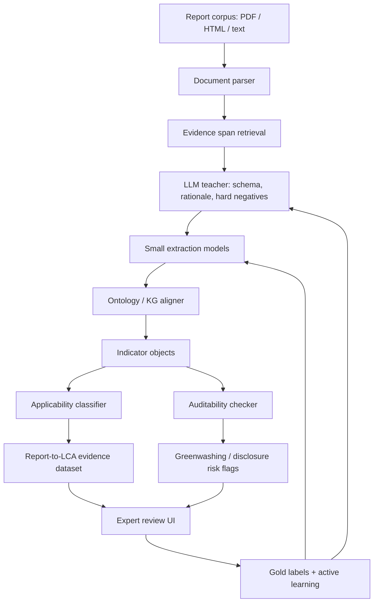

# Report-to-LCA Evidence Engine / 可审计报告到 LCA 证据引擎

这份 research proposal 聚焦一个更具体、可落地的 Agentic LCA 方向：使用大量 corporate sustainability reports，构建一个能把非结构化报告转化为 **LCA-relevant structured evidence** 的 agentic pipeline，并系统评估它在 **extraction accuracy、LCA applicability、concept matching、auditability / greenwashing detection** 上的表现。

<div class="tldr">
<strong>TL;DR</strong><br>
我们不直接声称 sustainability reports 能完成严格 product-level LCA；我们解决的是更基础也更可评估的问题：如何从报告中精准抓取环境/社会/供应链证据，如何把概念匹配到 LCA / Scope 3 / S-LCA schema，如何评估这些证据在哪些 LCA 任务中可用，以及如何建立可审计机制来识别缺失披露、口径不一致和 greenwashing 风险。
</div>

## Proposal overview {#proposal-overview}

**Working title:** *Report-to-LCA Evidence Engine: Agentic Extraction, Concept Grounding, Applicability Evaluation, and Auditability of Corporate Sustainability Reports.*

**一句话研究目标：**

> 构建并评估一个 agentic evidence engine，将企业 sustainability reports 转化为带 provenance 的 LCA-relevant structured evidence，用于支持 LCI compilation、Scope 3 / supply-chain evidence mining、Social LCA evidence collection，以及 greenwashing / auditability review。

这个研究不是把 sustainability report 当成完整 LCA 数据库，而是把它当成一种 **evidence source**：报告中有大量 emissions、energy、water、waste、materials、Scope 3、supplier、worker、community、governance、assurance 与 target 信息。问题在于这些信息通常散落在 PDF 表格、叙述段落、图表、附录和不同年度报告中，口径不统一，单位不统一，也不一定适合直接进入 LCIA。

因此本研究解决四个核心问题：

1. **Extraction：怎么抓取精准？** 从 sustainability reports 中抽取 LCA/S-LCA/Scope 3 相关数据，且带页码、表格、quote、单位、年份、边界和置信度。
2. **Applicability：抽出来的数据能用到哪里？** 判断每个数据点适合支持 full LCA、screening LCA、corporate inventory、Scope 3 evidence、S-LCA evidence，还是只能作为 weak signal。
3. **Concept matching：知识点概念怎么匹配？** 用 ontology / knowledge graph 约束概念，用大模型做 teacher / guide，小模型做高吞吐、低成本、可复现的抽取和分类。
4. **Auditability：怎么解决审计问题？** 生成可复核 evidence ledger，识别缺失披露、边界不一致、强叙事弱数据、目标与实际脱节、Scope 3 空洞化等 greenwashing 风险。

## Central thesis {#central-thesis}

**核心论点：**

> Corporate sustainability reports can become useful inputs to Agentic LCA only when they are transformed into provenance-grounded, ontology-aligned, uncertainty-aware evidence objects rather than treated as free-form text for direct answer generation.

中文解释：

> sustainability reports 只有在被转化为“有证据链、有概念约束、有不确定性、有适用性判断”的结构化对象后，才适合进入 Agentic LCA 工作流。

这意味着系统输出不应该只是：

```text
Company X reported 1,234 tCO2e Scope 2 emissions.
```

而应该是：

```json
{
  "company": "Company X",
  "report_year": 2024,
  "indicator": "scope_2_emissions_market_based",
  "value": 1234,
  "unit": "tCO2e",
  "boundary": "market-based Scope 2",
  "evidence": {
    "report_file": "CompanyX_Sustainability_Report_2024.pdf",
    "page": 42,
    "quote": "Scope 2 market-based emissions were 1,234 tCO2e..."
  },
  "lca_applicability": "corporate_inventory_or_scope3_context",
  "not_sufficient_for": ["product_level_lcia_without_allocation"],
  "confidence": 0.91,
  "audit_flags": []
}
```

## Research questions {#research-questions}

### Main RQ

> **How can LLM-guided agentic systems transform corporate sustainability reports into provenance-grounded, ontology-aligned, and audit-ready evidence for LCA-relevant extraction, applicability assessment, and greenwashing review?**

中文：

> LLM-guided agentic systems 如何将企业 sustainability reports 转化为具备 provenance、ontology 对齐和审计可用性的 LCA 相关证据，以支持精准抽取、适用性评估和 greenwashing 审查？

### RQ1 — Extraction accuracy

> **RQ1:** To what extent can LLM-guided agents accurately extract LCA-relevant environmental, social, and supply-chain indicators from sustainability reports?

中文：LLM-guided agents 能否从 sustainability reports 中准确抽取与 LCA、Scope 3、S-LCA 相关的环境、社会和供应链指标？

重点指标包括：

- Scope 1 / 2 / 3 emissions；
- energy consumption and renewable electricity；
- water withdrawal, discharge, recycling；
- waste, recycling, hazardous waste；
- materials, packaging, recycled content；
- logistics, product use-phase, end-of-life claims；
- worker health and safety, human rights, supplier code, community engagement。

### RQ2 — Concept matching with big-model-guided small models

> **RQ2:** Can large models guide smaller models to improve ontology-aligned concept extraction and mapping from sustainability reports to LCA, Scope 3, and S-LCA schemas?

中文：大模型能否作为 teacher / guide，提升小模型将报告概念映射到 LCA、Scope 3、S-LCA schema 的准确性和一致性？

研究重点不是“只用最大模型抽取”，而是形成一个可扩展系统：

- 大模型负责 schema design、ontology alignment、few-shot rationale、hard negative generation、error diagnosis；
- 小模型负责高吞吐抽取、span classification、indicator mapping、boundary detection、applicability tagging；
- 人类专家负责抽样审核与 gold label 修正。

### RQ3 — Applicability evaluation

> **RQ3:** How can extracted sustainability-report evidence be evaluated for its applicability to different LCA-related tasks?

中文：如何判断 sustainability report 中抽取的数据，适合用于哪些 LCA 相关任务，不适合用于哪些任务？

输出不应该只有“抽取成功/失败”，还要判断适用性：

| Applicability class | Meaning |
| --- | --- |
| `product_lca_ready` | 可直接支持产品级 LCA 的某个 foreground flow，通常很少见 |
| `screening_lca_ready` | 可用于 screening-level estimate，但需要 assumptions |
| `corporate_inventory_ready` | 可用于 company-level environmental inventory |
| `scope3_evidence_ready` | 可用于 Scope 3 / supply-chain evidence |
| `social_lca_evidence_ready` | 可用于 S-LCA stakeholder evidence |
| `weak_signal_only` | 只有叙事或目标，不能直接量化 |
| `not_applicable` | 与 LCA / S-LCA 无关或无法使用 |

### RQ4 — Auditability and provenance

> **RQ4:** Can provenance-first agentic extraction reduce hallucination and improve expert auditability of report-derived sustainability evidence?

中文：provenance-first agentic extraction 能否降低 hallucination，并提升专家对报告证据的审计效率？

每个数据点必须记录：report file、page、table/section、quote、value、unit、year、boundary、method note、assurance status、confidence、agent rationale、review status。

### RQ5 — Greenwashing and disclosure-risk audit

> **RQ5:** Can agentic audit systems identify sustainability reports with disclosure gaps, inconsistent boundaries, weak evidence, or greenwashing risk?

中文：agentic audit systems 能否识别哪些 sustainability reports 存在披露缺口、边界不一致、证据弱、或者 greenwashing 风险？

目标不是让 agent 做法律判断，而是生成可解释的 risk flags，让专家快速定位问题报告和问题段落。

## Dataset {#dataset}

本研究使用大量 corporate sustainability reports，构建一个 **report-to-evidence benchmark**。数据可以按如下层级组织：

| Level | Unit | Example fields |
| --- | --- | --- |
| Document | one report PDF / HTML | company, year, sector, geography, reporting framework, assurance |
| Page / section | report region | section title, page number, table/figure marker |
| Evidence span | quote or table cell | raw text, bounding box if available, extracted value |
| Indicator object | normalized data point | indicator, value, unit, boundary, year, method, confidence |
| Applicability label | LCA usefulness | product LCA, screening LCA, corporate inventory, Scope 3, S-LCA, weak signal |
| Audit flag | review issue | missing boundary, no unit, target without baseline, intensity-only, Scope 3 omitted |

### Candidate indicators

Environmental indicators:

- GHG emissions: Scope 1, Scope 2 market-based, Scope 2 location-based, Scope 3 categories;
- energy: electricity, fuel, renewable electricity share, energy intensity;
- water: withdrawal, consumption, discharge, recycling;
- waste: total waste, hazardous waste, recycling, landfill, incineration;
- materials: raw material input, recycled content, packaging, critical materials;
- product: product carbon footprint, use-phase emissions, end-of-life treatment, EPD/LCA claims.

Social / S-LCA indicators:

- worker health and safety, LTIFR/TRIR, fatalities;
- training hours, turnover, diversity;
- human rights policy, forced labor / child labor risk;
- supplier code of conduct, supplier audits;
- grievance mechanisms;
- community engagement, indigenous rights, local employment;
- consumer safety and product responsibility.

### Data governance

Because sustainability reports may have copyright and redistribution constraints, the public research artifact should prioritize:

- extracted schemas;
- annotation guidelines;
- derived labels and metrics;
- evidence references to public URLs where allowed;
- no redistribution of private/internal PDFs unless explicitly licensed;
- company anonymization if needed for internal reports.

## System architecture {#system-architecture}



Pipeline modules:

1. **Document parser**: PDF/HTML to layout-aware text, tables, pages, sections.
2. **Evidence retriever**: finds candidate spans for emissions, water, waste, Scope 3, S-LCA topics.
3. **LLM teacher**: proposes schema mapping, explains rationale, generates counterexamples and edge cases.
4. **Small model extractor**: learns high-throughput extraction and classification.
5. **Ontology/KG aligner**: maps terms to canonical concepts, units, boundaries, reporting year, stakeholder group.
6. **Applicability classifier**: decides whether extracted data is useful for product LCA, screening LCA, corporate inventory, Scope 3, S-LCA, weak signal, or not applicable.
7. **Auditability checker**: flags missing unit, missing year, missing boundary, inconsistent totals, no assurance, target-only claims, intensity-only disclosure, Scope 3 omissions.
8. **Expert review interface**: lets humans correct extraction, mapping, applicability and audit flags.

## Big model guides small model {#teacher-student}

本研究的关键方法是：**用大模型 guide 小模型，而不是长期依赖大模型完成所有任务。**

理由：

- sustainability reports 数量大，纯 LLM 成本高；
- 企业报告可能包含敏感或版权受限内容，小模型更适合本地/私有部署；
- benchmark 需要可复现和低方差输出；
- 小模型可以被严格评估、蒸馏和版本化。

### Teacher roles

大模型作为 teacher 做这些工作：

| Teacher task | Output |
| --- | --- |
| Schema refinement | indicator ontology, boundary taxonomy, applicability classes |
| Few-shot annotation | labeled examples with rationale |
| Hard negative generation | confusing spans that look relevant but are not usable |
| Error diagnosis | why the small model confused Scope 2 vs Scope 3, target vs actual, intensity vs absolute |
| Prompt-to-label bootstrapping | weak labels for active learning |
| Audit reasoning | evidence-based explanation of greenwashing risk flags |

### Student roles

小模型负责：

- span detection；
- numeric value extraction；
- unit normalization；
- indicator classification；
- boundary classification；
- report section classification；
- applicability tagging；
- audit flag classification。

Candidate student model families can include compact encoder models, sentence-transformer retrievers, rerankers, table extractors, or domain-specific classifiers. The proposal does not require selecting a final architecture upfront; model choice should follow pilot benchmark results.

## Extraction evaluation {#extraction-evaluation}

### Tasks

| Task | Example | Metric |
| --- | --- | --- |
| Indicator detection | find Scope 2 emissions in a report | precision, recall, F1 |
| Value extraction | extract `12,345` | exact match, numeric relative error |
| Unit extraction | `tCO2e`, `MWh`, `m3` | unit accuracy |
| Boundary extraction | market-based vs location-based, operational vs value chain | classification F1 |
| Year extraction | 2023, FY2024 | exact match |
| Evidence citation | page + quote + table cell | citation accuracy, span IoU |
| Hallucination control | no unsupported data points | unsupported claim rate |

### Baselines

1. rule-based regex and table extraction;
2. zero-shot LLM;
3. RAG + LLM;
4. small model only;
5. LLM-guided small model;
6. ontology-grounded LLM-guided small model.

### Gold labels

A human-labeled subset should cover:

- multiple sectors;
- multiple years;
- different reporting formats;
- narrative-heavy reports and table-heavy reports;
- reports with assurance and without assurance;
- reports with complete Scope 3 and missing Scope 3.

## Applicability evaluation {#applicability-evaluation}

Extraction accuracy alone is not enough. A value can be correctly extracted but still not useful for a particular LCA task.

Example:

- `Total company Scope 2 emissions = 1,234 tCO2e` is useful for corporate inventory, but usually not enough for product-level LCA.
- `Recycled aluminum content = 40% for product line A` may be useful for screening LCA if functional unit and mass are available.
- `We are committed to circularity` is a weak signal, not a usable inventory data point.

### Applicability labels

| Label | Use case | Required evidence |
| --- | --- | --- |
| product_lca_ready | direct product-level LCI or PCF | product, functional unit, quantity, unit, boundary |
| screening_lca_ready | approximate LCA | quantitative value plus assumptions |
| corporate_inventory_ready | company-level inventory | indicator, value, unit, year, organizational boundary |
| scope3_evidence_ready | supply-chain / value-chain evidence | GHG Protocol category, method or boundary note |
| social_lca_evidence_ready | S-LCA evidence | stakeholder group, social topic, evidence span |
| weak_signal_only | qualitative signal | narrative claim but insufficient quantification |
| not_applicable | irrelevant | no LCA/S-LCA relevance |

### Metrics

- applicability classification accuracy;
- macro-F1 across applicability classes;
- expert agreement rate;
- false-ready rate: cases incorrectly marked as LCA-ready;
- false-discard rate: useful evidence incorrectly discarded;
- calibration: confidence vs expert correctness.

## Auditability evaluation {#auditability-evaluation}

Auditability means an expert can check what the agent did without reconstructing the entire process manually.

### Audit object

Each extracted evidence object should contain:

```json
{
  "indicator": "scope_3_category_1_purchased_goods",
  "value": 987654,
  "unit": "tCO2e",
  "year": 2024,
  "boundary": "upstream purchased goods and services",
  "source": {
    "file": "report.pdf",
    "page": 88,
    "section": "Value chain emissions",
    "quote": "Category 1 emissions were ..."
  },
  "ontology_mapping": {
    "canonical_concept": "scope3.category1.purchased_goods_and_services",
    "aliases_detected": ["purchased goods", "supply chain emissions"]
  },
  "applicability": "scope3_evidence_ready",
  "audit_flags": ["method_not_disclosed"],
  "confidence": 0.84,
  "review_status": "pending"
}
```

### Auditability metrics

| Metric | Meaning |
| --- | --- |
| provenance completeness | fraction of outputs with page/quote/source |
| evidence faithfulness | whether value and claim are supported by quote |
| reviewer time | time needed for expert to accept/reject output |
| correction distance | number of fields corrected per object |
| audit flag precision | how often risk flags are accepted by experts |
| audit flag recall | how many expert-identified issues the system finds |

## Greenwashing audit {#greenwashing-audit}

The greenwashing module should not make final legal or reputational accusations. It should generate **reviewable risk flags** with evidence.

### Candidate risk flags

| Flag | Description | Example evidence |
| --- | --- | --- |
| target_without_baseline | emissions target without baseline year or baseline value | “net zero by 2050” with no baseline |
| intensity_only | only intensity metric, no absolute emissions | “emissions per revenue decreased” |
| scope3_missing | Scope 3 omitted despite value-chain-heavy sector | no Scope 3 table |
| boundary_unclear | unclear organizational or operational boundary | no market/location note |
| method_missing | no emission factor or accounting method disclosed | no GHG Protocol / method note |
| selective_category | only easy Scope 3 categories reported | reports travel but not purchased goods |
| unverifiable_claim | broad claim without data | “sustainable materials” with no values |
| contradiction_across_years | same indicator changes definition or baseline | inconsistent year-over-year table |
| target_progress_gap | ambitious target but insufficient trend | target not matched by trajectory |
| assurance_gap | critical figures lack third-party assurance | assurance statement excludes emissions table |

### Greenwashing-readiness score

The system can output a **Disclosure Risk Score**, not as final judgment but as triage:

```text
risk = missing_boundary + missing_method + weak_evidence + inconsistency + target_progress_gap + assurance_gap
```

Possible dimensions:

- completeness;
- specificity;
- traceability;
- consistency;
- assurance;
- LCA usefulness;
- uncertainty disclosure;
- target-performance alignment.

## Work packages {#work-packages}

### WP1 — Corpus preparation and schema design

- Collect sustainability reports by company, year, sector, region.
- Convert PDF/HTML to text, tables, sections and page-aware spans.
- Define extraction schema, applicability schema and audit flag taxonomy.
- Create annotation guidelines.

### WP2 — Gold-label benchmark

- Sample reports across sectors and disclosure quality levels.
- Annotate evidence spans, indicators, units, values, years, boundaries.
- Label applicability and audit flags.
- Measure inter-annotator agreement.

### WP3 — Agentic extraction pipeline

- Build baseline extractors.
- Build RAG + LLM extraction pipeline.
- Add ontology / KG-constrained extraction.
- Add teacher-student distillation pipeline.
- Compare models on extraction accuracy and cost.

### WP4 — Applicability classifier

- Train/evaluate applicability labels.
- Test false-ready and false-discard rates.
- Create examples showing why a correctly extracted value may still be unsuitable for product-level LCA.

### WP5 — Auditability and greenwashing review

- Build provenance ledger.
- Define audit flag taxonomy.
- Evaluate expert review time and audit flag quality.
- Produce report-level disclosure risk summaries.

### WP6 — Case studies

Run case studies on selected sectors, for example:

- consumer electronics;
- construction / building materials;
- textile and apparel;
- battery / renewable energy supply chain;
- food and agriculture.

## Deliverables {#deliverables}

| Deliverable | Description |
| --- | --- |
| D1: Report-to-LCA schema | canonical indicators, units, boundaries, applicability labels, audit flags |
| D2: Annotated benchmark | gold-labeled sustainability report spans and structured evidence objects |
| D3: Agentic extraction pipeline | RAG + ontology + teacher-student system |
| D4: Applicability evaluator | classifier and metrics for LCA usefulness |
| D5: Auditability ledger | provenance-first evidence object format |
| D6: Greenwashing risk module | evidence-backed disclosure risk flags |
| D7: Paper / thesis chapter | research contribution and experimental results |
| D8: SiliWiki knowledge base | public-facing methods, source registry and evolving proposal notes |

## Expected contributions

1. **A new benchmark:** sustainability-report-to-LCA evidence extraction benchmark.
2. **A method:** LLM-guided small model pipeline for ontology-aligned extraction.
3. **A framework:** applicability-aware transformation from reports to LCA-relevant evidence.
4. **An audit model:** provenance-first evidence ledger and greenwashing risk taxonomy.
5. **An empirical result:** performance comparison across extraction, applicability and auditability.
6. **A thesis direction:** bridges Agentic LCA, sustainability reporting, Scope 3 evidence mining, Social LCA and greenwashing detection.

## Risks and boundaries {#risks}

| Risk | Mitigation |
| --- | --- |
| Reports are company-level, not product-level | explicitly evaluate applicability; do not overclaim product LCA readiness |
| Copyright / redistribution constraints | publish schema, labels and derived metadata; avoid sharing private PDFs without license |
| Greenwashing detection can be sensitive | frame as risk flags for expert review, not final accusation |
| LLM hallucination | require page/quote provenance for every extracted object |
| Inconsistent reporting standards | ontology maps multiple frameworks and aliases to canonical concepts |
| Small models underperform on complex tables | use LLM teacher for hard cases and active learning |
| Evaluation labels are subjective | use annotation guidelines and inter-annotator agreement |

## References {#references}

This proposal builds on the Agentic LCA literature review wiki and public reporting/LCA frameworks. Source details are in [`raw/sources.md`](raw/sources.md).

Key source groups:

- LLM/Agentic LCA: Preuss et al. 2024; Tu et al. 2024; Zhang et al. 2025; Kumar et al. 2025; ARIA 2025.
- ABM/MAS-LCA: Davis et al. 2009; Querini & Benetto 2015; Lan & Yao 2019; Walzberg et al. 2019; Fuortes et al. 2025.
- Reporting frameworks: GHG Protocol Corporate Standard, GHG Protocol Scope 3 Standard, GRI Standards, IFRS S1/S2, ESRS.
- LCA / S-LCA frameworks: ISO 14040/14044, UNEP S-LCA Guidelines, Brightway, openLCA.

## Changelog

- 2026-05-06: Created proposal wiki for Report-to-LCA Evidence Engine, focused on extraction, applicability, concept matching, auditability and greenwashing review.
