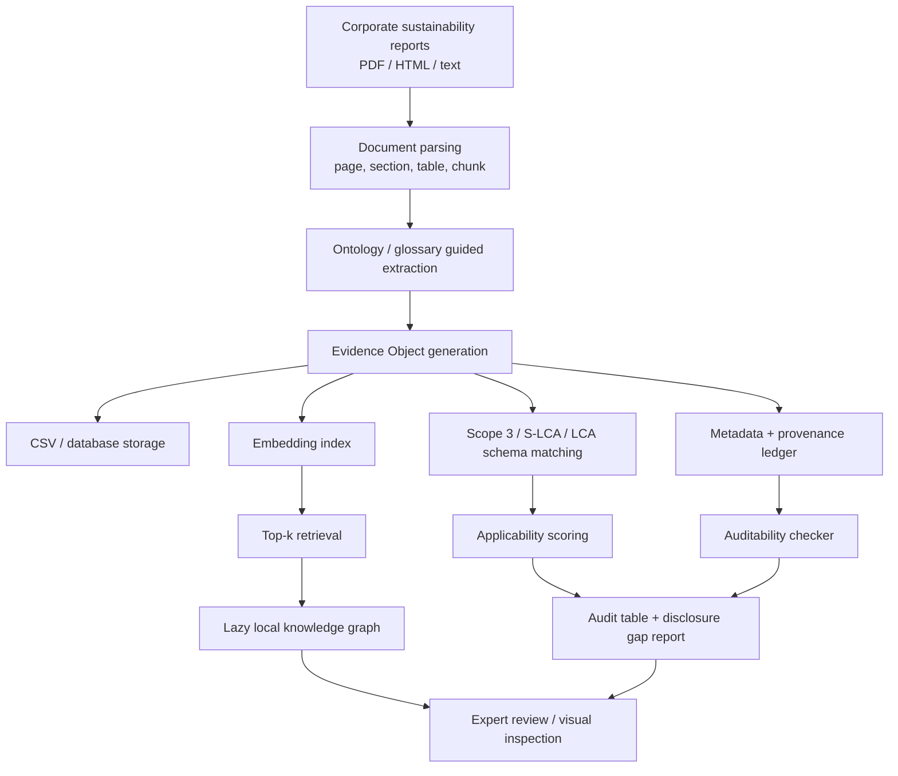

# Report-to-LCA Evidence Engine / 可审计报告到 LCA 证据引擎

这篇浓缩版文章总结 2026-05-06 与马老师讨论后确定的研究设计：**不把企业 Sustainability Report 直接当成完整产品级 LCA 数据库，而是把它转化为可计算、可检索、可审计的 LCA / Scope 3 / S-LCA 证据层**。

<div class="tldr">
<strong>TL;DR</strong><br>
本研究的核心贡献是一个 <strong>ontology-guided, provenance-aware Evidence Engine</strong>：从企业 sustainability reports 中抽取 ESG、供应链、Scope 3 与 S-LCA 相关证据，生成带来源、页码、原文、metadata、embedding 和适用性判断的 Evidence Objects；再通过 schema matching、lazy knowledge graph、missing-evidence detection 和 audit ledger，评估这些证据能否支持 LCA 相关任务，并识别披露缺口与 greenwashing risk indicators。
</div>

## 核心定位 {#core-positioning}

这项研究不声称：

> sustainability reports 可以自动完成严格的 product-level LCA。

原因很简单：企业可持续发展报告通常缺少产品级 functional unit、foreground activity data、allocation rules、emission factors、系统边界和可复核的 LCI 明细。直接从报告生成完整 LCA，claim 太强，也容易被 reviewer 质疑。

本研究真正解决的是更基础也更可评估的问题：

> **如何把不可审计的文字报告，转化为可计算、可追溯、可复核的 sustainability evidence layer。**

这个 evidence layer 可以服务于四类任务：

1. **LCA / LCI applicability assessment**：判断报告证据能否支持 full LCA、screening LCA、corporate inventory 或仅作为 weak signal。
2. **Scope 3 / supply-chain evidence mining**：识别采购、物流、使用阶段、报废阶段、supplier engagement 等价值链证据。
3. **Social LCA evidence collection**：抽取 worker、supplier、community、consumer、human rights 等 S-LCA 相关证据。
4. **Auditability / greenwashing review**：标记缺失披露、边界不清、强叙事弱数据、target 与 performance 脱节、Scope 3 空洞化等风险信号。

一句话：**不是 report-to-LCA result，而是 report-to-LCA evidence。**

## 研究问题 {#research-questions}

### Main RQ

> How can an ontology-guided and provenance-aware Evidence Engine extract, structure, and evaluate LCA-relevant evidence from corporate sustainability reports?

中文：

> 如何构建一个由 ontology 约束、由 provenance 支撑的 Evidence Engine，将企业 sustainability reports 转换为可审计、可评估、可用于 LCA 相关任务的结构化证据？

### RQ1 — Extraction accuracy

系统能否准确抽取 LCA / Scope 3 / S-LCA 相关 concept、claim、指标、数值、单位、年份、边界和 evidence span？

### RQ2 — Concept and schema matching

抽出的 evidence 能否正确匹配到 Scope 3 categories、S-LCA stakeholder categories、LCA inventory concepts、NAICS sector context 和自建 ontology / glossary？

### RQ3 — Applicability evaluation

每条 evidence 到底能支持什么任务？是 product-level LCA ready、screening LCA ready、corporate inventory ready、Scope 3 evidence ready、S-LCA evidence ready，还是只能作为 weak signal？

### RQ4 — Grounding and auditability

要求每个系统输出都能回到原报告的 page、section、quote 或 table cell，能否减少 unsupported claim，并提升专家复核效率？

### RQ5 — Disclosure gap and greenwashing risk indicators

系统能否识别“报告中本该披露但缺失的证据”，以及模糊 claim、无边界数据、target-only narrative、Scope 3 omission 等可复核风险信号？

## 使用的数据 {#data}

本研究的数据分成三层：候选语料、pilot benchmark 和人工标注 gold standard。

| 层级 | 数据用途 | 建议规模 | 说明 |
| --- | --- | --- | --- |
| Candidate corpus | 长期语料池与系统压力测试 | 最高约 20,000 份 sustainability reports | 不作为第一阶段实验要求；用于验证未来可扩展性 |
| Pilot benchmark | 第一篇论文 / proposal demo | 10–20 份 reports | 覆盖 3 个左右 NAICS sector，每个 sector 3–6 家公司 |
| Gold standard subset | 精准评估 extraction / matching / auditability | 每份报告抽样标注重点章节 | 只标 Scope 3、energy、materials、water、waste、supplier、S-LCA、targets 等高价值区域 |

### 为什么先小样本

当前阶段不需要一开始处理 20,000 份报告。PhD proposal 和方法论文最关键的是证明：

- schema 定义清楚；
- extraction pipeline 跑得通；
- evidence object 可复核；
- metrics 可计算；
- 小样本实验能证明方法优于 baseline；
- 后续可扩展到大规模。

### 数据单位

| Unit | 示例字段 |
| --- | --- |
| Report | company, year, NAICS, sector, reporting framework, assurance status |
| Page / section | page number, section title, table marker, chunk id |
| Evidence span | raw quote, table cell, bounding box if available |
| Evidence object | concept, value, unit, boundary, source, confidence, applicability, audit flags |
| Report-level summary | coverage, missing categories, disclosure risk, reviewer notes |

## 架构设计 {#architecture}

系统的核心不是先做一个巨大的 knowledge graph，而是先生成高质量 **Evidence Objects**。Knowledge graph 采用 lazy loading：平时只保存 evidence、metadata、embedding 和 provenance；需要查询、比较或可视化时，再动态生成局部图。



### 模块说明

| 模块 | 作用 | 输出 |
| --- | --- | --- |
| Document parser | 把 PDF / HTML 转成 page-aware text、table、section、chunk | chunks, pages, sections |
| Glossary / ontology extractor | 抽取报告中的关键 concepts、claims、metrics、entities | concept candidates |
| Evidence object builder | 把 concept 与原文证据、来源、metadata 绑定 | structured evidence objects |
| Embedding index | 将 evidence / concept 转成 vector，支持相似度计算 | embeddings |
| Schema matcher | 映射到 Scope 3、S-LCA、LCA ontology、NAICS context | schema labels |
| Applicability evaluator | 判断证据可用于哪类 LCA 任务 | applicability score |
| Auditability checker | 检查证据链、缺失字段、claim 支持程度 | audit flags |
| Lazy KG visualizer | 按 top-k 动态生成局部知识图谱 | local graph |

## Evidence Object schema {#evidence-object}

Evidence Object 是系统的原子单位。每条证据都必须能回答四个问题：

1. **它说了什么？** concept / claim / value / unit / boundary。
2. **它从哪里来？** report、page、section、quote、chunk id。
3. **它能用来做什么？** LCA / Scope 3 / S-LCA applicability。
4. **它有什么问题？** missing fields、confidence、risk flags、review status。

示例 schema：

```json
{
  "report_id": "company_a_2024",
  "company": "Company A",
  "report_year": 2024,
  "naics_code": "2211",
  "sector": "Utilities",
  "concept": "purchased goods and services emissions",
  "schema_match": "Scope 3 Category 1",
  "evidence_text": "The company engaged suppliers to reduce upstream emissions...",
  "source_page": 42,
  "source_section": "Value chain emissions",
  "source_chunk_id": "p42_c03",
  "evidence_type": "qualitative",
  "value": null,
  "unit": null,
  "boundary": "upstream value chain",
  "similarity_score": 0.78,
  "confidence": 0.82,
  "applicability": "weak_signal_only",
  "missing_fields": ["quantified activity data", "emission factor", "supplier-specific boundary"],
  "audit_flags": ["method_missing", "weak_evidence"],
  "greenwashing_risk_indicator": "medium",
  "review_status": "pending"
}
```

这类结构让系统避免“自由文本回答”，转而输出可验证的 evidence ledger。

## 方法设计 {#methods}

### 1. Ontology / glossary-guided extraction

报告文本不是让 LLM 自由总结，而是在 glossary / ontology / schema 约束下抽取。系统关注的不是普通关键词，而是 **evidence-bearing concepts**：能支持 LCA、Scope 3、S-LCA 或 audit review 的概念、指标、claim 和证据片段。

抽取对象包括：

- environmental metrics：emissions、energy、water、waste、materials；
- Scope 3 categories：purchased goods、transport、business travel、use of sold products、end-of-life；
- S-LCA topics：workers、local community、value-chain actors、consumers、human rights；
- report claims：net zero、carbon neutrality、supplier engagement、circularity、sustainable materials；
- audit cues：baseline、boundary、method、assurance、target progress、omitted categories。

### 2. Provenance-first grounding

每个输出必须有来源：report file、page、section、quote 或 table cell。系统不追求消除 hallucination，而是通过 provenance-first design 将 unsupported outputs 暴露出来。

原则：

> No evidence, no claim. Missing evidence is itself an output.

如果报告没有 Scope 3 数据，系统不编造，而是输出：

```text
Expected evidence: Scope 3 category-level disclosure
Status: Missing / insufficient
Audit implication: disclosure gap
```

### 3. Embedding + lazy knowledge graph

所有 Evidence Objects 会保存 embedding，支持相似度检索和 concept matching。但系统不预先生成全量图，因为如果 20,000 份报告、每份 500 个 concepts，两两连接会产生不可控的边数量。

采用 lazy loading：

1. 先保存 CSV / database + embedding + metadata；
2. 查询时取 top-k evidence / concepts；
3. 只在局部节点上计算 similarity edges；
4. 动态生成 local knowledge graph；
5. 给专家可视化检查。

例如 top-100 节点最多约 10,000 条边，可计算、可解释、可展示。

### 4. NAICS-aware comparison

不同行业的 sustainability report 披露强度差异很大。Energy、manufacturing、technology、education、financial services 的 Scope 3 和 supply-chain evidence 不应简单横向比较。

因此实验采用 NAICS 做 sector control：

- within-sector comparison：同一 NAICS sector 内比较 disclosure quality；
- cross-sector pattern：观察行业间证据覆盖差异；
- fair baseline：与已有 NAICS-based 方法进行更公平比较。

### 5. Human-in-the-loop audit

专家不是被替代，而是从“全篇手动阅读”转为“审核结构化 evidence ledger”。系统负责预抽取、预匹配、预标记；专家负责复核、修正、确认 gold labels。

## 实验设计 {#experiments}

实验不追求一次跑完整 20,000 份报告，而是先完成一个最小可验证闭环。

### Experiment 1 — Extraction accuracy

**目标：** 评估系统从报告中抽取 LCA-relevant evidence 的准确率。

| 设置 | 内容 |
| --- | --- |
| Input | 10–20 份 sustainability reports 的重点章节 |
| Gold labels | concept、evidence span、page、value、unit、boundary、schema label |
| Baselines | keyword/rule-based, vanilla LLM, RAG+LLM, ontology-guided pipeline |
| Metrics | precision, recall, F1, evidence span accuracy, page accuracy, hallucinated evidence rate |

### Experiment 2 — Schema matching and concept grounding

**目标：** 评估 evidence 到 Scope 3 / S-LCA / LCA schema 的映射质量。

| 任务 | 指标 |
| --- | --- |
| Scope 3 category matching | top-1 / top-3 accuracy |
| S-LCA stakeholder/topic matching | macro-F1 |
| NAICS-aware concept matching | within-sector accuracy |
| Similarity threshold tuning | precision-recall curve |

### Experiment 3 — Applicability evaluation

**目标：** 判断抽取出的 evidence 到底能用于哪类 LCA 任务。

| Applicability label | 含义 |
| --- | --- |
| `product_lca_ready` | 可直接支持产品级 LCA；预计很少 |
| `screening_lca_ready` | 可用于粗略 screening，需要 assumptions |
| `corporate_inventory_ready` | 可用于企业级环境 inventory |
| `scope3_evidence_ready` | 可用于 Scope 3 / supply-chain evidence |
| `social_lca_evidence_ready` | 可用于 S-LCA evidence collection |
| `weak_signal_only` | 只有叙事、目标或政策，不可直接量化 |
| `not_applicable` | 与 LCA / S-LCA 任务无关 |

关键指标：applicability accuracy、macro-F1、false-ready rate、expert agreement、confidence calibration。

### Experiment 4 — Auditability and provenance

**目标：** 验证 provenance-aware pipeline 是否让专家更容易复核系统输出。

| 指标 | 含义 |
| --- | --- |
| provenance completeness | 输出中包含 page / quote / source 的比例 |
| citation correctness | 引用页码和原文是否真实支持输出 |
| evidence-claim support | quote 是否足以支持 claim |
| reviewer time | 专家接受/拒绝一条 evidence 的时间 |
| correction distance | 每条 evidence 需要修正的字段数量 |

### Experiment 5 — Disclosure gap and greenwashing risk indicators

**目标：** 不做法律意义上的 greenwashing 判决，而是识别可复核风险信号。

| Risk indicator | 例子 |
| --- | --- |
| `scope3_missing` | value-chain-heavy sector 但没有 Scope 3 table |
| `target_without_baseline` | “net zero by 2050” 但无 baseline |
| `intensity_only` | 只报强度下降，不报绝对排放 |
| `boundary_unclear` | 组织边界或 operational boundary 不明 |
| `method_missing` | 无 emission factor / accounting method |
| `selective_category` | 只报容易的 Scope 3 类别，遗漏 purchased goods |
| `weak_evidence` | 强 claim 只有模糊叙事，无数据 |

## 预期输出 {#outputs}

系统最终输出不是一篇普通总结，而是可审计的数据产品。

### 1. Evidence table

每一行是一条 Evidence Object，包含 source、concept、schema、applicability、missing fields 和 audit flags。

### 2. Report-level audit summary

每份报告生成：

```text
Company: A
Sector: Utilities
Report year: 2024
Scope 3 evidence coverage: partial
Strongest evidence: Scope 1/2 quantified emissions with assurance
Weakest evidence: supplier-specific activity data missing
Disclosure gap: Scope 3 Category 1 method not disclosed
Greenwashing risk indicators: medium
Reviewer action: inspect pages 42, 58, 91
```

### 3. Lazy KG visualization

按 query 或 company 动态生成局部 graph，用于展示 company、concept、Scope 3 category、evidence span、risk flag 之间的关系。

### 4. Benchmark and metrics

生成一个 report-to-evidence benchmark，用来比较不同 pipeline 在 accuracy、efficiency、grounding、auditability 和 cost 上的表现。

## 当前结论 {#conclusions}

这次方法整合后的研究结论可以浓缩成五点：

1. **研究 claim 必须降级。** Sustainability reports 不能被直接当成严格 product-level LCA 数据源；更合理的定位是 LCA-relevant evidence source。
2. **核心贡献是 Evidence Object，不是大模型回答。** 论文的原子单位应该是带 provenance、metadata、embedding、schema label 和 applicability 的 structured evidence object。
3. **Missing evidence 是有价值输出。** Scope 3 披露缺失、边界缺失、method 缺失不能由模型补齐，而应被显式标记为 disclosure gap。
4. **Lazy KG 是正确架构。** 不应提前构建全量知识图谱；先保存 evidence + embedding，需要时按 top-k 动态生成局部图，才能兼顾成本和可解释性。
5. **实验应先小后大。** 当前阶段用 10–20 份报告建立 gold standard、验证 pipeline 和评价指标，比直接跑 20,000 份报告更有学术说服力。

因此，这条研究线最稳的 thesis statement 是：

> An ontology-guided, provenance-aware Evidence Engine can transform corporate sustainability reports into auditable LCA-relevant evidence objects, enabling more reliable extraction, applicability assessment, disclosure-gap detection, and expert review than free-form LLM summarization.

## 边界与限制 {#limitations}

| 限制 | 处理方式 |
| --- | --- |
| 报告通常不是产品级 LCA 数据 | 用 applicability labels 防止 overclaim |
| Greenwashing 判断敏感 | 只输出 risk indicators，交给专家复核 |
| LLM hallucination 不能彻底消除 | 强制 provenance；无证据则不输出 claim |
| Gold labels 成本高 | 先做 focused annotation，不全量标注整本报告 |
| 披露格式差异大 | 使用 ontology + NAICS sector control |
| API/token 成本高 | 小样本实验优先；大规模阶段申请 HDR Support Scheme |

## 下一阶段工作 {#next-stage}

最优先的不是继续堆功能，而是完成可评估闭环：

1. 固定 Evidence Object schema；
2. 选定 10–20 份 pilot reports；
3. 写 annotation guideline；
4. 人工标注 Scope 3 / supply chain / energy / materials / S-LCA 重点区域；
5. 跑 keyword、vanilla LLM、RAG+LLM、ontology-guided pipeline 四组 baseline；
6. 输出 extraction、matching、applicability、auditability、efficiency 五组指标；
7. 做一个 report-level audit table 和 lazy KG demo；
8. 申请 HDR Support Scheme 覆盖 API/token 成本。

## References {#references}

Source details are maintained in [`raw/sources.md`](raw/sources.md). The full earlier proposal draft is stored in [`raw/proposal-full.md`](raw/proposal-full.md), and the schema draft is stored in [`raw/extraction-schema.md`](raw/extraction-schema.md).

Key source groups:

- Meeting transcript: 2026-05-06 LCA Evidence Engine research discussion with Ma.
- LLM / Agentic LCA literature: Preuss et al. 2024; Tu et al. 2024; Zhang et al. 2025; Kumar et al. 2025.
- KG / ontology / matching: Peng et al. 2024; Agentic LCA wiki.
- Reporting frameworks: GHG Protocol Corporate Standard, GHG Protocol Scope 3 Standard, GRI, IFRS S1/S2, ESRS.
- LCA / S-LCA frameworks: ISO 14040/14044, UNEP S-LCA Guidelines, Brightway, openLCA.

## Changelog

- 2026-05-12: Rewritten as a condensed methods article after the 2026-05-06 meeting, emphasizing Evidence Objects, provenance-first extraction, lazy KG, pilot benchmark design, NAICS-aware evaluation and disclosure-gap audit.
- 2026-05-06: Created initial proposal wiki for Report-to-LCA Evidence Engine.
