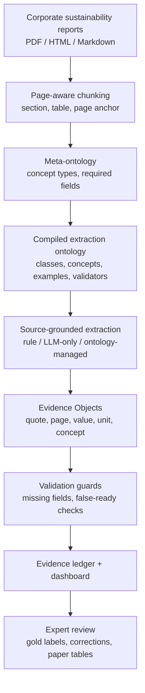

# Report-to-LCA Evidence Engine / 从企业报告到可审计 LCA 证据

这篇 wiki 记录当前 paper 的核心故事、系统方法和实验设计：**企业 sustainability reports 不是 product LCA 数据库，但可以被转化为 source-grounded、ontology-managed、可审计的 LCA-relevant Evidence Objects**。

<div class="tldr">
<strong>TL;DR</strong><br>
这篇文章的核心不是“用 AI 自动算 LCA”，而是提出一个 <strong>ontology-managed Report-to-LCA evidence layer</strong>：从企业 ESG / CSR / sustainability reports 中抽取 GHG、Scope 3、assurance、target、life-cycle claim 与 missing disclosure，并把每一条输出绑定到 source quote、page、canonical concept、missing fields、audit flags 和 readiness label。目标是防止 LLM 把普通 corporate disclosure 误判成 product-LCA-ready data，同时让 LCA 专家更快地审计报告到底能支持什么、缺什么、不能 claim 什么。
</div>

## Paper thesis {#thesis}

这篇 paper 最稳的 thesis statement 是：

> Corporate sustainability reports are valuable but unsafe intermediate evidence sources for LCA. Ontology-managed, source-grounded extraction can convert them into auditable LCA-relevant evidence objects while explicitly exposing missing methodological evidence and preventing unsupported product-LCA readiness claims.

中文翻译：

> 企业可持续发展报告很有价值，但不能直接当成产品级 LCA 数据。我们的方法把它们转成可追溯、可验证、可审计的 LCA 相关证据对象，同时显式标记缺失的方法学信息，防止普通 ESG 披露被误判为 product-LCA-ready。

这比“LLM extracts LCA data from reports”更准确，也更能抗审稿质疑。

## Why this matters {#why-this-matters}

LCA 的瓶颈不只是计算，而是 **data preparation and evidence qualification**：

- corporate reports 有大量 Scope 1/2/3、energy、water、waste、net-zero、assurance 和 life-cycle language；
- 但报告通常缺少 product-level functional unit、system boundary、allocation method、foreground activity data、emission factor provenance；
- LLM 可以读这些报告，但容易把 narrative smoothing 成“看似完整”的结构化数据；
- LCA 需要的是 conservatism：有证据就抽，没证据就显式标记 missing evidence，而不是补全。

因此本研究的价值是建立一层 **audit-first converter**：不让报告直接跳到 LCA result，而是先进入 evidence ledger。

## Literature gap {#literature-gap}

现有文献大致分成三类，但中间缺了一层。

| Research stream | Existing strength | Gap for this paper |
| --- | --- | --- |
| Automated LCA / LCI compilation | 证明 LCI 数据收集与建模是自动化瓶颈；已有 semantic model、KG、LLM-for-LCI work | 多数面向结构化数据库、scientific literature 或 process data，不处理 corporate report 的 auditability 和 missing method |
| ESG / climate disclosure NLP | 能做 sustainability report classification、ClimateBERT、net-zero detection、GHG extraction、greenwashing scoring | 多数停留在 disclosure / scoring，不检查 functional unit、product boundary、allocation、LCA readiness |
| LLM grounding / structured extraction | 强调 RAG、factuality、source-grounded extraction、hallucination evaluation | 一般不懂 LCA 约束；grounded quote 仍可能被错误解释成 product-LCA-ready |

我们的 gap 是：

> **从 sustainability report disclosure 到 LCA-ready / not-ready evidence judgement 的 ontology-managed audit layer。**

## Method overview {#method}

系统不是让 LLM 自由总结报告，而是用 meta-ontology 编译出 extraction ontology、canonical concepts、validation rules 和 false-ready guards。



核心设计原则：

1. **No evidence, no claim.** 没有 source quote 的输出不能作为 evidence。
2. **Missing evidence is evidence.** 缺 functional unit、method、boundary 本身就是审计发现。
3. **Corporate GHG evidence ≠ product LCA readiness.** Scope 3 或 assurance 不自动等于 product-LCA-ready。
4. **Ontology constrains interpretation.** number、target、assurance、method、boundary 的意义必须由 domain ontology 判断。

## Evidence Object schema {#evidence-object-schema}

Evidence Object 是系统的原子单位。每条 evidence 至少要记录：

```json
{
  "evidence_id": "stable id",
  "report_id": "company_year_report",
  "company": "Company name",
  "report_year": 2023,
  "source_page": 42,
  "source_quote": "Exact text span from the report",
  "evidence_class": "scope3_category_metric",
  "canonical_concept_id": "ghg.scope3.category1.purchased_goods_and_services",
  "value": "2618",
  "unit": "tCO2e",
  "year": 2023,
  "method": null,
  "boundary": "upstream value chain",
  "missing_fields": ["emission_factor_provenance", "product_boundary"],
  "audit_flags": ["method_missing"],
  "readiness_label": "scope3_evidence_ready"
}
```

这让输出变成 ledger，而不是聊天式答案。

## Readiness ladder {#readiness-ladder}

报告证据不是二元的 usable / unusable，而是一条 readiness ladder：

| Readiness label | Meaning | Typical required evidence |
| --- | --- | --- |
| `weak_signal_only` | 只有叙事、承诺、政策、life-cycle language | quote + concept |
| `corporate_inventory_ready` | 可支持企业层面的 GHG inventory review | value + unit + scope + year + source |
| `scope3_evidence_ready` | 可支持 Scope 3 / supply-chain screening | Scope 3 category + value or materiality + boundary context |
| `screening_ready` | 可用于粗筛或 hotspot identification | enough field context, but assumptions still needed |
| `product_lca_ready` | 可直接支持产品级 LCA | functional unit + product boundary + value + unit + method + source quote |
| `missing_evidence` | 应披露但缺失或不足 | missing field + audit implication + source context |

本研究的关键不是让更多东西变成 `product_lca_ready`，而是准确判断大多数 corporate disclosures 为什么还不到这个级别。

## Preliminary 100-report baseline {#preliminary-baseline}

我们已经跑了一个 100-report high-signal deterministic rule-provider baseline。这个结果用于验证 pipeline mechanics、evidence density 和 demo feasibility；不是最终 LLM-quality benchmark。

| Metric | Value |
| --- | ---: |
| Reports | 100 |
| Selected chunks | 800 |
| Evidence Objects | 1,211 |
| Average evidence / report | 12.11 |
| Median evidence / report | 11 |
| Grounded evidence rate | 100% |
| Missing disclosure objects | 359 |
| Missing share | 29.64% |
| False-ready guard violations | 0 |

Report-level coverage：

| Signal | Reports with signal |
| --- | ---: |
| Scope 3 total or specific category | 43 / 100 |
| Specific Scope 3 categories | 34 / 100 |
| LCA / life-cycle claim | 24 / 100 |
| Assurance statement | 76 / 100 |
| Target claims | 68 / 100 |
| Missing Scope 3 method signal | 97 / 100 |
| Missing functional unit signal | 21 / 100 |

Interpretation：

- 报告里有大量 climate disclosure 和 assurance，但不代表 product LCA readiness；
- target、assurance、Scope 3 disclosure 很多，method / functional unit / boundary 缺口也很多；
- 这证明系统的产品定位更像 **LCA / sustainability disclosure audit assistant**，不是自动 LCA calculator；
- zero false-ready guard violations 说明 conservative readiness guard 是可实现的。

## Experimental design {#experimental-design}

正式 paper 要跑三组对照。

| Condition | Description | Purpose |
| --- | --- | --- |
| C1 Rule baseline | deterministic rule provider | mechanics sanity check, low-cost lower bound, regression testing |
| C2 LLM-only | same chunks, generic LLM structured extraction without compiled ontology constraints | test hallucination, over-readiness, target-vs-measured-data confusion |
| C3 Ontology-managed | meta-ontology + canonical concepts + validators + false-ready guards + missing evidence objects | proposed method |

Gold set 建议：

- stronger paper version: **100 reports or 300–500 LCA-relevant chunks**；
- 覆盖 manufacturing、chemicals/materials、energy/utilities、transport/logistics、tech/services、finance/property、consumer goods；
- 包含 clean table、messy markdown、短 CSR report、长 integrated report；
- 每条 gold label 包含 evidence class、canonical concept、source quote、page、value/unit/year、boundary/method、missing fields、audit flags、readiness label。

## Evaluation metrics {#evaluation-metrics}

不只看 extraction F1。核心指标应该覆盖四层。

| Metric group | Metrics |
| --- | --- |
| Extraction quality | evidence precision / recall / F1; class macro-F1; concept accuracy; value / unit / year accuracy |
| Grounding and auditability | exact quote match; page traceability; unsupported evidence rate; duplicate / merged evidence error |
| LCA-readiness safety | false-ready rate; target-vs-measured-data confusion; assurance-scope overgeneralization |
| Missing evidence | missing functional unit recall; missing boundary recall; missing method recall; missing emission-factor provenance recall |
| Operations | runtime/report; cost/report; chunks/report; token count; retry count; cache hit rate |

主假设：

> C3 ontology-managed extraction should reduce false-ready claims and improve missing-evidence recall while preserving competitive extraction quality and source grounding.

如果 C2 LLM-only 抽得更多，但把 target、assurance、generic LCA language 误判为 LCA-ready，那么 C3 更 scientifically defensible。

## Research-paper draft {#paper-draft}

当前完整 paper draft 已写入 raw：

- [`raw/research-paper-draft-2026-05-20.md`](raw/research-paper-draft-2026-05-20.md)

Draft 内容包括：

- abstract；
- introduction；
- related work；
- why this research is necessary；
- ontology-managed extraction method；
- data and gold-set design；
- C1 / C2 / C3 experimental design；
- preliminary 100-report baseline；
- discussion；
- limitations；
- ethics；
- references；
- appendix with proposed paper tables and figures。

## Research value {#research-value}

这项研究的价值在于它把“报告抽取”从一般 NLP 任务推进到 LCA 研究需要的证据治理任务。

1. **Scientific conservatism:** 不把 corporate disclosure 过度解释为 product LCA data。
2. **Auditability:** 每条 evidence 都保留 quote、page、concept、field、flag，专家能复核。
3. **Missingness as signal:** 缺 method、functional unit、boundary 是输出，不是静默失败。
4. **Ontology-managed interpretation:** LCA 概念、GHG scope、assurance、target、readiness 由 schema 约束，而不是自由文本判断。
5. **Benchmarkable method:** 可以通过 gold set、C1/C2/C3 对照、false-ready rate、missing-evidence recall 做科学评估。

## Limitations {#limitations}

| Limitation | Handling |
| --- | --- |
| Sustainability reports are not product LCA inventories | Use readiness labels and false-ready guards |
| PDF-to-markdown conversion can damage tables and footnotes | Validate value/unit/year at field level; inspect table-heavy cases |
| Source grounding does not guarantee correctness | Combine grounding with ontology constraints and gold labels |
| Missing data cannot be recovered if not disclosed | Represent missing disclosure explicitly |
| High-signal baseline is not representative | Use stratified gold set for final claims |
| LLM outputs vary by model and prompt | Cache by chunk hash + prompt version + model; log provider settings |

## Next experimental milestone {#next-milestone}

下一步应该直接进入 evaluation harness：

1. 固定 gold annotation schema；
2. 选 100-report / 300–500 chunk gold set；
3. 实现统一 runner：`rule`, `llm_only`, `ontology_managed`；
4. 加缓存、retry、errors.jsonl、cost/time logging；
5. 跑 C1/C2/C3；
6. 生成 main results table、safety table、error taxonomy；
7. 用正式结果替换 draft 中 preliminary-only 的 Results 部分。

## References {#references}

Sources and literature anchors are maintained in [`raw/sources.md`](raw/sources.md). Earlier proposal artifacts remain available in [`raw/proposal-full.md`](raw/proposal-full.md) and [`raw/extraction-schema.md`](raw/extraction-schema.md). The 2026-05-20 full research paper draft is stored in [`raw/research-paper-draft-2026-05-20.md`](raw/research-paper-draft-2026-05-20.md).

## Changelog {#changelog}

- 2026-05-20: Updated page from proposal/method note into paper-facing wiki; added literature-grounded story, 100-report baseline, C1/C2/C3 experimental design, readiness ladder, and full research-paper draft under raw.
- 2026-05-12: Rewritten as a condensed methods article after the 2026-05-06 meeting, emphasizing Evidence Objects, provenance-first extraction, lazy KG, pilot benchmark design, NAICS-aware evaluation and disclosure-gap audit.
- 2026-05-06: Created initial proposal wiki for Report-to-LCA Evidence Engine.
