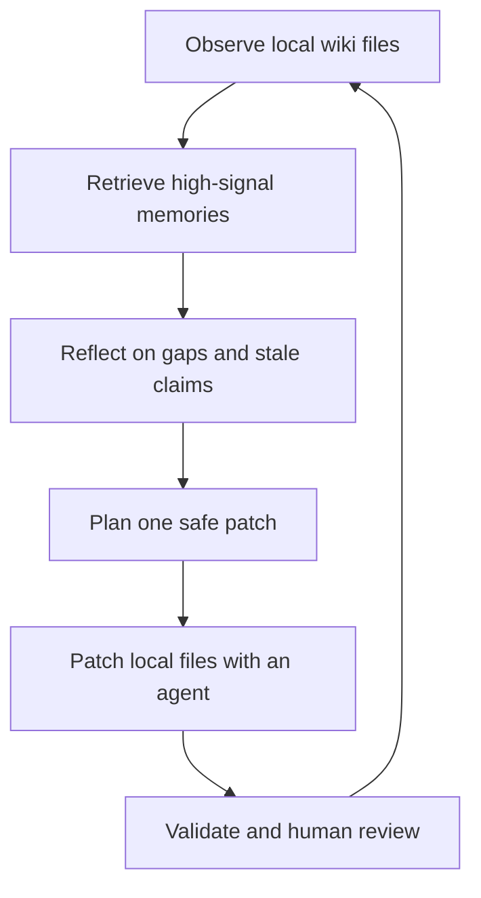

# Self-evolving Agentic Wiki / 自进化代理笔记

## It is a local wiki that can ask for its own next improvement {#what-it-is}

A **Self-evolving Agentic Wiki** is a local knowledge pack that can be read by a human, inspected by a local agent, and improved through a controlled loop.

In SiliWiki, “self-evolving” does **not** mean the wiki silently rewrites itself. It means the wiki stores enough structure for the next agent run to propose a safe, reviewable improvement:

- `content.md` explains the topic.
- `glossary.json` keeps key terms stable.
- `raw/sources.md` records evidence.
- `skills/siliwiki-writer/SKILL.md` tells the agent how to write.
- `evolution/plan.md` records the next proposed patch.

## Why this matters {#why-it-matters}

Most AI-generated notes are hard to maintain because the reasoning disappears after the chat ends. SiliWiki keeps the reasoning around the note:

1. What terms did we define?
2. Which claims have sources?
3. Which parts are still weak?
4. What should the next agent improve first?
5. Which command proves the pack still works?

That makes agent-generated writing closer to a small knowledge system than a disposable answer.

## SiliLoop: observe → retrieve → reflect → plan → patch → validate {#sili-loop}



SiliLoop is inspired by agent-memory systems such as **Generative Agents**, **MemGPT**, **Reflexion**, **Voyager**, and **Self-RAG**. The SiliWiki version is deliberately smaller: it stores the loop as local files and requires validation before the reader treats a change as trusted.

## Memory model {#memory-model}

SiliWiki turns a wiki pack into a **memory stream**:

| Memory entry | Where it comes from | Why it matters |
| --- | --- | --- |
| Section memory | headings and paragraphs in `content.md` | helps the agent locate weak explanations |
| Glossary memory | entries in `glossary.json` | keeps important terms consistent |
| Source memory | anchors in `raw/sources.md` | protects the audit trail |
| Gap memory | missing sources, missing diagrams, stale dates, uncertainty markers | drives the next improvement plan |

The CLI ranks entries with recency, importance, and relevance to the user's focus. This mirrors the retrieval pattern from Generative Agents, but the output is plain Markdown that the user can review.

## Glossary and sources are part of the interface {#glossary-and-sources}

A SiliWiki note defines its own important terms. That is why this page has glossary terms for `SiliLoop`, `memory stream`, `reflection`, `evolution plan`, and `glossary`.

Sources are equally important. If a future agent wants to change the explanation of agent memory, it should first inspect `raw/sources.md`, then preserve or improve the source anchors. This keeps the wiki readable for humans and usable for agents.

## CLI walkthrough {#cli-walkthrough}

Generate a plan:

```bash
npm run evolve -- self-evolving-agentic-wiki --focus "agent memory"
```

Write the plan into the content pack:

```bash
npm run evolve -- self-evolving-agentic-wiki --focus "agent memory" --write
```

Then ask a local agent:

```text
Read the SiliWiki writer skill and evolution/plan.md.
Execute only the first safe patch.
Preserve glossary entries and source anchors.
Run npm run validate afterwards.
```

## Human review boundary {#human-review}

SiliWiki can propose what should change, but a human still decides what is accepted. This is intentional:

- The plan is a proposal, not an automatic migration.
- A source anchor should support important claims.
- A glossary entry should not be deleted just because the current note does not use it often.
- Validation catches structure problems, but humans still judge meaning and evidence quality.

## References {#references}

- Park et al., **Generative Agents: Interactive Simulacra of Human Behavior**, UIST 2023. DOI: [10.1145/3586183.3606763](https://doi.org/10.1145/3586183.3606763). See `raw/sources.md#generative-agents`.
- Packer et al., **MemGPT: Towards LLMs as Operating Systems**, arXiv: [2310.08560](https://arxiv.org/abs/2310.08560). See `raw/sources.md#memgpt`.
- Shinn et al., **Reflexion: Language Agents with Verbal Reinforcement Learning**, arXiv: [2303.11366](https://arxiv.org/abs/2303.11366). See `raw/sources.md#reflexion`.
- Wang et al., **Voyager: An Open-Ended Embodied Agent with Large Language Models**, arXiv: [2305.16291](https://arxiv.org/abs/2305.16291). See `raw/sources.md#voyager`.
- Asai et al., **Self-RAG: Learning to Retrieve, Generate, and Critique through Self-Reflection**, arXiv: [2310.11511](https://arxiv.org/abs/2310.11511). See `raw/sources.md#self-rag`.
