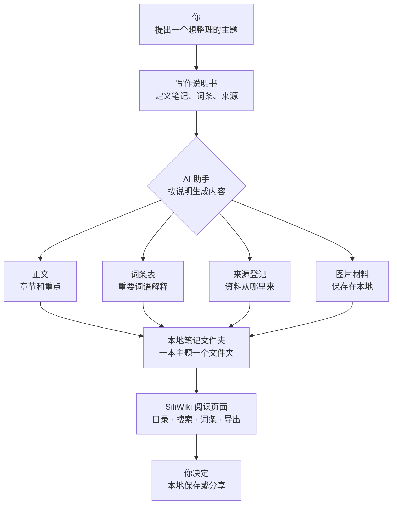
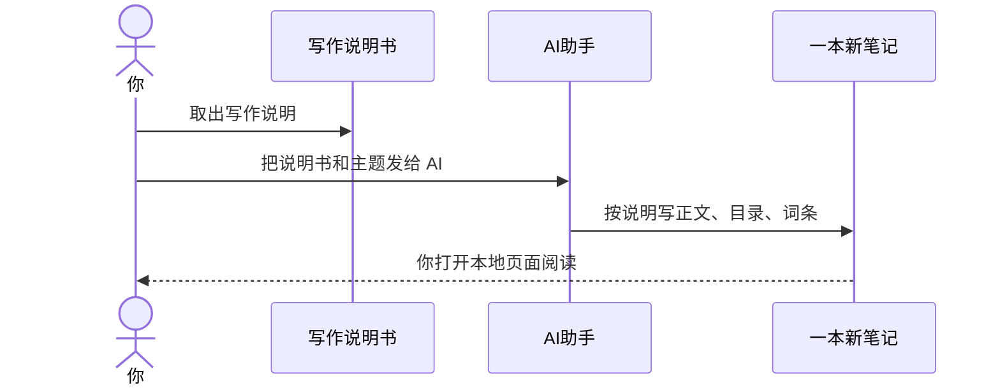
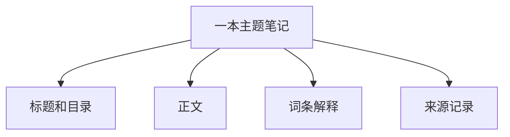
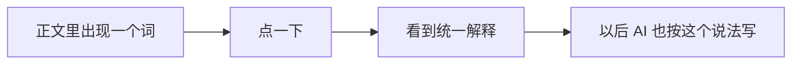
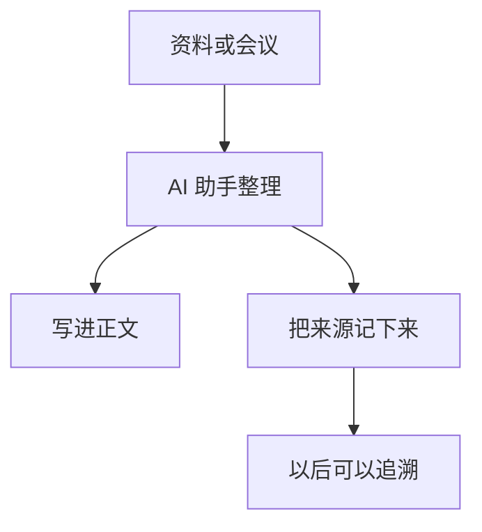
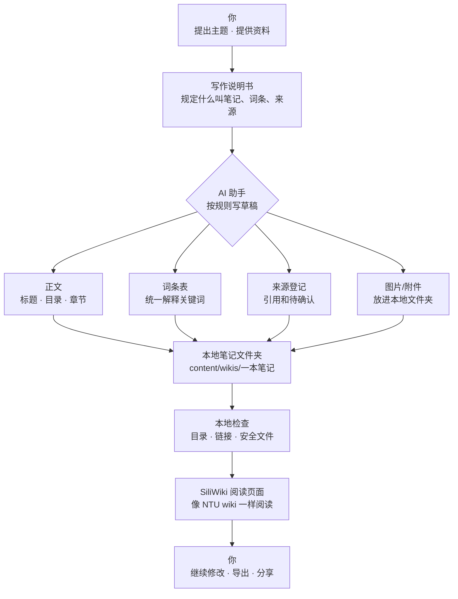
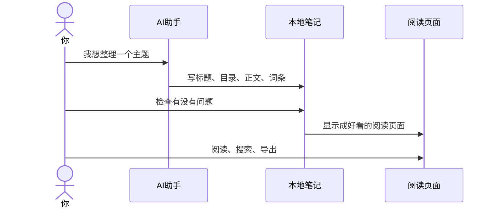
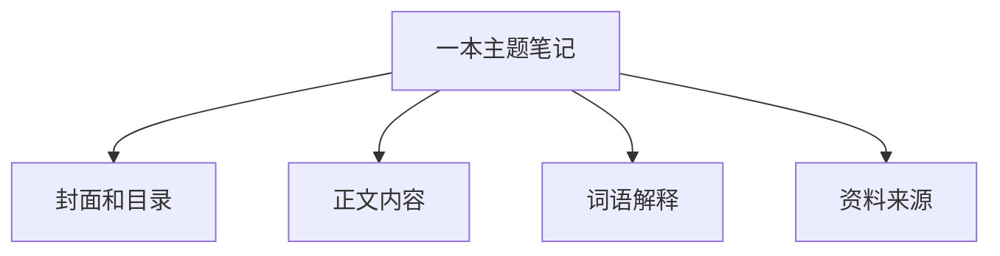
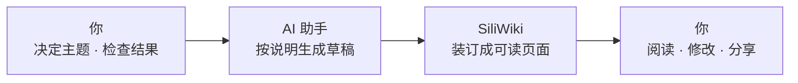

# SiliWiki V1 小白使用说明

这页是给第一次接触硅基笔记的人看的。你不需要懂技术，只要知道三件事：**你有一个本地笔记书架；你把写作说明交给自己的 AI 助手；AI 助手按说明把内容写成一本可以打开阅读的笔记。**

<div class="tldr">
<h4>先记住一句话</h4>
<strong>硅基笔记 = 一本放在你电脑里的“智能说明书书架”。</strong><br>
你告诉 AI 助手想整理什么主题，它按固定格式写好内容；你打开网页一样的界面阅读、搜索、看词条、导出。
</div>



<div class="stat-grid">
  <div class="stat"><div class="stat-value">1</div><div class="stat-label">一个本地书架</div></div>
  <div class="stat"><div class="stat-value">1</div><div class="stat-label">一份写作说明</div></div>
  <div class="stat"><div class="stat-value">N</div><div class="stat-label">很多本主题笔记</div></div>
  <div class="stat"><div class="stat-value">0</div><div class="stat-label">默认不上传云端</div></div>
</div>

<h2 id="what-you-get">0.1 你会得到什么</h2>

你可以把 SiliWiki 想成一个**本地书架**：

- 每一个主题，就是书架上的一本小书。
- 每本小书都有正文、目录、词条解释和来源记录。
- AI 助手负责帮你写初稿。
- 你负责检查、修改、决定要不要分享出去。

<div class="two-col">
<div class="card">
<h4>以前的方式</h4>
<ul>
<li>聊天记录散在各处</li>
<li>同一个概念反复解释</li>
<li>过几天就找不到重点</li>
<li>AI 每次写法都不一样</li>
</ul>
</div>
<div class="card">
<h4>硅基笔记的方式</h4>
<ul>
<li>一个主题变成一本本地笔记</li>
<li>目录清楚，方便阅读</li>
<li>重要词语统一解释</li>
<li>以后可以继续让 AI 维护</li>
</ul>
</div>
</div>

<h2 id="v1-product-shape">0.2 V1 长什么样</h2>

第一版只做一个很简单的闭环：**让 AI 帮你生成一本能长期保存的本地笔记。**

<div class="diagram flow-diagram">
<div class="diagram-title">V1 最小闭环</div>
<div class="flow-row">
  <div class="flow-node"><strong>AI 助手</strong><span>按写作说明生成草稿</span></div>
  <div class="flow-arrow">→</div>
  <div class="flow-node"><strong>主题笔记</strong><span>正文、目录、词条、来源</span></div>
  <div class="flow-arrow">→</div>
  <div class="flow-node"><strong>阅读页面</strong><span>打开、搜索、查看词条、导出</span></div>
</div>
</div>

V1 暂时不追求复杂功能。它先把最关键的一件事做好：**把一次聊天变成一本可以反复打开的笔记。**

<h2 id="install-and-run">1.1 安装并启动</h2>

如果你会打开命令行，就复制下面几行：

```bash
git clone <项目地址>
cd siliwiki
npm install
npm run dev
```

然后打开浏览器访问：

```text
http://127.0.0.1:3000
```

如果你不知道这些命令是什么意思，也没关系。你可以把它理解成：

1. 把项目下载到电脑里。
2. 进入这个文件夹。
3. 安装需要的东西。
4. 打开本地预览页面。

<div class="flag-blue">
<strong>小白理解：</strong>这不是把你的内容传到别人网站上，而是在你自己的电脑上开了一个本地阅读页面。
</div>

<h2 id="give-skill-to-agent">1.2 把写作说明交给 AI 助手</h2>

项目里自带一份**给 AI 助手看的写作说明书**。你不用记住技术名词，只要知道：它会告诉 AI 应该怎么写一本结构清楚的主题笔记。

导出这份说明书：

```bash
npm run skill > siliwiki-skill.md
```

然后把 `siliwiki-skill.md` 里的内容贴给你的 AI 助手，并告诉它你想整理什么主题。



<h2 id="generate-content-pack">1.3 生成一本新笔记</h2>

先创建一本空白笔记，例如“电池回收”：

```bash
npm run new -- battery-recycling --title "电池回收笔记"
```

然后让 AI 助手往这本笔记里填内容。

你不需要记住很多文件名，只要理解这四样东西：

| 部分 | 像什么 | 作用 |
|---|---|---|
| 标题和目录 | 一本书的封面和目录 | 告诉读者这本书讲什么 |
| 正文 | 书的章节 | 真正解释主题内容 |
| 词条 | 书后的术语解释 | 解释容易混淆的词 |
| 来源 | 参考资料清单 | 记录内容从哪里来 |

<h2 id="preview-and-validate">1.4 预览与检查</h2>

AI 写完后，先检查一下有没有明显问题：

```bash
npm run validate
```

再打开本地页面：

```bash
npm run dev
```

如果你的笔记名字是 `battery-recycling`，就打开：

```text
http://127.0.0.1:3000/wiki/battery-recycling
```

<div class="flag-green">
<strong>推荐习惯：</strong>每次让 AI 改完内容，都先检查，再打开页面看。这样不容易留下坏链接、坏目录或混乱词条。
</div>

<h2 id="wiki-spec">2.1 什么是主题笔记</h2>

在 SiliWiki 里，**主题笔记** 可以先理解成“一本可以长期维护的小书”。

它不是临时聊天，也不是一次性文章。它更像：

- 一本小手册
- 一个主题档案夹
- 一份能不断更新的知识说明书



判断一本主题笔记好不好，看这几个问题：

1. 一个陌生人能不能看懂它在讲什么？
2. 重要词语有没有解释清楚？
3. 内容来源有没有记录？
4. 下次 AI 能不能接着维护，而不是重头再写？

<h2 id="glossary-spec">2.2 什么是词条表</h2>

**词条表**就是一本笔记里的“统一解释表”。你可以直接把它理解成“重要词语解释”。

比如一本关于电池的笔记里，可能会反复出现这些词：

- 回收
- 梯次利用
- 正极材料
- 生命周期
- 碳排放

如果每次都重新解释，会很乱。所以我们把它们放进词条表里：



<div class="card">
<h4>为什么词条很重要？</h4>
<p>长期笔记最怕“同一个词有很多叫法”。词条表能把叫法统一起来，让人和 AI 都不容易跑偏。</p>
</div>

<h2 id="source-registry">2.3 什么是来源登记</h2>

来源登记就是“这句话从哪里来的”。

它可以记录：

- 一篇文章
- 一份报告
- 一次会议纪要
- 一张截图
- 你自己的一段观察



<div class="flag-yellow">
<strong>重要原则：</strong>AI 可以帮你总结，但不能假装有来源。没有来源就写“待确认”。
</div>

<h2 id="system-architecture">3.1 整体图：这件事怎么运转</h2>

下面这张图用最简单的话说明：人、AI 助手、笔记、阅读页面之间是什么关系。



这张图里最重要的是：**内容先放在你电脑里。你想分享时再分享，不想分享就只是本地笔记。**

<h2 id="generation-sequence">3.2 从想法到笔记的过程</h2>



如果把它说得更白话一点：

> 你说需求，AI 写草稿，硅基笔记把草稿变成一本能看的小书。

<h2 id="folder-map">3.3 这本小书里面有什么</h2>

你可以不用记英文文件名，只要知道一本笔记大概分四层：



如果你真的打开文件夹，会看到类似这样：

```text
一本笔记/
├── 标题和目录
├── 正文
├── 词条解释
└── 来源记录
```

<h2 id="role-map">3.4 角色分工图</h2>

这张图专门说明：你、AI 助手和 SiliWiki 各自做什么，避免把所有事情都丢给 AI。



<h2 id="example-prompt">4.1 给 AI 助手的例子</h2>

你可以这样说：

```text
请按照硅基笔记的写作说明，帮我做一本“AI 记忆系统入门”的笔记。
目标读者是完全不懂技术的人。
请写得像一本小白手册：先解释是什么，再解释为什么有用，最后告诉我怎么继续学习。
请加上词条解释和来源记录。
写完后帮我检查一遍。
```

更生活化一点，你也可以这样说：

```text
我有一堆关于电池回收的资料，你帮我整理成一本小白能看懂的笔记。
不要写得像论文，要像给朋友解释。
重要词语单独做词条。
不确定的地方标注“待确认”。
```

<h2 id="v1-scope">4.2 第一版做什么，不做什么</h2>

第一版先做这些：

- 打开本地书架
- 阅读一本主题笔记
- 搜索当前笔记
- 查看词条解释
- 导出内容
- 让 AI 按说明生成新笔记

第一版暂时不做这些：

- 账号登录
- 多人协作
- 云端同步
- 在线发布市场
- 复杂编辑器

<div class="flag-green">
<strong>为什么先这样做：</strong>越简单，越容易让用户理解，也越容易保证内容还在自己手里。</div>

<h2 id="next-steps">4.3 下一步</h2>

下一步可以继续做：

1. 让页面里的图更漂亮。
2. 让 AI 改完后自动告诉你改了哪里。
3. 给不同 AI 助手准备不同使用示例。
4. 支持把会议记录、文章、资料一键整理成一本笔记。
5. 增加更多主题样式，让每本笔记更像一本独立的小书。

最终目标很简单：

> 你只要说“我想整理这个主题”，AI 就能帮你生成一本结构清楚、词条统一、可以长期维护的本地笔记。
