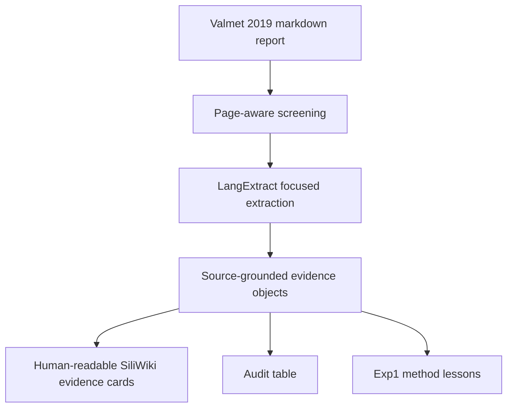

# Valmet 2019 LCA Evidence Extraction Demo

这是一页 **human-readable** 的 Report-to-LCA Evidence Engine 示例：我们从 20,449 份 markdown 企业可持续发展报告语料中，选取 `valmet_2019_GRI_Supplement.md`，把它转成可读的 LCA / Scope 3 / audit evidence review，而不是直接展示 raw JSON。

<strong>TL;DR</strong> 
Valmet 2019 GRI Supplement 是一个非常适合 Exp1 的单篇样本：它包含 GRI 305 Scope 1/2/3 表格、Scope 3 Category 1/4/6/9、water/waste 表、产品生命周期分析声明、use-phase impact claim，以及 DNV GL limited assurance。LangExtract 可以把关键证据抽成 source-grounded evidence objects；SiliWiki 再把这些 objects 转成人能读懂的 evidence cards、audit table 和方法观察。

## Source report {#source-report}

| Field | Value |
| --- | --- |
| Company | Valmet |
| Report | GRI Supplement 2019 |
| Source format | Markdown converted from corporate sustainability report |
| Corpus | `markdown报告.zip` → 20,449 markdown reports |
| Local source filename | `valmet_2019_GRI_Supplement.md` |
| Report size | ~112 KB markdown |
| Page markers | 44 page markers using `## 第 N 页` |
| Extraction target | LCA-relevant evidence, Scope 3 evidence, product/use-phase claims, auditability signals |

The source is not a PDF anymore; it is already page-aware markdown. That is ideal for the Evidence Engine because every extraction can be mapped back to a page marker.

## What was extracted {#what-was-extracted}

This demo converts one report into three reader-facing layers:

1. **Evidence cards** — compact human summaries of each important evidence group.
2. **Audit table** — exact evidence text, value, unit, source page, applicability, and limitation.
3. **Method notes** — what worked, what failed, and what this means for Exp1.

## Page map {#page-map}

The full report was scanned page-by-page. The evidence-rich pages are:

| Page | Evidence type | Why it matters |
| --- | --- | --- |
| p.3 | Reporting basis, GRI, assurance markers | Establishes reporting framework and assurance context |
| p.8 | GRI content index for water, energy, emissions, waste, products | Index points to where evidence should be found |
| p.20 | Sustainable solutions, LCA/use-phase framing | Early product/use-phase narrative |
| p.23 | Water withdrawal and value-chain water-impact discussion | Environmental evidence beyond carbon |
| p.24 | GHG emissions, Scope 1/2/3, GHG intensity | Strongest quantitative Scope 3 evidence |
| p.25 | Air emissions and waste by disposal method | Additional environmental inventory evidence |
| p.26 | Product and service environmental impacts, LCA, use-phase claims | Screening LCA / product-impact evidence |
| p.39–40 | Independent limited assurance | Auditability and assurance scope |

## Evidence card 1 — Corporate GHG inventory {#ghg-inventory}

Valmet reports Scope 1 and Scope 2 GHG emissions for 2019, 2018 and 2017. For 2019, the extracted values are:

| Indicator | 2019 value | Unit | Source page | Applicability |
| --- | ---: | --- | --- | --- |
| Scope 1 emissions | 17.6 | 1,000 tCO2 | p.24 | `corporate_inventory_ready` |
| Scope 2 emissions, location-based | 69.0 | 1,000 tCO2 | p.24 | `corporate_inventory_ready` |
| Scope 2 emissions, market-based | 83.0 | 1,000 tCO2 | p.24 | `corporate_inventory_ready` |

**Interpretation:** these values are usable for corporate inventory review and Scope 1/2 benchmarking. They are not product-level LCA inputs because the report does not provide product functional units or product-specific foreground flows.

**Important OCR/markdown artifact:** the source text appears as `Scope 12 17.6 17.7 16.8`, where the footnote marker `2` is attached to `Scope 1`. The extractor still interpreted it correctly, but the production pipeline should clean footnote markers before evaluation.

## Evidence card 2 — Scope 3 category evidence {#scope3-evidence}

Valmet discloses several Scope 3 categories. These are much more directly useful for our Report-to-LCA Evidence Engine than generic climate targets, because they map to GHG Protocol value-chain categories.

| Scope 3 category | 2019 value | Unit | Source page | Applicability |
| --- | ---: | --- | --- | --- |
| Category 1 — Purchased goods and services | 2,618 | 1,000 tCO2 | p.24 | `scope3_evidence_ready` |
| Category 4 — Upstream transportation and distribution | 76 | 1,000 tCO2 | p.24 | `scope3_evidence_ready` |
| Category 6 — Business travel | 38 | 1,000 tCO2 | p.24 | `scope3_evidence_ready` |
| Category 9 — Downstream transportation and distribution | 13 | 1,000 tCO2 | p.24 | `scope3_evidence_ready` |

**Interpretation:** this is strong Scope 3 evidence. It supports corporate value-chain evidence mining and category coverage analysis. It still does not provide enough granularity for rigorous product-level LCA because purchased goods are aggregated at company level.

## Evidence card 3 — Product and use-phase LCA claims {#product-use-phase}

Valmet also reports product/use-phase claims that are useful for screening and audit review.

| Evidence | Value | Source page | Applicability | Missing fields |
| --- | ---: | --- | --- | --- |
| “Based on life cycle analysis (LCA) of selected product families” | — | p.26 | `weak_signal_only` | product boundary, functional unit, study details |
| “around 95% of the environmental impacts of Valmet’s entire value chain occur when Valmet’s solutions are being used for production at customer sites” | 95% | p.26 | `screening_lca_ready` | functional unit, product-specific inventory, method details |
| “the content of bio-based and/or recycled raw material is 75–96%” | 75–96% | p.26 | `screening_lca_ready` | functional unit, quantified impact reduction |
| “vacuum energy consumption can be decreased by 30–60%” | 30–60% | p.26 | `screening_lca_ready` | baseline, total energy consumption, functional unit |
| “forming section drive power will be more than 50% lower” | >50% | p.26 | `screening_lca_ready` | baseline, total drive power, use conditions |

**Interpretation:** these are not useless claims. They are valuable evidence that Valmet thinks product use-phase dominates value-chain impact, and that product-level improvements may reduce energy or material use. But they should be treated as **screening / weak evidence**, not as audit-ready product LCA inventory.

## Evidence card 4 — Water and waste signals {#water-waste}

The page-level scan found relevant water and waste evidence:

| Topic | Source page | Evidence type | Use in Evidence Engine |
| --- | --- | --- | --- |
| Water withdrawal | p.23 | Quantitative GRI 303-3 table | Environmental inventory evidence |
| Value-chain water impact | p.23 | LCA-related narrative | Screening evidence; helps identify use-phase / supply-chain relevance |
| Waste by disposal method | p.25 | Quantitative GRI 306-2 table | Environmental inventory evidence |
| Air emissions | p.25 | Quantitative GRI 305-7 table | Environmental evidence beyond GHG |

These sections were identified in the full-report page scan, but the focused LangExtract demo prioritized GHG, Scope 3 and product-use-phase evidence. In the production Exp1 pipeline, water and waste would be separate extraction tasks with their own examples and validation rules.

## Evidence card 5 — Assurance and auditability {#assurance}

The report includes an independent limited assurance section by DNV GL.

| Audit signal | Source page | Interpretation |
| --- | --- | --- |
| Independent limited assurance report | p.39 | Strengthens auditability for selected information |
| Assurance limited to selected information | p.39 | Not every claim in the report is assured |
| Energy-use data used in GHG calculations has inherent limitations | p.40 | Important uncertainty note for GHG evidence |

**Interpretation:** assurance improves confidence, but it is scoped. The Evidence Engine should preserve assurance status at evidence-object level where possible, not simply mark the whole report as “assured”.

## Human-readable audit summary {#audit-summary}

For this report, a reviewer would see:

| Dimension | Assessment |
| --- | --- |
| Scope 1/2 disclosure | Strong: quantitative, multi-year, units provided |
| Scope 3 disclosure | Moderate to strong: several categories disclosed, but aggregated |
| Product-level LCA readiness | Weak: LCA is referenced, but functional unit and detailed inventory are missing |
| Screening LCA usefulness | Good: use-phase impact share and product-improvement claims can guide screening hypotheses |
| Auditability | Good for selected metrics because source pages and assurance section exist |
| Greenwashing risk indicator | Low to medium for extracted sections: strong quantitative disclosure exists, but product/use-phase claims need method details |

## Method observations {#method-observations}

### What worked

- Markdown page markers made page-level provenance easy.
- LangExtract produced exact `char_interval` grounding for all focused GHG/Scope 3 rows.
- The Scope 3 table was extracted cleanly into category-level evidence.
- Product/use-phase claims were converted into applicability labels and missing-field notes.

### What failed or needs engineering

- Long mixed chunks caused one Gemini JSON parse error in the broader page 24–26 run. Smaller focused chunks fixed it.
- Footnote markers polluted text, e.g. `Scope 12` instead of `Scope 1²`. This needs preprocessing.
- The model extracts better when the task is specific: a GHG/Scope 3 table extractor works better than a single universal extractor.
- Water and waste should be separate extraction passes rather than mixed with GHG and LCA claims.

## Exp1 implications {#exp1-implications}

This single-report case suggests that Exp1 should be designed as **task-specific extraction passes**, not one giant prompt over whole reports.

Recommended Exp1 passes:

1. GHG inventory pass — Scope 1, Scope 2, GHG intensity.
2. Scope 3 pass — categories 1–15, values, units, years, missing categories.
3. Water/waste/materials pass — GRI 303/306/301-style metrics.
4. Product/use-phase LCA pass — product claims, LCA references, use-phase percentages, missing functional units.
5. Assurance/audit pass — assurance scope, method notes, uncertainty, limitations.

For evaluation, the human-facing output should be reviewed as evidence cards like this page, while the machine-facing output remains JSONL / Evidence Objects.

## Changelog

- 2026-05-13: Created a human-readable SiliWiki case study from one complete markdown corporate sustainability report, using Valmet 2019 GRI Supplement as the first concrete Report-to-LCA Evidence Engine demo.
