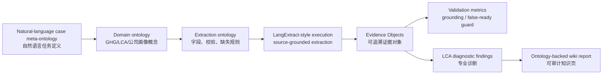

# Valmet 五年本体驱动 LCA 诊断：从企业披露到专业证据对象

这是一份公司级 ontology extraction case study。它选择 Valmet 2018–2022 连续五年的 GRI Supplement，把自然语言 case-study meta-ontology 编译成 domain ontology / extraction ontology，再用 LangExtract-style source-grounded extraction 生成 Evidence Objects，最后从专业 LCA 与企业可持续披露角度做审计、诊断和公司评价。

<strong>TL;DR</strong> 
Valmet 是一个非常适合做 ontology-driven LCA extraction 的样本：它不是简单的消费品公司，而是面向制浆造纸、能源、自动化与流体控制等过程工业的 B2B 技术与服务公司。它自身运营排放不是故事的全部，真正的环境杠杆在客户现场的技术使用阶段、供应链材料与长期服务周期。五年报告共抽取 44 条 source-grounded Evidence Objects，grounded rate = 1.00，false-ready guard violations = 0。结论是：Valmet 的公司级 GHG inventory 与 Scope 3 hotspot screening 证据基础较强，报告透明度和审计成熟度不错；但它的披露还不能直接支撑 product LCA，因为缺 functional unit、product system boundary、allocation method，以及 Scope 3 emission-factor / activity-data 细节。这类公司最需要的不是“再抓几个字段”，而是用 ontology 把公司画像、业务模式、环境杠杆、Scope 数据、LCA claim、assurance scope 和 missing evidence 统一管理起来。

## 研究问题 {#research-question}

本 case study 回答一个实际问题：如果用户只提供自然语言 meta-ontology，系统能不能自动把五年 sustainability reports 转换为可审计、可追溯、可用于 LCA 判断的 evidence base？

这里的关键不是“抓一堆字段”，而是把抓取出来的每条信息放进稳定的 ontology 管理框架中。对于 unstructured data，真正难点有三个：

1. **概念不稳定。** 报告里可能写 “Scope 3 Category 1”、也可能写 “purchased goods and services”，还可能在表格脚注里说明边界。没有 ontology，模型抓出来的是碎片字符串。
2. **字段不等价。** 同样是“碳排放”，公司级 Scope 1/2、Scope 3 category total、产品 LCA foreground flow、use-phase scenario、net-zero target，本质上不是同一种 evidence。
3. **业务语义必须进入抽取规则。** Valmet 这类过程工业技术公司，环境影响主要发生在客户使用其技术的生产阶段。如果 ontology 只定义 value/unit/year，而不定义 company role、customer-use leverage、assurance scope、method completeness，就会把战略判断和 LCA 判断混在一起。

## 公司画像：Valmet 是什么类型的公司？ {#company-profile}

**Valmet Oyj** 是一家芬兰上市公司，总部位于 Espoo，股票在 Nasdaq Helsinki 上市。它的核心定位不是“卖单一产品”，而是为过程工业提供技术、自动化、流体控制、服务与生命周期解决方案。Valmet 官方公司页面把自己描述为服务 process industries 的全球技术领导者，业务横跨 biomaterials solutions and services、process performance solutions，以及 pulp、packaging and paper、tissue、energy、services、automation solutions、flow control 等方向。

从 LCA / Scope 3 / ontology extraction 的角度看，Valmet 的特殊性在于：

| 维度 | 观察 | 对 LCA 抽取的含义 |
| --- | --- | --- |
| 公司类型 | 过程工业技术、自动化、服务与流体控制供应商 | 不能只按“制造商自有工厂排放”理解；应建模为 customer-process enabler |
| 客户关系 | 服务贯穿客户生命周期，强调长期技术、维护、自动化与过程性能 | 可能拥有丰富 customer-use phase 与服务数据，但公开报告中未完全结构化披露 |
| 环境影响位置 | 报告称价值链环境影响主要来自客户使用 Valmet 技术的阶段；2022 报告还提到约 1% 来自自有地点、约 4% 来自供应链，其余主要来自客户使用阶段 | ontology 必须区分 own operations、supply chain、customer use phase，不能把公司级排放与产品 LCA 混成一张表 |
| 披露成熟度 | 连续多年 GRI Supplement、Scope 1/2/3 表格、limited assurance、环境数据收集系统 | 适合做纵向 evidence extraction 与 disclosure audit |
| 最大短板 | 公开报告缺 product family functional unit、system boundary、allocation、emission factor、activity data | 适合 hotspot screening，但 product LCA readiness 仍低 |

这个公司样本的价值在于，它迫使我们面对一个真实问题：**很多工业公司的可持续披露不是“没有数据”，而是“数据处在错误的抽象层级”。** 报告层面的 Scope 3 category total 对投资者、ESG、供应链管理很有用；但对产品 LCA 来说，它缺少功能单位、边界、活动数据和计算方法。因此 ontology extraction 的目标不是让 LLM “看起来抓到了碳数据”，而是让系统知道这些数据到底能用于什么、不能用于什么。

## 为什么选择 Valmet？ {#company-selection}

选择 **Valmet** 的原因有三层。

第一，corpus 中有 Valmet 连续多年 GRI Supplement，可做 longitudinal case。2018–2022 五年报告中包含 GHG Scope 1/2、Scope 3 category、assurance、LCA/use-phase language、target claim、missing disclosure 等多类证据，适合测试 ontology extraction 能不能跨年份保持概念一致。

第二，Valmet 的业务本身有强 LCA 意义。它卖的是过程工业技术和服务，不只是单个物理产品。它的客户用这些技术进行生产，环境影响往往发生在客户现场。因此，如果我们只抽 “Scope 1/2/3 value”，会漏掉这个公司真正的环境杠杆：**它通过技术效率、能源效率、水效率、自动化控制和设备生命周期，间接影响客户工厂的资源消耗和排放。**

第三，它非常适合检验 ontology extraction 是否能区分以下几类看似相近、实则不同的证据：

- corporate inventory：公司层面的 Scope 1/2/3 disclosure；
- Scope 3 hotspot screening：供应链和价值链类别层面的热点判断；
- product LCA readiness：是否能进入产品/产品族 LCA 建模；
- customer-use leverage：公司技术在客户使用阶段造成或减少影响的能力；
- assurance / auditability：哪些指标被第三方有限保证，哪些只是披露叙述；
- missing evidence：哪些关键 LCA 字段没有披露，不能被模型自动补全。

## 对 Valmet 这家公司本身的评价 {#company-assessment}

我的判断是：**Valmet 是一个“环境杠杆很高、披露成熟度较高、但 product-LCA 透明度还不够”的工业技术公司。**

这句话可以拆成四个部分。

### 1. 它的环境影响不应该只看自有运营

Valmet 自身工厂和办公地点的 Scope 1/2 当然重要，但这不是它环境影响的核心。报告中的 LCA/use-phase language 明确把大量价值链影响指向 customer use phase。对 Valmet 这种公司，最关键的问题不是“公司办公室用了多少电”，而是：

- 它的技术是否让客户的生产过程更节能、更省水、更少废弃物？
- 它的自动化系统是否提高过程稳定性，降低单位产品资源消耗？
- 它的服务与维护是否延长设备寿命，减少替换、停机和过度生产？
- 它的 flow control / automation / process performance solutions 是否能量化到客户现场的 avoided impact 或 efficiency gain？

如果这些问题有扎实数据，Valmet 的正向环境杠杆可能很大；如果没有，这些叙述只能停留在战略层面，不能直接变成 LCA 结果。

### 2. 它的报告质量适合“审计型抽取”，但不等于“LCA-ready”

Valmet 的 GRI Supplement 有连续年份、明确表格、Scope 3 category rows、assurance statement 和管理方法说明。这对 ontology extraction 很友好：系统可以稳定地抽出 year、value、unit、concept、page、quote，并生成 Evidence Objects。

但从专业 LCA 看，这些还不够。比如 Scope 3 Category 1 purchased goods and services 是很强的 hotspot signal，但报告片段没有提供足够的 supplier-specific activity data、emission factor provenance、calculation method 和 boundary notes。也就是说：

> Valmet 的披露适合做公司级趋势分析和热点筛查；不适合被直接复制进产品 LCI 模型。

这正是 ontology 的价值：它不仅保存 value，还保存 `applicability` 和 `audit_flags`，告诉后续 agent “这条证据能做什么、不能做什么”。

### 3. 它是专业化 agent 的好目标行业

Valmet 这类工业技术公司非常适合发展 **expert heuristic + ontology extraction** 的专业化 agent。原因是：

- 概念体系稳定：Scope、供应链、设备、服务、客户使用阶段、自动化、能源、水、维护、生命周期，都是可建模概念；
- 文档来源丰富：GRI Supplement、Annual Review、assurance report、产品页面、技术白皮书、客户案例都可以成为 evidence source；
- 专家规则重要：是否可用于 product LCA，不是通用 LLM 靠语感能判断的，必须编码 LCA heuristics；
- 业务价值明确：如果能把 Valmet 的产品族、客户行业、use-phase scenario 和 Scope 3 数据连接起来，就能形成比普通 ESG 摘要更有价值的 technical due diligence / LCA intelligence。

换句话说，Valmet 不是一个“抽碳排放表格”的简单样本，而是一个可以测试专业 agent 是否真的理解 industrial sustainability 的样本。

### 4. 对公司披露的批评：战略语言强，方法透明度仍需提高

Valmet 报告的优点是：叙事清楚，GRI 结构完整，连续年份披露较好，并且愿意使用 LCA / customer use phase language 来解释价值链影响。这比很多只披露 Scope 1/2 的公司更先进。

但短板也明显：公开报告没有把关键 LCA 计算前提充分结构化。尤其是：

- product family 的 functional unit 不清楚；
- customer use phase 的 scenario assumptions 不清楚；
- “约 95% 影响来自客户使用阶段”这类判断缺少可复核的 product-system boundary；
- Scope 3 category totals 缺少 emission-factor / activity-data / supplier-specific data 明细；
- assurance scope 不能自动外推到 product LCA claim。

所以对 Valmet 的评价不能简单说“好”或“不好”。更准确的说法是：**它已经有较高的 sustainability disclosure maturity，但要进入专业 LCA intelligence，还需要把业务、产品族、客户使用场景和计算方法进一步结构化。**

## 案例 ontology 设计 {#ontology-design}

本 case-study meta-ontology 把通用 Report-to-LCA ontology extraction 专门化为五年公司诊断。核心实体不是“字符串字段”，而是 typed Evidence Objects。每个 Evidence Object 都必须回答三个问题：

1. **它是什么概念？** 例如 `ghg.scope1`、`ghg.scope3.category1.purchased_goods_and_services`、`lca.life_cycle_analysis_claim`。
2. **它来自哪里？** 必须保留 source file、year、page、quote，避免模型凭空总结。
3. **它能用于什么？** 通过 applicability 和 audit flags 区分 corporate inventory、hotspot screening、weak signal、missing evidence、product-LCA-ready 等状态。

| 层级 | 本 case 中的角色 |
| --- | --- |
| Meta-ontology | 定义 concept type、required fields、validation rule、missing-evidence policy、diagnosis schema。 |
| Domain ontology | 定义 GHG Scope 1/2/3、Scope 3 categories、LCA/use-phase claims、assurance、target claims、missing disclosures，以及公司画像和业务语义。 |
| Extraction ontology | 定义本次从 Valmet 五年报告中实际抽哪些 class、字段、source quote、page、单位、audit flags。 |
| Evidence Objects | 存储每条具体抽取实例：concept type、canonical concept、value、unit、year、page、quote、applicability、missing fields、audit flags。 |

本 case 的主要 concept types：

| 概念类型 | 数量 | 解释 |
| --- | ---: | --- |
| `ghg_emission_metric` | 9 | Scope 1/2 公司级 GHG 指标 |
| `scope3_category_metric` | 19 | Scope 3 category-level 价值链指标 |
| `assurance_statement` | 10 | 第三方有限保证 / assurance 相关证据 |
| `lca_claim` | 2 | LCA / customer use phase 叙述证据 |
| `missing_disclosure` | 2 | 缺失方法或披露不足的证据对象 |
| `target_claim` | 2 | 减排目标 / carbon-neutral 叙述证据 |

## 抽取运行与验证结果 {#extraction-results}

本次运行使用 offline deterministic provider `ontology-rule-r2l-v1`。这一步的目的不是宣称 live LLM benchmark 质量，而是验证 ontology-managed extraction pipeline 的闭环：从定义概念，到抽取证据，到校验 grounding，再到形成诊断。

| 指标 | 结果 |
| --- | ---: |
| Reports | 5 |
| Evidence Objects | 44 |
| Grounded evidence | 44 |
| Grounded evidence rate | 1.00 |
| Missing-evidence objects | 2 |
| False-ready guard violations | 0 |

### 概念覆盖 {#concept-coverage}

| 标准概念 | 证据数量 |
| --- | ---: |
| `ghg.scope1` | 5 |
| `ghg.scope2.location_based` | 2 |
| `ghg.scope2.market_based` | 2 |
| `ghg.scope3.category1.purchased_goods_and_services` | 5 |
| `ghg.scope3.category4.upstream_transportation_distribution` | 5 |
| `ghg.scope3.category6.business_travel` | 5 |
| `ghg.scope3.category9.downstream_transportation_distribution` | 4 |
| `assurance.ghg_inventory_verification` | 10 |
| `lca.life_cycle_analysis_claim` | 2 |
| `missing.scope3_method` | 2 |
| `target.net_zero` | 2 |

### 审计标记 {#audit-flags}

| 审计标记 | 数量 | 含义 |
| --- | ---: | --- |
| `method_missing` | 21 | 有数值/单位，但缺计算方法、emission factor 或 activity data |
| `functional_unit_missing` | 2 | 有 LCA/use-phase claim，但缺功能单位 |
| `target_without_baseline` | 2 | 有目标叙述，但缺 baseline / scope / pathway |

`method_missing` 是本 case 最重要的质量信号：Scope 3 category rows 有数值和单位，适合 disclosure benchmarking / hotspot screening；但报告片段没有给出足够 emission-factor、activity-data 或 calculation-method detail，所以不能直接升格为 product LCA foreground inventory。

## 专业 LCA scorecard {#lca-scorecard}

| 评估项 | 评级 | 证据基础 |
| --- | --- | --- |
| Corporate inventory readiness / 公司级盘查可用性 | `medium-high` | D1: `ev_0b0bbb6d788b`, `ev_d817d2cbdb8e`, `ev_9860caae29cb`, `ev_9cc64e238689`, `ev_e73327c18a31` + Scope 2 source set |
| Scope 3 hotspot screening readiness / Scope 3 热点筛查可用性 | `high` | D2/D3: `ev_db0c3e17538e`, `ev_e4b2f83e57a3`, `ev_db0474f7fb92`, `ev_679bb4eee8d9`, `ev_f4913df49967` + full Scope 3 category table |
| Product LCA readiness / 产品 LCA 可用性 | `low` | D1/D3/D4: corporate inventory、method-missing flags、LCA/use-phase claims `ev_37831ba12f99`, `ev_a0bed69c021f` |
| Auditability / 可审计性 | `medium-high` | D5: `ev_957e7d86dd4e`, `ev_faaf1a420250`, `ev_8fda0855fca8`, `ev_cf99b5422e53`, `ev_598fe6711ee3` |

主要 blocker：

- `missing functional unit`：缺功能单位；
- `missing product system boundary`：缺产品系统边界；
- `missing allocation method`：缺分配方法；
- `missing Scope 3 emission-factor/activity-data detail`：缺 Scope 3 排放因子与活动数据细节。

## 五年指标表 {#metric-table}

以下表格不是手工录入，而是从 Evidence Objects / `diagnostic_findings.json` 生成；每个数值都保留 Evidence ID 和报告页码。

| 指标 | 本体概念 | 年份 | 数值 | 单位 | 证据 ID | 页码 |
| --- | --- | ---: | ---: | --- | --- | ---: |
| `scope1` | `ghg.scope1` | 2018 | 17.7 | 1,000 tCO2 | `ev_0b0bbb6d788b` | 22 |
| `scope1` | `ghg.scope1` | 2019 | 17.6 | 1,000 tCO2 | `ev_d817d2cbdb8e` | 24 |
| `scope1` | `ghg.scope1` | 2020 | 19.1 | 1,000 tCO2 | `ev_9860caae29cb` | 27 |
| `scope1` | `ghg.scope1` | 2021 | 21.5 | 1,000 tCO2 | `ev_9cc64e238689` | 27 |
| `scope1` | `ghg.scope1` | 2022 | 21.1 | 1,000 tCO2 | `ev_e73327c18a31` | 29 |
| `scope2_location` | `ghg.scope2.location_based` | 2018 | 73.1 | 1,000 tCO2 | `ev_482759b0aa55` | 22 |
| `scope2_location` | `ghg.scope2.location_based` | 2019 | 69.0 | 1,000 tCO2 | `ev_5e51927f0a85` | 24 |
| `scope2_market` | `ghg.scope2.market_based` | 2018 | 95.2 | 1,000 tCO2 | `ev_7fd544ee8e9d` | 22 |
| `scope2_market` | `ghg.scope2.market_based` | 2019 | 83.0 | 1,000 tCO2 | `ev_1ded939a4eb8` | 24 |
| `cat1` | `ghg.scope3.category1.purchased_goods_and_services` | 2018 | 2025.0 | 1,000 tCO2 | `ev_db0c3e17538e` | 22 |
| `cat1` | `ghg.scope3.category1.purchased_goods_and_services` | 2019 | 2618.0 | 1,000 tCO2 | `ev_e4b2f83e57a3` | 24 |
| `cat1` | `ghg.scope3.category1.purchased_goods_and_services` | 2020 | 1815.0 | 1,000 tCO2 | `ev_db0474f7fb92` | 27 |
| `cat1` | `ghg.scope3.category1.purchased_goods_and_services` | 2021 | 2783.0 | 1,000 tCO2 | `ev_679bb4eee8d9` | 27 |
| `cat1` | `ghg.scope3.category1.purchased_goods_and_services` | 2022 | 2237.0 | 1,000 tCO2 | `ev_f4913df49967` | 29 |
| `cat4` | `ghg.scope3.category4.upstream_transportation_distribution` | 2018 | 63.0 | 1,000 tCO2 | `ev_bee546d1ee49` | 22 |
| `cat4` | `ghg.scope3.category4.upstream_transportation_distribution` | 2019 | 76.0 | 1,000 tCO2 | `ev_2a5ce95d97a8` | 24 |
| `cat4` | `ghg.scope3.category4.upstream_transportation_distribution` | 2020 | 72.0 | 1,000 tCO2 | `ev_aa2b0e71fd9d` | 27 |
| `cat4` | `ghg.scope3.category4.upstream_transportation_distribution` | 2021 | 102.0 | 1,000 tCO2 | `ev_fff7d2339669` | 27 |
| `cat4` | `ghg.scope3.category4.upstream_transportation_distribution` | 2022 | 45.0 | 1,000 tCO2 | `ev_3d4c84923cab` | 29 |
| `cat6` | `ghg.scope3.category6.business_travel` | 2018 | 34.0 | 1,000 tCO2 | `ev_d8d60fd98505` | 22 |
| `cat6` | `ghg.scope3.category6.business_travel` | 2019 | 38.0 | 1,000 tCO2 | `ev_b9d32cef6d6d` | 24 |
| `cat6` | `ghg.scope3.category6.business_travel` | 2020 | 17.0 | 1,000 tCO2 | `ev_56506f871975` | 27 |
| `cat6` | `ghg.scope3.category6.business_travel` | 2021 | 18.0 | 1,000 tCO2 | `ev_5051f6106084` | 27 |
| `cat6` | `ghg.scope3.category6.business_travel` | 2022 | 37.0 | 1,000 tCO2 | `ev_3455f43625db` | 29 |
| `cat9` | `ghg.scope3.category9.downstream_transportation_distribution` | 2018 | 11.0 | 1,000 tCO2 | `ev_931ff86c0988` | 22 |
| `cat9` | `ghg.scope3.category9.downstream_transportation_distribution` | 2019 | 13.0 | 1,000 tCO2 | `ev_be669096ca82` | 24 |
| `cat9` | `ghg.scope3.category9.downstream_transportation_distribution` | 2020 | 13.0 | 1,000 tCO2 | `ev_303fb4f76c86` | 27 |
| `cat9` | `ghg.scope3.category9.downstream_transportation_distribution` | 2021 | 15.0 | 1,000 tCO2 | `ev_77060a9e5aab` | 27 |

## 本体支撑的诊断结论 {#diagnosis}

每条诊断都必须引用 ontology Evidence Objects。下面每个 diagnosis 都列出 Evidence IDs，并提供 evidence table：year、ontology concept、value/unit、page、source quote。完整对象保存在 `raw/valmet-5y-case/evidence_objects.jsonl` 与 `raw/valmet-5y-case/diagnostic_findings.json`。

### D1 — 公司级 GHG 盘查证据可审计，但不能直接等同产品 LCA {#d1}

- 严重性： `medium`
- 诊断：抽取 ontology 覆盖 2018–2022 五年 Scope 1 证据，Scope 1 从 17.7 增至 21.1 thousand tCO2，增幅约 19.2%。2018–2019 的 Scope 2 location/market-based evidence 也有 source grounding；但 2020–2022 的后续 Scope 2 行在当前 rule-provider pilot 中没有进入 accepted Evidence Objects，需要 live LLM 或人工校验补齐。
- LCA 含义：这些证据适合公司级 inventory review、纵向披露分析和审计上下文；但它们仍是 corporate-scope inventory，不是产品特定 foreground activity data，缺 functional unit 和 system boundary。
- 本体证据 IDs： `ev_0b0bbb6d788b`, `ev_d817d2cbdb8e`, `ev_9860caae29cb`, `ev_9cc64e238689`, `ev_e73327c18a31`, `ev_482759b0aa55`, `ev_5e51927f0a85`, `ev_7fd544ee8e9d`, `ev_1ded939a4eb8`
- 建议动作：把公司级 inventory 作为 audit context；若要做 product LCA，需要另行索取 product-level foreground flows、functional unit、product boundary、allocation rules 和 emission factors。

| 证据 ID | 年份 | 本体概念 | 数值 | 单位 | 页码 | 原文片段 |
| --- | ---: | --- | ---: | --- | ---: | --- |
| `ev_0b0bbb6d788b` | 2018 | `ghg.scope1` | 17.70 | 1,000 tCO2 | 22 | Scope 12 17.70 16.80 16.60 |
| `ev_d817d2cbdb8e` | 2019 | `ghg.scope1` | 17.6 | 1,000 tCO2 | 24 | Scope 12 17.6 17.7 16.8 |
| `ev_9860caae29cb` | 2020 | `ghg.scope1` | 19.1 | 1,000 tCO2 | 27 | Scope 12 19.1 17.6 17.7 |
| `ev_9cc64e238689` | 2021 | `ghg.scope1` | 21.5 | 1,000 tCO2 | 27 | Scope 12 21.5 19.1 17.6 19.7 |
| `ev_e73327c18a31` | 2022 | `ghg.scope1` | 21.1 | 1,000 tCO2 | 29 | Scope 12 21.1 21.5 19.1 21.5 |
| `ev_482759b0aa55` | 2018 | `ghg.scope2.location_based` | 73.10 | 1,000 tCO2 | 22 | Scope 2 (location based)3 73.10 70.00 66.70 |
| `ev_5e51927f0a85` | 2019 | `ghg.scope2.location_based` | 69.0 | 1,000 tCO2 | 24 | Scope 2 (location based)3 69.0 71.2 68.2 |
| `ev_7fd544ee8e9d` | 2018 | `ghg.scope2.market_based` | 95.20 | 1,000 tCO2 | 22 | Scope 2 (market based)4 95.20 92.70 95.60 |
| `ev_1ded939a4eb8` | 2019 | `ghg.scope2.market_based` | 83.0 | 1,000 tCO2 | 24 | Scope 2 (market based)4 83.0 87.5 91.5 |

### D2 — 已抓取 Scope 3 类别中，Purchased goods and services 是绝对主导热点 {#d2}

- 严重性： `high`
- 诊断：在已抽取的 Scope 3 category ontology 中，Category 1 purchased goods and services 在每个年份都是最大类别。它在 captured category sum 中的占比约 94.7%–96.5%。
- LCA 含义：对 Valmet 来说，上游采购、材料、零部件与供应商数据是 Scope 3 / LCA screening 的第一优先级。它说明 Valmet 不能只讲客户使用阶段，也必须把供应链材料数据做深。
- 本体证据 IDs： `ev_db0c3e17538e`, `ev_e4b2f83e57a3`, `ev_db0474f7fb92`, `ev_679bb4eee8d9`, `ev_f4913df49967`, `ev_bee546d1ee49`, `ev_2a5ce95d97a8`, `ev_aa2b0e71fd9d`, `ev_fff7d2339669`, `ev_3d4c84923cab`, `ev_d8d60fd98505`, `ev_b9d32cef6d6d`, `ev_56506f871975`, `ev_5051f6106084`, `ev_3455f43625db`, `ev_931ff86c0988`, `ev_be669096ca82`, `ev_303fb4f76c86`, `ev_77060a9e5aab`
- 建议动作：优先补充 supplier-specific activity data、material composition、procurement spend/activity split、emission-factor provenance，并把 Category 1 拆到可行动的供应商/材料层级。

| 证据 ID | 年份 | 本体概念 | 数值 | 单位 | 页码 | 原文片段 |
| --- | ---: | --- | ---: | --- | ---: | --- |
| `ev_db0c3e17538e` | 2018 | `ghg.scope3.category1.purchased_goods_and_services` | 2,025 | 1,000 tCO2 | 22 | Category 1: CO2 emissions from purchased goods and services6 2,025 1,665 1,288 |
| `ev_e4b2f83e57a3` | 2019 | `ghg.scope3.category1.purchased_goods_and_services` | 2,618 | 1,000 tCO2 | 24 | Category 1: CO2 emissions from purchased goods and services6 2,618 2,025 1,665 |
| `ev_db0474f7fb92` | 2020 | `ghg.scope3.category1.purchased_goods_and_services` | 1,815 | 1,000 tCO2 | 27 | Category 1: CO2 emissions from purchased goods and services6 1,815 1,581 1,441 |
| `ev_679bb4eee8d9` | 2021 | `ghg.scope3.category1.purchased_goods_and_services` | 2,783 | 1,000 tCO2 | 27 | Category 1: CO2 emissions from purchased goods and services6 2,783 2,020 1,938 |
| `ev_f4913df49967` | 2022 | `ghg.scope3.category1.purchased_goods_and_services` | 2,237 | 1,000 tCO2 | 29 | Category 1: CO2 emissions from purchased goods and services7 2,237 1,656 1,694 |
| `ev_bee546d1ee49` | 2018 | `ghg.scope3.category4.upstream_transportation_distribution` | 63 | 1,000 tCO2 | 22 | Category 4: CO2 emissions from upstream transportation and distribution7 63 60 49 |
| `ev_2a5ce95d97a8` | 2019 | `ghg.scope3.category4.upstream_transportation_distribution` | 76 | 1,000 tCO2 | 24 | Category 4: CO2 emissions from upstream transportation and distribution7 76 63 60 |
| `ev_aa2b0e71fd9d` | 2020 | `ghg.scope3.category4.upstream_transportation_distribution` | 72 | 1,000 tCO2 | 27 | Category 4: CO2 emissions from upstream transportation and distribution7 72 76 63 |
| `ev_fff7d2339669` | 2021 | `ghg.scope3.category4.upstream_transportation_distribution` | 102 | 1,000 tCO2 | 27 | Category 4: CO2 emissions from upstream transportation and distribution7 102 100 105 |
| `ev_3d4c84923cab` | 2022 | `ghg.scope3.category4.upstream_transportation_distribution` | 45 | 1,000 tCO2 | 29 | Category 4: CO2 emissions from upstream transportation and distribution8 45 41 40 |
| `ev_d8d60fd98505` | 2018 | `ghg.scope3.category6.business_travel` | 34 | 1,000 tCO2 | 22 | Category 6: CO2 emissions from business travel8 34 32 31 |
| `ev_b9d32cef6d6d` | 2019 | `ghg.scope3.category6.business_travel` | 38 | 1,000 tCO2 | 24 | Category 6: CO2 emissions from business travel8 38 34 32 |
| `ev_56506f871975` | 2020 | `ghg.scope3.category6.business_travel` | 17 | 1,000 tCO2 | 27 | Category 6: CO2 emissions from business travel8 17 38 34 |
| `ev_5051f6106084` | 2021 | `ghg.scope3.category6.business_travel` | 18 | 1,000 tCO2 | 27 | Category 6: CO2 emissions from business travel8 18 18 44 |
| `ev_3455f43625db` | 2022 | `ghg.scope3.category6.business_travel` | 37 | 1,000 tCO2 | 29 | Category 6: CO2 emissions from business travel9 37 18 15 |
| `ev_931ff86c0988` | 2018 | `ghg.scope3.category9.downstream_transportation_distribution` | 11 | 1,000 tCO2 | 22 | Category 9: CO2 emissions from downstream transportation and distribution9 11 11 9 |
| `ev_be669096ca82` | 2019 | `ghg.scope3.category9.downstream_transportation_distribution` | 13 | 1,000 tCO2 | 24 | Category 9: CO2 emissions from downstream transportation and distribution9 13 11 11 |
| `ev_303fb4f76c86` | 2020 | `ghg.scope3.category9.downstream_transportation_distribution` | 13 | 1,000 tCO2 | 27 | Category 9: CO2 emissions from downstream transportation and distribution9 13 13 11 |
| `ev_77060a9e5aab` | 2021 | `ghg.scope3.category9.downstream_transportation_distribution` | 15 | 1,000 tCO2 | 27 | Category 9: CO2 emissions from downstream transportation and distribution9 15 15 16 |

### D3 — Scope 3 category coverage 有纵向价值，但方法细节仍弱 {#d3}

- 严重性： `high`
- 诊断：ontology 对 Category 1、4、6 抽到了五年连续数据，对 Category 9 抽到了四年数据。但所有已抽取 Scope 3 category metrics 都带有 `method_missing`，因为报告片段给出了类别合计值，却没有足够 emission-factor、activity-data 或 calculation-method detail。
- LCA 含义：这些数据可以用于 disclosure benchmarking 和 hotspot screening；但不应直接作为 LCI foreground data 复用。尤其是 Valmet 这种复杂 B2B 技术公司，Scope 3 total 背后可能混有采购结构变化、项目组合变化、供应商变化和方法变化。
- 本体证据 IDs： `ev_db0c3e17538e`, `ev_e4b2f83e57a3`, `ev_db0474f7fb92`, `ev_679bb4eee8d9`, `ev_f4913df49967`, `ev_bee546d1ee49`, `ev_2a5ce95d97a8`, `ev_aa2b0e71fd9d`, `ev_fff7d2339669`, `ev_3d4c84923cab`, `ev_d8d60fd98505`, `ev_b9d32cef6d6d`, `ev_56506f871975`, `ev_5051f6106084`, `ev_3455f43625db`, `ev_931ff86c0988`, `ev_be669096ca82`, `ev_303fb4f76c86`, `ev_77060a9e5aab`
- 建议动作：增加 method-level extraction：emission factors、activity data、supplier-specific data、spend/activity method、category-boundary notes，并维护 category-year completeness matrix。

| 证据 ID | 年份 | 本体概念 | 数值 | 单位 | 页码 | 原文片段 |
| --- | ---: | --- | ---: | --- | ---: | --- |
| `ev_db0c3e17538e` | 2018 | `ghg.scope3.category1.purchased_goods_and_services` | 2,025 | 1,000 tCO2 | 22 | Category 1: CO2 emissions from purchased goods and services6 2,025 1,665 1,288 |
| `ev_e4b2f83e57a3` | 2019 | `ghg.scope3.category1.purchased_goods_and_services` | 2,618 | 1,000 tCO2 | 24 | Category 1: CO2 emissions from purchased goods and services6 2,618 2,025 1,665 |
| `ev_db0474f7fb92` | 2020 | `ghg.scope3.category1.purchased_goods_and_services` | 1,815 | 1,000 tCO2 | 27 | Category 1: CO2 emissions from purchased goods and services6 1,815 1,581 1,441 |
| `ev_679bb4eee8d9` | 2021 | `ghg.scope3.category1.purchased_goods_and_services` | 2,783 | 1,000 tCO2 | 27 | Category 1: CO2 emissions from purchased goods and services6 2,783 2,020 1,938 |
| `ev_f4913df49967` | 2022 | `ghg.scope3.category1.purchased_goods_and_services` | 2,237 | 1,000 tCO2 | 29 | Category 1: CO2 emissions from purchased goods and services7 2,237 1,656 1,694 |
| `ev_bee546d1ee49` | 2018 | `ghg.scope3.category4.upstream_transportation_distribution` | 63 | 1,000 tCO2 | 22 | Category 4: CO2 emissions from upstream transportation and distribution7 63 60 49 |
| `ev_2a5ce95d97a8` | 2019 | `ghg.scope3.category4.upstream_transportation_distribution` | 76 | 1,000 tCO2 | 24 | Category 4: CO2 emissions from upstream transportation and distribution7 76 63 60 |
| `ev_aa2b0e71fd9d` | 2020 | `ghg.scope3.category4.upstream_transportation_distribution` | 72 | 1,000 tCO2 | 27 | Category 4: CO2 emissions from upstream transportation and distribution7 72 76 63 |
| `ev_fff7d2339669` | 2021 | `ghg.scope3.category4.upstream_transportation_distribution` | 102 | 1,000 tCO2 | 27 | Category 4: CO2 emissions from upstream transportation and distribution7 102 100 105 |
| `ev_3d4c84923cab` | 2022 | `ghg.scope3.category4.upstream_transportation_distribution` | 45 | 1,000 tCO2 | 29 | Category 4: CO2 emissions from upstream transportation and distribution8 45 41 40 |
| `ev_d8d60fd98505` | 2018 | `ghg.scope3.category6.business_travel` | 34 | 1,000 tCO2 | 22 | Category 6: CO2 emissions from business travel8 34 32 31 |
| `ev_b9d32cef6d6d` | 2019 | `ghg.scope3.category6.business_travel` | 38 | 1,000 tCO2 | 24 | Category 6: CO2 emissions from business travel8 38 34 32 |
| `ev_56506f871975` | 2020 | `ghg.scope3.category6.business_travel` | 17 | 1,000 tCO2 | 27 | Category 6: CO2 emissions from business travel8 17 38 34 |
| `ev_5051f6106084` | 2021 | `ghg.scope3.category6.business_travel` | 18 | 1,000 tCO2 | 27 | Category 6: CO2 emissions from business travel8 18 18 44 |
| `ev_3455f43625db` | 2022 | `ghg.scope3.category6.business_travel` | 37 | 1,000 tCO2 | 29 | Category 6: CO2 emissions from business travel9 37 18 15 |
| `ev_931ff86c0988` | 2018 | `ghg.scope3.category9.downstream_transportation_distribution` | 11 | 1,000 tCO2 | 22 | Category 9: CO2 emissions from downstream transportation and distribution9 11 11 9 |
| `ev_be669096ca82` | 2019 | `ghg.scope3.category9.downstream_transportation_distribution` | 13 | 1,000 tCO2 | 24 | Category 9: CO2 emissions from downstream transportation and distribution9 13 11 11 |
| `ev_303fb4f76c86` | 2020 | `ghg.scope3.category9.downstream_transportation_distribution` | 13 | 1,000 tCO2 | 27 | Category 9: CO2 emissions from downstream transportation and distribution9 13 13 11 |
| `ev_77060a9e5aab` | 2021 | `ghg.scope3.category9.downstream_transportation_distribution` | 15 | 1,000 tCO2 | 27 | Category 9: CO2 emissions from downstream transportation and distribution9 15 15 16 |

### D4 — Valmet 明确把价值链影响指向客户使用阶段，这是公司评价的核心 {#d4}

- 严重性： `high`
- 诊断：2020 和 2021 报告包含 source-grounded LCA/use-phase claims，称基于 LCA 与客户使用阶段市场数据，Valmet 价值链环境影响中约 1% 来自自身地点，绝大多数来自客户使用其技术的阶段。2022 报告也延续了类似逻辑，强调 own locations、supply chain 与 customer use phase 的区别。
- LCA 含义：这是强方向性 hotspot evidence：Valmet 的产品/技术影响很可能主要发生在 customer operations。但这仍是 `weak_signal_only`，因为缺 functional unit、product system boundary、allocation method 和 scenario assumptions。
- 公司评价：这使 Valmet 具有高环境杠杆——如果技术真的能提高客户生产效率，它的正向影响可能超过自身运营减排；但也提高了披露责任——公司需要把 use-phase model 讲清楚，否则容易停留在战略叙事。
- 本体证据 IDs： `ev_37831ba12f99`, `ev_a0bed69c021f`
- 建议动作：把 use-phase claim 转成 product-family LCA templates：定义 functional unit、product family、use scenario、energy/water/process assumptions、lifetime、allocation 和 sensitivity ranges。

| 证据 ID | 年份 | 本体概念 | 数值 | 单位 | 页码 | 原文片段 |
| --- | ---: | --- | ---: | --- | ---: | --- |
| `ev_37831ba12f99` | 2020 | `lca.life_cycle_analysis_claim` |  |  | 20 | Based on life cycle analysis (LCA) and market data on the customer use phase of Valmet’s technology, we estimate that around one percent of the … |
| `ev_a0bed69c021f` | 2021 | `lca.life_cycle_analysis_claim` |  |  | 20 | Based on life cycle analysis (LCA) and market data on the customer use phase of Valmet’s technology, we estimate that around one percent of the … |

### D5 — External limited assurance 提高披露可审计性，但不能替代 LCA critical review {#d5}

- 严重性： `medium`
- 诊断：ontology 在五年 corpus 中抓到了 limited assurance / assurance statements。这些证据支持 selected sustainability information 的可追溯性，但不能证明 product-level LCA assumptions、use-phase models 或 Scope 3 emission factors 已经被产品 LCA 意义上的 critical review 审查。
- LCA 含义：assurance 能增强 sustainability disclosure confidence；但 ISO 14040/14044-style product LCA 仍需要 goal/scope definition、inventory modelling、impact assessment assumptions 和必要的 critical review。
- 公司评价：Valmet 披露成熟度较好，但应避免把 disclosure assurance 与 product LCA validity 混为一谈。对于外部读者，ontology 应把 assurance scope 单独建模。
- 本体证据 IDs： `ev_957e7d86dd4e`, `ev_faaf1a420250`, `ev_8fda0855fca8`, `ev_cf99b5422e53`, `ev_598fe6711ee3`
- 建议动作：把 assurance scope 存成独立 ontology object，精确映射哪些 metrics 被 assurance 覆盖；不要自动把公司披露 assurance 外推到产品 LCA claims。

| 证据 ID | 年份 | 本体概念 | 数值 | 单位 | 页码 | 原文片段 |
| --- | ---: | --- | ---: | --- | ---: | --- |
| `ev_957e7d86dd4e` | 2018 | `assurance.ghg_inventory_verification` |  |  | 32 | that we comply with ethical requirements and plan and perform the assurance engage- ment to obtain limited assurance. |
| `ev_faaf1a420250` | 2019 | `assurance.ghg_inventory_verification` |  |  | 39 | that we comply with ethical re- quirements and plan and perform the assurance engagement to obtain limited assurance. |
| `ev_8fda0855fca8` | 2020 | `assurance.ghg_inventory_verification` |  |  | 42 | that we comply with ethical requirements and plan and perform the assurance en- gagement to obtain limited assurance. |
| `ev_cf99b5422e53` | 2021 | `assurance.ghg_inventory_verification` |  |  | 45 | that we comply with ethical requirements and plan and perform the assurance engagement to obtain limited assurance. |
| `ev_598fe6711ee3` | 2022 | `assurance.ghg_inventory_verification` |  |  | 44 | Practitioner’s responsibility Our responsibility is to express a limited assurance conclusion on the Selected sustainability information based o… |

### D6 — Target / carbon-neutral language 需要 baseline 与 pathway 才能进入 LCA 语境 {#d6}

- 严重性： `medium`
- 诊断：2021–2022 抽到的 target/carbon-neutral claims 有 source grounding，但 ontology 标记为 `target_without_baseline`。这些是 sustainability strategy signals，不是 quantified LCA evidence。
- LCA 含义：target 不能和 measured performance 或 inventory data 混在一起。对 LCA diagnostics 来说，除非 baseline、scope、pathway、offset/neutralization approach 和 progress metrics 都被结构化，否则 target 只能作为 future scenario context。
- 公司评价：Valmet 的战略语言方向正确，但专业用户真正需要的是目标如何落到产品族、供应链、客户使用阶段和技术路线图上。
- 本体证据 IDs： `ev_0dd676e81054`, `ev_2f7f3f7c7dfb`
- 建议动作：把 target baseline year、target scope、covered emissions、reduction pathway、offsets/neutralization approach 和 progress metrics 作为独立 target ontology fields 抽取。

| 证据 ID | 年份 | 本体概念 | 数值 | 单位 | 页码 | 原文片段 |
| --- | ---: | --- | ---: | --- | ---: | --- |
| `ev_0dd676e81054` | 2021 | `target.net_zero` |  |  | 23 | until 2021 ‒ Selected fossil-based product parts to be replaced with renewable or recyclable materials ‒ Enable carbon neutral production for al… |
| `ev_2f7f3f7c7dfb` | 2022 | `target.net_zero` |  |  | 20 | We strive in our locations and supply chain for efficient use of resources, renewable fuels and carbon neutral energy, and to minimize waste and… |

## Evidence Object 证据台账 {#evidence-ledger}

这张表是 44 条 Evidence Objects 的压缩索引，用来证明诊断不是游离文字，而是可追溯到 ontology-managed extraction output。完整 JSONL 请看 `raw/valmet-5y-case/evidence_objects.jsonl`。

| 证据 ID | 年份 | 类型 | 概念 | 适用性 | 审计标记 | 页码 | 原文片段 |
| --- | ---: | --- | --- | --- | --- | ---: | --- |
| `ev_0b0bbb6d788b` | 2018 | `ghg_emission_metric` | `ghg.scope1` | `corporate_inventory_ready` |  | 22 | Scope 12 17.70 16.80 16.60 |
| `ev_482759b0aa55` | 2018 | `ghg_emission_metric` | `ghg.scope2.location_based` | `corporate_inventory_ready` |  | 22 | Scope 2 (location based)3 73.10 70.00 66.70 |
| `ev_7fd544ee8e9d` | 2018 | `ghg_emission_metric` | `ghg.scope2.market_based` | `corporate_inventory_ready` |  | 22 | Scope 2 (market based)4 95.20 92.70 95.60 |
| `ev_db0c3e17538e` | 2018 | `scope3_category_metric` | `ghg.scope3.category1.purchased_goods_and_services` | `scope3_evidence_ready` | method_missing | 22 | Category 1: CO2 emissions from purchased goods and services6 2,025 1,665 1,288 |
| `ev_bee546d1ee49` | 2018 | `scope3_category_metric` | `ghg.scope3.category4.upstream_transportation_distribution` | `scope3_evidence_ready` | method_missing | 22 | Category 4: CO2 emissions from upstream transportation and distribution7 63 60 49 |
| `ev_d8d60fd98505` | 2018 | `scope3_category_metric` | `ghg.scope3.category6.business_travel` | `scope3_evidence_ready` | method_missing | 22 | Category 6: CO2 emissions from business travel8 34 32 31 |
| `ev_931ff86c0988` | 2018 | `scope3_category_metric` | `ghg.scope3.category9.downstream_transportation_distribution` | `scope3_evidence_ready` | method_missing | 22 | Category 9: CO2 emissions from downstream transportation and distribution9 11 11 9 |
| `ev_957e7d86dd4e` | 2018 | `assurance_statement` | `assurance.ghg_inventory_verification` | `audit_support` |  | 32 | that we comply with ethical requirements and plan and perform the assurance engage- ment to obtain limited as… |
| `ev_a3e5b5cfbd60` | 2018 | `assurance_statement` | `assurance.ghg_inventory_verification` | `audit_support` |  | 33 | been prepared in accordance with the Criteria and to report to Valmet in the form of an independent limited a… |
| `ev_3af9b8bf8f42` | 2018 | `assurance_statement` | `assurance.ghg_inventory_verification` | `audit_support` |  | 33 | Assurance Finland OY/AB is part of DNV GL – Business Assurance, a global provider of certification, verificat… |
| `ev_d817d2cbdb8e` | 2019 | `ghg_emission_metric` | `ghg.scope1` | `corporate_inventory_ready` |  | 24 | Scope 12 17.6 17.7 16.8 |
| `ev_5e51927f0a85` | 2019 | `ghg_emission_metric` | `ghg.scope2.location_based` | `corporate_inventory_ready` |  | 24 | Scope 2 (location based)3 69.0 71.2 68.2 |
| `ev_1ded939a4eb8` | 2019 | `ghg_emission_metric` | `ghg.scope2.market_based` | `corporate_inventory_ready` |  | 24 | Scope 2 (market based)4 83.0 87.5 91.5 |
| `ev_e4b2f83e57a3` | 2019 | `scope3_category_metric` | `ghg.scope3.category1.purchased_goods_and_services` | `scope3_evidence_ready` | method_missing | 24 | Category 1: CO2 emissions from purchased goods and services6 2,618 2,025 1,665 |
| `ev_2a5ce95d97a8` | 2019 | `scope3_category_metric` | `ghg.scope3.category4.upstream_transportation_distribution` | `scope3_evidence_ready` | method_missing | 24 | Category 4: CO2 emissions from upstream transportation and distribution7 76 63 60 |
| `ev_b9d32cef6d6d` | 2019 | `scope3_category_metric` | `ghg.scope3.category6.business_travel` | `scope3_evidence_ready` | method_missing | 24 | Category 6: CO2 emissions from business travel8 38 34 32 |
| `ev_be669096ca82` | 2019 | `scope3_category_metric` | `ghg.scope3.category9.downstream_transportation_distribution` | `scope3_evidence_ready` | method_missing | 24 | Category 9: CO2 emissions from downstream transportation and distribution9 13 11 11 |
| `ev_faaf1a420250` | 2019 | `assurance_statement` | `assurance.ghg_inventory_verification` | `audit_support` |  | 39 | that we comply with ethical re- quirements and plan and perform the assurance engagement to obtain limited as… |
| `ev_667d3c380296` | 2019 | `assurance_statement` | `assurance.ghg_inventory_verification` | `audit_support` |  | 40 | been prepared in accordance with the Criteria and to report to Valmet in the form of an independent limited a… |
| `ev_7ed6e5c837f5` | 2019 | `assurance_statement` | `assurance.ghg_inventory_verification` | `audit_support` |  | 40 | Assurance Finland OY/AB is part of DNV GL – Business Assurance, a global provider of certification, verificat… |
| `ev_9860caae29cb` | 2020 | `ghg_emission_metric` | `ghg.scope1` | `corporate_inventory_ready` |  | 27 | Scope 12 19.1 17.6 17.7 |
| `ev_db0474f7fb92` | 2020 | `scope3_category_metric` | `ghg.scope3.category1.purchased_goods_and_services` | `scope3_evidence_ready` | method_missing | 27 | Category 1: CO2 emissions from purchased goods and services6 1,815 1,581 1,441 |
| `ev_aa2b0e71fd9d` | 2020 | `scope3_category_metric` | `ghg.scope3.category4.upstream_transportation_distribution` | `scope3_evidence_ready` | method_missing | 27 | Category 4: CO2 emissions from upstream transportation and distribution7 72 76 63 |
| `ev_56506f871975` | 2020 | `scope3_category_metric` | `ghg.scope3.category6.business_travel` | `scope3_evidence_ready` | method_missing | 27 | Category 6: CO2 emissions from business travel8 17 38 34 |
| `ev_303fb4f76c86` | 2020 | `scope3_category_metric` | `ghg.scope3.category9.downstream_transportation_distribution` | `scope3_evidence_ready` | method_missing | 27 | Category 9: CO2 emissions from downstream transportation and distribution9 13 13 11 |
| `ev_8fda0855fca8` | 2020 | `assurance_statement` | `assurance.ghg_inventory_verification` | `audit_support` |  | 42 | that we comply with ethical requirements and plan and perform the assurance en- gagement to obtain limited as… |
| `ev_1111dd369507` | 2020 | `assurance_statement` | `assurance.ghg_inventory_verification` | `audit_support` |  | 43 | been prepared in accordance with the Criteria and to report to Valmet in the form of an independent limited a… |
| `ev_37831ba12f99` | 2020 | `lca_claim` | `lca.life_cycle_analysis_claim` | `weak_signal_only` | functional_unit_missing | 20 | Based on life cycle analysis (LCA) and market data on the customer use phase of Valmet’s technology, we estim… |
| `ev_e5f5535e5920` | 2020 | `missing_disclosure` | `missing.scope3_method` | `missing_evidence` | method_missing | 3 | Independent assurance report CONTENTS Reported cases of potential Code of Conduct violations 14 Scope 1, Scop… |
| `ev_9cc64e238689` | 2021 | `ghg_emission_metric` | `ghg.scope1` | `corporate_inventory_ready` |  | 27 | Scope 12 21.5 19.1 17.6 19.7 |
| `ev_679bb4eee8d9` | 2021 | `scope3_category_metric` | `ghg.scope3.category1.purchased_goods_and_services` | `scope3_evidence_ready` | method_missing | 27 | Category 1: CO2 emissions from purchased goods and services6 2,783 2,020 1,938 |
| `ev_fff7d2339669` | 2021 | `scope3_category_metric` | `ghg.scope3.category4.upstream_transportation_distribution` | `scope3_evidence_ready` | method_missing | 27 | Category 4: CO2 emissions from upstream transportation and distribution7 102 100 105 |
| `ev_5051f6106084` | 2021 | `scope3_category_metric` | `ghg.scope3.category6.business_travel` | `scope3_evidence_ready` | method_missing | 27 | Category 6: CO2 emissions from business travel8 18 18 44 |
| `ev_77060a9e5aab` | 2021 | `scope3_category_metric` | `ghg.scope3.category9.downstream_transportation_distribution` | `scope3_evidence_ready` | method_missing | 27 | Category 9: CO2 emissions from downstream transportation and distribution9 15 15 16 |
| `ev_cf99b5422e53` | 2021 | `assurance_statement` | `assurance.ghg_inventory_verification` | `audit_support` |  | 45 | that we comply with ethical requirements and plan and perform the assurance engagement to obtain limited assu… |
| `ev_a0bed69c021f` | 2021 | `lca_claim` | `lca.life_cycle_analysis_claim` | `weak_signal_only` | functional_unit_missing | 20 | Based on life cycle analysis (LCA) and market data on the customer use phase of Valmet’s technology, we estim… |
| `ev_0dd676e81054` | 2021 | `target_claim` | `target.net_zero` | `weak_signal_only` | target_without_baseline | 23 | until 2021 ‒ Selected fossil-based product parts to be replaced with renewable or recyclable materials ‒ Enab… |
| `ev_e73327c18a31` | 2022 | `ghg_emission_metric` | `ghg.scope1` | `corporate_inventory_ready` |  | 29 | Scope 12 21.1 21.5 19.1 21.5 |
| `ev_f4913df49967` | 2022 | `scope3_category_metric` | `ghg.scope3.category1.purchased_goods_and_services` | `scope3_evidence_ready` | method_missing | 29 | Category 1: CO2 emissions from purchased goods and services7 2,237 1,656 1,694 |
| `ev_3d4c84923cab` | 2022 | `scope3_category_metric` | `ghg.scope3.category4.upstream_transportation_distribution` | `scope3_evidence_ready` | method_missing | 29 | Category 4: CO2 emissions from upstream transportation and distribution8 45 41 40 |
| `ev_3455f43625db` | 2022 | `scope3_category_metric` | `ghg.scope3.category6.business_travel` | `scope3_evidence_ready` | method_missing | 29 | Category 6: CO2 emissions from business travel9 37 18 15 |
| `ev_598fe6711ee3` | 2022 | `assurance_statement` | `assurance.ghg_inventory_verification` | `audit_support` |  | 44 | Practitioner’s responsibility Our responsibility is to express a limited assurance conclusion on the Selected… |
| `ev_2f7f3f7c7dfb` | 2022 | `target_claim` | `target.net_zero` | `weak_signal_only` | target_without_baseline | 20 | We strive in our locations and supply chain for efficient use of resources, renewable fuels and carbon neutra… |
| `ev_213cb4fe796c` | 2022 | `missing_disclosure` | `missing.scope3_method` | `missing_evidence` | method_missing | 5 | (location- and market-based) emissions based on the GHG Protocol’s “A Corporate Accounting and Reporting Stan… |

## 方法限制与审计边界 {#limitations}

1. **Corporate inventory ≠ product LCA.** Valmet 报告中的 Scope 1/2/3 信息主要是公司层面的 GHG inventory / sustainability disclosure evidence。它能支持 disclosure audit、trend analysis、hotspot screening，但不能直接替代 ISO 14040/14044 product LCA。
2. **Scope 2 2020–2022 需要后续 live provider / manual validation。** 当前 rule-provider pilot 抓到了 2018–2019 的 Scope 2 location/market-based rows；2020–2022 后续行没有进入 accepted Evidence Objects，因此本文不把 Scope 2 五年趋势作为强结论。
3. **Scope 3 categories 缺 method granularity。** Category 1/4/6/9 的五年数据有 source grounding，但仍缺 emission factor、activity data、supplier-specific method 和 category-boundary detail。
4. **LCA/use-phase claim 是强方向性证据，不是 product LCA result。** 2020–2021 抓到的 LCA/use-phase language 指向 customer use phase / value-chain hotspot，但缺 functional unit、product family、system boundary、allocation 和 scenario assumptions。
5. **Provider 类型必须透明。** 本 case 使用 deterministic baseline provider `ontology-rule-r2l-v1`；下一步应该用 Gemini/OpenAI live provider 与人工 gold labels 做 field-level precision/recall/F1。

## 可复现文件 {#raw-artifacts}

本 wiki pack 附带原始输出，均在相对路径下，不依赖本机绝对路径：

| 工件 | 相对路径 |
| --- | --- |
| Case config | `raw/valmet-5y-case/valmet_5y_case_config.json` |
| Case meta-ontology | `raw/valmet-5y-case/valmet_5y_case_meta_ontology.md` |
| Metrics | `raw/valmet-5y-case/metrics.json` |
| Report summaries | `raw/valmet-5y-case/report_summaries.json` |
| Evidence Objects | `raw/valmet-5y-case/evidence_objects.jsonl` |
| LangExtract annotated output | `raw/valmet-5y-case/langextract_annotated.jsonl` |
| Compiled concept types | `raw/valmet-5y-case/compiled/concept_types.json` |
| Compiled domain ontology | `raw/valmet-5y-case/compiled/domain_ontology.json` |
| Compiled extraction ontology | `raw/valmet-5y-case/compiled/extraction_ontology.json` |
| Diagnostic report | `raw/valmet-5y-case/diagnostic_report.md` |
| Diagnostic findings JSON | `raw/valmet-5y-case/diagnostic_findings.json` |

## 下一步 {#next-steps}

1. 用 live LLM provider 重跑 Valmet case，和 deterministic baseline 做 field-level comparison。
2. 建一个 5-year gold-label set：Scope 1/2/3、assurance、LCA/use-phase、target claims、missing disclosures。
3. 计算 field-level precision/recall/F1：concept type、canonical concept、year、value、unit、page、quote、audit flag。
4. 增加 method-level extraction：emission factors、activity data、supplier-specific data、spend/activity method、category boundary notes。
5. 把 diagnosis schema 产品化：每条诊断必须引用 Evidence IDs，否则不能进入报告。

## 更新记录 {#changelog}

- 2026-05-13: 创建 Valmet 2018–2022 五年本体驱动 LCA case study；抽取 44 条 source-grounded Evidence Objects，形成 6 条专业诊断、原始抽取工件与 LCA 审计 scorecard。
- 2026-05-13: 将 wiki 主叙事中文化，新增 Valmet 公司画像、公司评价、业务/LCA leverage 分析，并把公司评价纳入 ontology extraction 的概念管理视角。
