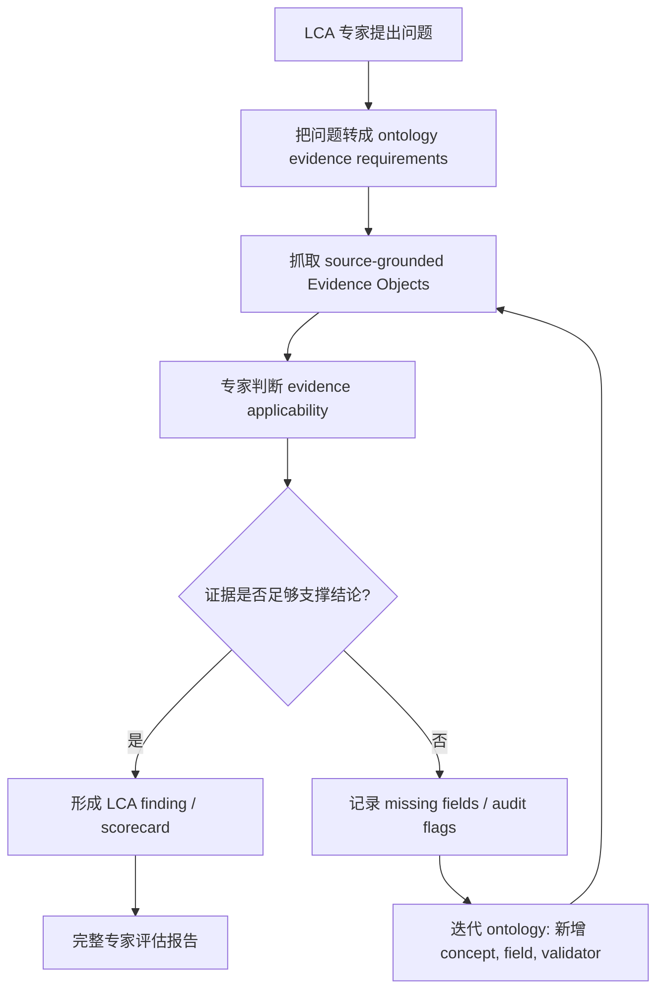

# Valmet 2018–2022 LCA 专家评估报告：基于五年公开披露的证据审查

这份页面已经从“算法展示”重构为一份 **LCA 领域专家评估报告**。Ontology extraction 在这里不是主题本身，而是专家审查的证据工具：它把 Valmet 2018–2022 五年 GRI Supplement 中的披露内容转成可追溯 Evidence Objects，让每个判断都能回到 `evidence_id → source quote → report page`。

<strong>专家结论</strong> 
Valmet 是一家环境杠杆很高的 B2B 过程工业技术公司。它的真正 LCA 重点不在办公室和自有工厂，而在两端：上游采购材料/供应链，以及客户现场使用 Valmet 技术时的能源、水、过程效率和设备生命周期。基于已抓取的 44 条 source-grounded Evidence Objects，本评估认为：Valmet 的 <strong>公司级 GHG inventory readiness = medium-high</strong>，<strong>Scope 3 hotspot screening readiness = high</strong>，<strong>auditability = medium-high</strong>；但 <strong>product LCA readiness = low</strong>。核心原因不是“没有披露碳数据”，而是公开披露缺少产品 LCA 必需的 functional unit、product system boundary、allocation method，以及 Scope 3 emission-factor / activity-data detail。

## 1. 评估对象与边界 {#scope-boundary}

本报告站在 **LCA consultant / LCA reviewer** 的角度，回答的问题不是“能不能从报告里抓到字段”，而是：

> 基于 Valmet 五年公开披露，我们能对它的 LCA 能力、Scope 3 热点、产品 LCA 准备度和披露可审计性作出什么专业判断？哪些判断有证据，哪些仍然不能下结论？

需要先把边界说清楚：

| 层级 | 本报告是否评估 | 专家解释 |
| --- | --- | --- |
| 公司级 GHG inventory | 是 | Scope 1/2/3 company-level disclosure，可用于企业盘查复核和趋势分析。 |
| Scope 3 hotspot screening | 是 | Scope 3 category total 可用于优先级判断，尤其是 Category 1。 |
| 产品 LCA / product-family LCA | 只评估 readiness，不直接建模 | 当前公开披露缺 functional unit、product boundary、allocation、foreground flows。 |
| ISO 14040/14044 critical review | 否 | 本报告不是正式 critical review；它是 evidence-backed readiness assessment。 |
| 投资结论或 assurance conclusion | 否 | Assurance 只作为证据对象之一，不替代财务、法律或第三方审计判断。 |

所以，本报告的专业原则是：**corporate inventory ≠ product LCA**。如果一个信息只能支持公司级披露审计，就不能把它写成产品 LCA 结论；如果一个 claim 缺少功能单位或边界，就只能作为 weak signal，而不能当成 quantified LCA result。

## 2. 专家问题链：先问专业问题，再抓证据 {#expert-question-chain}

LCA 专家不会一上来就“抽所有字段”。正确顺序是：先定义评估问题，再用 ontology 把每个问题转成证据需求，然后根据证据缺口迭代下一轮问题。

| 专家问题 | 需要抓取的证据对象 | 本轮证据结论 | 下一轮迭代方向 |
| --- | --- | --- | --- |
| Q1. Valmet 的公司级 GHG 盘查是否可审计？ | Scope 1、Scope 2 location/market、assurance statements、year/page/quote | Scope 1 五年完整；Scope 2 当前捕获到 2018–2019；存在 limited assurance 证据。Corporate inventory readiness = `medium-high`。 | 补齐 Scope 2 2020–2022 source-grounded rows；映射 assurance scope 到具体指标。 |
| Q2. Scope 3 的主要热点在哪里？ | Scope 3 Category 1/4/6/9 values、unit、year、category | Category 1 purchased goods and services 在已捕获类别中占 94.7%–96.5%，是主导热点。Scope 3 hotspot screening readiness = `high`。 | 进入 supplier/material ontology：材料构成、采购活动量、供应商因子。 |
| Q3. 这些披露能否直接支持产品 LCA？ | functional unit、product boundary、allocation、foreground flows、method、emission factors | 当前不够。已抓到 LCA/use-phase claim，但带 `functional_unit_missing`；Scope 3 rows 带 `method_missing`。Product LCA readiness = `low`。 | 建产品族模板，要求每个 product family 给出功能单位、边界、场景、寿命和分配。 |
| Q4. Valmet 的价值链环境杠杆在哪里？ | LCA/use-phase/customer-site claims、company role、business model | Valmet 明确把价值链影响指向客户使用阶段；这符合过程工业技术公司的业务逻辑。 | 把 customer-use phase 从叙述升级为 scenario ontology。 |
| Q5. Assurance 与 target language 能否作为 LCA 证据？ | assurance statement、target claim、baseline、scope、pathway | Assurance 提升披露可信度，但不能替代产品 LCA critical review；targets 缺 baseline/pathway，只能作为 strategy signal。 | 把 assurance scope 和 target pathway 独立建模，防止和实测数据混用。 |

## 3. 迭代式 ontology 证据审查过程 {#iterative-review}

本报告采用的是一个反复迭代的专家审查流程，而不是一次性字段抽取。

### Round 0：领域假设

Valmet 不是普通消费品公司，而是面向制浆造纸、能源、自动化、流体控制等过程工业的 B2B 技术与服务公司。专家初始假设是：

1. 自有运营排放重要，但不是生命周期影响的核心；
2. Scope 3 Category 1 可能代表上游材料/采购热点；
3. 客户使用阶段可能是 Valmet 最大环境杠杆；
4. 公开报告可能适合 screening，但未必适合 product LCA。

这些假设不能直接写成结论，所以进入 Round 1 抓证据。

### Round 1：抓 corporate inventory / Scope 3 / LCA claim / assurance

第一轮 ontology 抽取产生 44 条 Evidence Objects，所有对象都有 source quote 与 page。它回答了“报告里到底有什么证据”：

| 指标 | 结果 |
| --- | ---: |
| 报告数量 | 5 |
| Evidence Objects | 44 |
| Grounded evidence | 44 |
| Grounded evidence rate | 1.0 |
| Missing-evidence objects | 2 |
| False-ready guard violations | 0 |

### Round 2：判断证据能用于什么，不能用于什么

第二轮不是继续多抓字段，而是审查 applicability：同样是“碳数据”，不同抽象层级的用途完全不同。

| 审计标记 | 数量 | 专家解释 |
| --- | ---: | --- |

这一轮的关键发现是：Valmet 不是缺少 ESG 披露，而是缺少可直接用于 product LCA 的方法细节。也就是说，问题不是“有没有 value”，而是 value 是否有足够的 **unit + boundary + method + source + applicability**。

### Round 3：把缺口写回 ontology，形成 readiness scorecard

第三轮把专家判断固化成诊断维度：corporate inventory readiness、Scope 3 hotspot screening readiness、product LCA readiness、auditability。这样后续 agent 不会把所有 evidence 都当成同一种“碳数据”，而是知道每条证据的专业用途。

## 4. 公司与业务背景判断 {#company-context}

**Valmet Oyj** 是一家芬兰上市公司，总部位于 Espoo，股票在 Nasdaq Helsinki 上市。它为过程工业提供技术、自动化、流体控制、服务与生命周期解决方案。这个业务模型决定了 LCA 解释不能只看自有运营：Valmet 的技术在客户生产现场被长期使用，可能通过能源效率、水效率、过程稳定性、维护周期和设备寿命影响客户的生命周期环境表现。

从专家角度，对 Valmet 的评价是：

| 维度 | 专家判断 | LCA 含义 |
| --- | --- | --- |
| 公司类型 | B2B 过程工业技术、自动化、服务与 flow control 公司 | 应建模为 customer-process enabler，而不是简单制造商。 |
| 环境杠杆 | 报告中的 LCA/use-phase language 指向客户使用阶段 | 需要 customer-use scenario ontology，不应只看 own operations。 |
| 披露成熟度 | 连续五年 GRI Supplement、GHG tables、Scope 3 categories、assurance statements | 适合公司级审计与纵向 screening。 |
| 产品 LCA 短板 | 缺 functional unit、product system boundary、allocation、method detail | 公开披露还不能直接支持 ISO-style product LCA。 |
| 业务建议 | 把产品族、客户行业、使用阶段假设和供应链材料数据结构化 | 这会把 Valmet 从 ESG disclosure 推向 LCA intelligence。 |

因此，对 Valmet 不能简单说“披露好/不好”。更准确的判断是：**Valmet 的 sustainability disclosure maturity 较高，但 product-LCA transparency 仍不足；它最需要补的是方法和边界，而不是漂亮叙事。**

## 5. 证据基础与数据质量 {#evidence-base}

本报告使用的证据基础来自 Valmet 2018–2022 五份 GRI Supplement。Ontology extraction 只承担证据收集与结构化职责；最终判断由 LCA 专业标准和专家规则完成。

### 5.1 Evidence Object 类型分布 {#evidence-types}

| Evidence Object 类型 | 数量 |
| --- | ---: |
| `ghg_emission_metric` | 9 |
| `scope3_category_metric` | 19 |
| `assurance_statement` | 10 |
| `lca_claim` | 2 |
| `missing_disclosure` | 2 |
| `target_claim` | 2 |

### 5.2 标准概念覆盖 {#concept-coverage}

| 标准概念 | 证据数量 |
| --- | ---: |
| `ghg.scope1` | 5 |
| `ghg.scope2.location_based` | 2 |
| `ghg.scope2.market_based` | 2 |
| `ghg.scope3.category1.purchased_goods_and_services` | 5 |
| `ghg.scope3.category4.upstream_transportation_distribution` | 5 |
| `ghg.scope3.category6.business_travel` | 5 |
| `ghg.scope3.category9.downstream_transportation_distribution` | 4 |
| `assurance.ghg_inventory_verification` | 10 |
| `lca.life_cycle_analysis_claim` | 2 |
| `missing.scope3_method` | 2 |
| `target.net_zero` | 2 |

### 5.3 Category 1 主导性 {#cat1-share}

| 年份 | Category 1 数值 | 已捕获 Scope 3 category sum | Category 1 占比 | 证据 ID |
| ---: | ---: | ---: | ---: | --- |
| 2018 | 2025.0 | 2133.0 | 94.9% | `ev_db0c3e17538e` |
| 2019 | 2618.0 | 2745.0 | 95.4% | `ev_e4b2f83e57a3` |
| 2020 | 1815.0 | 1917.0 | 94.7% | `ev_db0474f7fb92` |
| 2021 | 2783.0 | 2918.0 | 95.4% | `ev_679bb4eee8d9` |
| 2022 | 2237.0 | 2319.0 | 96.5% | `ev_f4913df49967` |

这张表是本报告 Scope 3 hotspot 判断的核心依据：在已捕获的 Scope 3 category sum 中，Category 1 purchased goods and services 长期占据绝对主导。它不等于完整产品 LCA，但足以指导下一步 supplier/material data collection。

## 6. LCA 专业 scorecard {#lca-scorecard}

| 评估项 | 评级 | 专家解释 | 关键证据 |
| --- | --- | --- | --- |
| Corporate inventory readiness / 公司级盘查可用性 | `medium-high` | Scope 1 五年完整，Scope 2 有部分 source-grounded 证据，且存在 limited assurance。适合公司级趋势和披露审计。 | D1 + D5 |
| Scope 3 hotspot screening readiness / Scope 3 热点筛查可用性 | `high` | Category 1/4/6/9 提供纵向类别证据，Category 1 明显主导。 | D2 + D3 |
| Product LCA readiness / 产品 LCA 可用性 | `low` | 缺 functional unit、product boundary、allocation、foreground flows 和 method detail，不能直接建模。 | D1 + D3 + D4 |
| Auditability / 可审计性 | `medium-high` | 披露和 source grounding 较好，limited assurance 存在；但 assurance scope 不等于 LCA critical review。 | D5 |

主要 blockers：

- `missing functional unit`
- `missing product system boundary`
- `missing allocation method`
- `missing Scope 3 emission-factor/activity-data detail`

## 7. 五年指标表：专家判断所依赖的量化证据 {#metric-table}

以下表格来自 `diagnostic_findings.json`，每个数值都能回到 Evidence Object、source quote 和报告页码。

| 指标 | 本体概念 | 年份 | 数值 | 单位 | 证据 ID | 页码 |
| --- | --- | ---: | ---: | --- | --- | ---: |
| `scope1` | `ghg.scope1` | 2018 | 17.7 | 1,000 tCO2 | `ev_0b0bbb6d788b` | 22 |
| `scope1` | `ghg.scope1` | 2019 | 17.6 | 1,000 tCO2 | `ev_d817d2cbdb8e` | 24 |
| `scope1` | `ghg.scope1` | 2020 | 19.1 | 1,000 tCO2 | `ev_9860caae29cb` | 27 |
| `scope1` | `ghg.scope1` | 2021 | 21.5 | 1,000 tCO2 | `ev_9cc64e238689` | 27 |
| `scope1` | `ghg.scope1` | 2022 | 21.1 | 1,000 tCO2 | `ev_e73327c18a31` | 29 |
| `scope2_location` | `ghg.scope2.location_based` | 2018 | 73.1 | 1,000 tCO2 | `ev_482759b0aa55` | 22 |
| `scope2_location` | `ghg.scope2.location_based` | 2019 | 69.0 | 1,000 tCO2 | `ev_5e51927f0a85` | 24 |
| `scope2_market` | `ghg.scope2.market_based` | 2018 | 95.2 | 1,000 tCO2 | `ev_7fd544ee8e9d` | 22 |
| `scope2_market` | `ghg.scope2.market_based` | 2019 | 83.0 | 1,000 tCO2 | `ev_1ded939a4eb8` | 24 |
| `cat1` | `ghg.scope3.category1.purchased_goods_and_services` | 2018 | 2025.0 | 1,000 tCO2 | `ev_db0c3e17538e` | 22 |
| `cat1` | `ghg.scope3.category1.purchased_goods_and_services` | 2019 | 2618.0 | 1,000 tCO2 | `ev_e4b2f83e57a3` | 24 |
| `cat1` | `ghg.scope3.category1.purchased_goods_and_services` | 2020 | 1815.0 | 1,000 tCO2 | `ev_db0474f7fb92` | 27 |
| `cat1` | `ghg.scope3.category1.purchased_goods_and_services` | 2021 | 2783.0 | 1,000 tCO2 | `ev_679bb4eee8d9` | 27 |
| `cat1` | `ghg.scope3.category1.purchased_goods_and_services` | 2022 | 2237.0 | 1,000 tCO2 | `ev_f4913df49967` | 29 |
| `cat4` | `ghg.scope3.category4.upstream_transportation_distribution` | 2018 | 63.0 | 1,000 tCO2 | `ev_bee546d1ee49` | 22 |
| `cat4` | `ghg.scope3.category4.upstream_transportation_distribution` | 2019 | 76.0 | 1,000 tCO2 | `ev_2a5ce95d97a8` | 24 |
| `cat4` | `ghg.scope3.category4.upstream_transportation_distribution` | 2020 | 72.0 | 1,000 tCO2 | `ev_aa2b0e71fd9d` | 27 |
| `cat4` | `ghg.scope3.category4.upstream_transportation_distribution` | 2021 | 102.0 | 1,000 tCO2 | `ev_fff7d2339669` | 27 |
| `cat4` | `ghg.scope3.category4.upstream_transportation_distribution` | 2022 | 45.0 | 1,000 tCO2 | `ev_3d4c84923cab` | 29 |
| `cat6` | `ghg.scope3.category6.business_travel` | 2018 | 34.0 | 1,000 tCO2 | `ev_d8d60fd98505` | 22 |
| `cat6` | `ghg.scope3.category6.business_travel` | 2019 | 38.0 | 1,000 tCO2 | `ev_b9d32cef6d6d` | 24 |
| `cat6` | `ghg.scope3.category6.business_travel` | 2020 | 17.0 | 1,000 tCO2 | `ev_56506f871975` | 27 |
| `cat6` | `ghg.scope3.category6.business_travel` | 2021 | 18.0 | 1,000 tCO2 | `ev_5051f6106084` | 27 |
| `cat6` | `ghg.scope3.category6.business_travel` | 2022 | 37.0 | 1,000 tCO2 | `ev_3455f43625db` | 29 |
| `cat9` | `ghg.scope3.category9.downstream_transportation_distribution` | 2018 | 11.0 | 1,000 tCO2 | `ev_931ff86c0988` | 22 |
| `cat9` | `ghg.scope3.category9.downstream_transportation_distribution` | 2019 | 13.0 | 1,000 tCO2 | `ev_be669096ca82` | 24 |
| `cat9` | `ghg.scope3.category9.downstream_transportation_distribution` | 2020 | 13.0 | 1,000 tCO2 | `ev_303fb4f76c86` | 27 |
| `cat9` | `ghg.scope3.category9.downstream_transportation_distribution` | 2021 | 15.0 | 1,000 tCO2 | `ev_77060a9e5aab` | 27 |

## 8. D1–D6 专家诊断 findings {#diagnosis}

下面每条 finding 都必须满足一个硬约束：**没有 Evidence Object，就不写成专业判断。** 因此，每条诊断都列出 evidence IDs，并在证据台账中保留原文摘录与页码。

### D1. 公司级 GHG 盘查证据可审计，但不能直接转为产品 LCA {#d1}

**严重性：** `medium`
**专家判断：** 2018–2022 五年均有 Scope 1 证据；Scope 1 从 17.7 上升到 21.1 thousand tCO2，增幅约 19.2%。Scope 2 location-based / market-based 在当前证据库中 source-grounded 捕获到 2018–2019；2020–2022 行需要下一轮人工或 LLM 抽取复核。
**LCA 含义：** 这些证据适合公司级碳盘查复核和纵向披露分析，但它们是 corporate-scope inventory，不是产品层 foreground activity data；缺 functional unit 与 product system boundary，因此不能直接进入产品 LCA 模型。
**建议动作：** 把公司级盘查作为审计背景使用；若目标是产品 LCA，必须追加产品族、功能单位、系统边界、分配规则、前景流和 emission factor 来源。

**证据范围：** `ev_0b0bbb6d788b`, `ev_d817d2cbdb8e`, `ev_9860caae29cb`, `ev_9cc64e238689`, `ev_e73327c18a31`, `ev_482759b0aa55`, `ev_5e51927f0a85`, `ev_7fd544ee8e9d`, `ev_1ded939a4eb8`

| 证据 ID | 年份 | 概念 | 数值/单位 | 页码 | 原文摘录 |
| --- | ---: | --- | --- | ---: | --- |
| `ev_0b0bbb6d788b` | 2018 | `ghg.scope1` | 17.70 1,000 tCO2 | 22 | Scope 12 17.70 16.80 16.60 |
| `ev_d817d2cbdb8e` | 2019 | `ghg.scope1` | 17.6 1,000 tCO2 | 24 | Scope 12 17.6 17.7 16.8 |
| `ev_9860caae29cb` | 2020 | `ghg.scope1` | 19.1 1,000 tCO2 | 27 | Scope 12 19.1 17.6 17.7 |
| `ev_9cc64e238689` | 2021 | `ghg.scope1` | 21.5 1,000 tCO2 | 27 | Scope 12 21.5 19.1 17.6 19.7 |
| `ev_e73327c18a31` | 2022 | `ghg.scope1` | 21.1 1,000 tCO2 | 29 | Scope 12 21.1 21.5 19.1 21.5 |
| `ev_482759b0aa55` | 2018 | `ghg.scope2.location_based` | 73.10 1,000 tCO2 | 22 | Scope 2 (location based)3 73.10 70.00 66.70 |
| … | … | … | … | … | 另有 3 条证据，完整见下方 Evidence Object ledger。 |

### D2. 采购商品与服务是已捕获 Scope 3 的主导热点 {#d2}

**严重性：** `high`
**专家判断：** 在已捕获的 Scope 3 category 证据中，Category 1 purchased goods and services 每年都是最大类别；在 captured category sum 中占比约 94.7%–96.5%。
**LCA 含义：** 从 LCA / Scope 3 screening 角度，Valmet 的上游材料、采购件和供应商数据应被视为第一优先级，而不是把注意力只放在自有运营。
**建议动作：** 优先补充 Category 1 的 supplier-specific activity data、材料构成、采购金额/实物流拆分，以及 emission-factor provenance。

**证据范围：** `ev_db0c3e17538e`, `ev_e4b2f83e57a3`, `ev_db0474f7fb92`, `ev_679bb4eee8d9`, `ev_f4913df49967`, `ev_bee546d1ee49`, `ev_2a5ce95d97a8`, `ev_aa2b0e71fd9d`, `ev_fff7d2339669`, `ev_3d4c84923cab`, `ev_d8d60fd98505`, `ev_b9d32cef6d6d`, `ev_56506f871975`, `ev_5051f6106084`, `ev_3455f43625db`, `ev_931ff86c0988`, `ev_be669096ca82`, `ev_303fb4f76c86`, `ev_77060a9e5aab`

| 证据 ID | 年份 | 概念 | 数值/单位 | 页码 | 原文摘录 |
| --- | ---: | --- | --- | ---: | --- |
| `ev_db0c3e17538e` | 2018 | `ghg.scope3.category1.purchased_goods_and_services` | 2,025 1,000 tCO2 | 22 | Category 1: CO2 emissions from purchased goods and services6 2,025 1,665 1,288 |
| `ev_e4b2f83e57a3` | 2019 | `ghg.scope3.category1.purchased_goods_and_services` | 2,618 1,000 tCO2 | 24 | Category 1: CO2 emissions from purchased goods and services6 2,618 2,025 1,665 |
| `ev_db0474f7fb92` | 2020 | `ghg.scope3.category1.purchased_goods_and_services` | 1,815 1,000 tCO2 | 27 | Category 1: CO2 emissions from purchased goods and services6 1,815 1,581 1,441 |
| `ev_679bb4eee8d9` | 2021 | `ghg.scope3.category1.purchased_goods_and_services` | 2,783 1,000 tCO2 | 27 | Category 1: CO2 emissions from purchased goods and services6 2,783 2,020 1,938 |
| `ev_f4913df49967` | 2022 | `ghg.scope3.category1.purchased_goods_and_services` | 2,237 1,000 tCO2 | 29 | Category 1: CO2 emissions from purchased goods and services7 2,237 1,656 1,694 |
| `ev_bee546d1ee49` | 2018 | `ghg.scope3.category4.upstream_transportation_distribution` | 63 1,000 tCO2 | 22 | Category 4: CO2 emissions from upstream transportation and distribution7 63 60 49 |
| … | … | … | … | … | 另有 13 条证据，完整见下方 Evidence Object ledger。 |

### D3. Scope 3 类别覆盖具有纵向筛查价值，但方法细节仍弱 {#d3}

**严重性：** `high`
**专家判断：** Category 1、4、6 五年均被抓到，Category 9 抓到四年；但所有 Scope 3 category metrics 都带有 `method_missing`，因为公开片段给出 category totals，却没有足够的 emission factor、activity data 或 calculation-method detail。
**LCA 含义：** 这些行可以用于 disclosure benchmarking 和 hotspot screening，但不能被直接当成 LCI foreground data 重用。
**建议动作：** 下一轮 ontology 应增加 method-level extraction：emission factors、activity data、supplier-specific share、spend/activity method、category boundary notes，并维护 category-year completeness matrix。

**证据范围：** `ev_db0c3e17538e`, `ev_e4b2f83e57a3`, `ev_db0474f7fb92`, `ev_679bb4eee8d9`, `ev_f4913df49967`, `ev_bee546d1ee49`, `ev_2a5ce95d97a8`, `ev_aa2b0e71fd9d`, `ev_fff7d2339669`, `ev_3d4c84923cab`, `ev_d8d60fd98505`, `ev_b9d32cef6d6d`, `ev_56506f871975`, `ev_5051f6106084`, `ev_3455f43625db`, `ev_931ff86c0988`, `ev_be669096ca82`, `ev_303fb4f76c86`, `ev_77060a9e5aab`

| 证据 ID | 年份 | 概念 | 数值/单位 | 页码 | 原文摘录 |
| --- | ---: | --- | --- | ---: | --- |
| `ev_db0c3e17538e` | 2018 | `ghg.scope3.category1.purchased_goods_and_services` | 2,025 1,000 tCO2 | 22 | Category 1: CO2 emissions from purchased goods and services6 2,025 1,665 1,288 |
| `ev_e4b2f83e57a3` | 2019 | `ghg.scope3.category1.purchased_goods_and_services` | 2,618 1,000 tCO2 | 24 | Category 1: CO2 emissions from purchased goods and services6 2,618 2,025 1,665 |
| `ev_db0474f7fb92` | 2020 | `ghg.scope3.category1.purchased_goods_and_services` | 1,815 1,000 tCO2 | 27 | Category 1: CO2 emissions from purchased goods and services6 1,815 1,581 1,441 |
| `ev_679bb4eee8d9` | 2021 | `ghg.scope3.category1.purchased_goods_and_services` | 2,783 1,000 tCO2 | 27 | Category 1: CO2 emissions from purchased goods and services6 2,783 2,020 1,938 |
| `ev_f4913df49967` | 2022 | `ghg.scope3.category1.purchased_goods_and_services` | 2,237 1,000 tCO2 | 29 | Category 1: CO2 emissions from purchased goods and services7 2,237 1,656 1,694 |
| `ev_bee546d1ee49` | 2018 | `ghg.scope3.category4.upstream_transportation_distribution` | 63 1,000 tCO2 | 22 | Category 4: CO2 emissions from upstream transportation and distribution7 63 60 49 |
| … | … | … | … | … | 另有 13 条证据，完整见下方 Evidence Object ledger。 |

### D4. Valmet 明确把价值链影响指向客户使用阶段 {#d4}

**严重性：** `high`
**专家判断：** 2020 与 2021 报告包含 source-grounded 的 LCA / customer use-phase claim，说明 Valmet 认为其价值链环境影响主要来自客户现场使用 Valmet 技术的阶段。
**LCA 含义：** 这是很强的方向性 hotspot 证据：customer operations / use phase 很可能主导生命周期影响。但当前证据仍是 `weak_signal_only`，因为缺功能单位、产品系统边界和分配方法。
**建议动作：** 把 use-phase claim 转成 product-family LCA templates：定义产品族、功能单位、使用场景、能源/水/过程假设、寿命、分配方法和敏感性范围。

**证据范围：** `ev_37831ba12f99`, `ev_a0bed69c021f`

| 证据 ID | 年份 | 概念 | 数值/单位 | 页码 | 原文摘录 |
| --- | ---: | --- | --- | ---: | --- |
| `ev_37831ba12f99` | 2020 | `lca.life_cycle_analysis_claim` | — | 20 | Based on life cycle analysis (LCA) and market data on the customer use phase of Valmet’s technology, we estimate that a… |
| `ev_a0bed69c021f` | 2021 | `lca.life_cycle_analysis_claim` | — | 20 | Based on life cycle analysis (LCA) and market data on the customer use phase of Valmet’s technology, we estimate that a… |

### D5. 有限保证提升披露可审计性，但不能替代 LCA critical review {#d5}

**严重性：** `medium`
**专家判断：** 五年报告均捕获到 limited assurance / assurance statements，说明披露有一定第三方审计基础。
**LCA 含义：** Assurance 能提升 sustainability disclosure 的可信度，但不能自动证明产品 LCA 假设、客户使用阶段模型或 Scope 3 emission factors 已经过 ISO 14040/14044 式 critical review。
**建议动作：** 把 assurance scope 作为独立 ontology object 存储，明确哪些指标被保证；不要把公司级披露 assurance 自动外推到产品 LCA claim。

**证据范围：** `ev_957e7d86dd4e`, `ev_faaf1a420250`, `ev_8fda0855fca8`, `ev_cf99b5422e53`, `ev_598fe6711ee3`

| 证据 ID | 年份 | 概念 | 数值/单位 | 页码 | 原文摘录 |
| --- | ---: | --- | --- | ---: | --- |
| `ev_957e7d86dd4e` | 2018 | `assurance.ghg_inventory_verification` | — | 32 | that we comply with ethical requirements and plan and perform the assurance engage- ment to obtain limited assurance. |
| `ev_faaf1a420250` | 2019 | `assurance.ghg_inventory_verification` | — | 39 | that we comply with ethical re- quirements and plan and perform the assurance engagement to obtain limited assurance. |
| `ev_8fda0855fca8` | 2020 | `assurance.ghg_inventory_verification` | — | 42 | that we comply with ethical requirements and plan and perform the assurance en- gagement to obtain limited assurance. |
| `ev_cf99b5422e53` | 2021 | `assurance.ghg_inventory_verification` | — | 45 | that we comply with ethical requirements and plan and perform the assurance engagement to obtain limited assurance. |
| `ev_598fe6711ee3` | 2022 | `assurance.ghg_inventory_verification` | — | 44 | Practitioner’s responsibility Our responsibility is to express a limited assurance conclusion on the Selected sustainab… |

### D6. 目标与 carbon-neutral 叙述需要 baseline/pathway 才能进入 LCA 判断 {#d6}

**严重性：** `medium`
**专家判断：** 2021–2022 的 target / carbon-neutral language 是 grounded evidence，但 ontology 标记为 `target_without_baseline`。
**LCA 含义：** 目标语言是 sustainability strategy signal，不是 measured performance 或 inventory data；在 LCA 诊断中只能作为未来情景背景，不能与实测排放混用。
**建议动作：** 单独抽取 target baseline year、target scope、covered emissions、reduction pathway、offset/neutralization approach 与 progress metrics。

**证据范围：** `ev_0dd676e81054`, `ev_2f7f3f7c7dfb`

| 证据 ID | 年份 | 概念 | 数值/单位 | 页码 | 原文摘录 |
| --- | ---: | --- | --- | ---: | --- |
| `ev_0dd676e81054` | 2021 | `target.net_zero` | — | 23 | until 2021 ‒ Selected fossil-based product parts to be replaced with renewable or recyclable materials ‒ Enable carbon … |
| `ev_2f7f3f7c7dfb` | 2022 | `target.net_zero` | — | 20 | We strive in our locations and supply chain for efficient use of resources, renewable fuels and carbon neutral energy, … |

## 9. 对 Valmet 的专业建议 {#recommendations}

如果 Valmet 想从“可持续披露成熟”进一步走向“LCA intelligence 成熟”，建议按以下顺序补证据。

| 优先级 | 建议 | 解决的问题 | 对 LCA 的价值 |
| ---: | --- | --- | --- |
| 1 | 建立 product-family LCA template | functional unit、product boundary、allocation 缺失 | 把 use-phase claim 从战略叙述变成可建模场景。 |
| 2 | 为 Category 1 建 supplier/material data layer | Scope 3 Category 1 占比过高但 method detail 不足 | 支撑供应链 hotspot 到 supplier-specific intervention 的转化。 |
| 3 | 把 customer-use phase 结构化 | 客户现场影响巨大但缺 scenario assumptions | 量化 Valmet 技术对能源、水、过程效率和寿命的影响。 |
| 4 | 建立 assurance-scope mapping | 有 limited assurance，但范围不能自动外推 | 明确哪些指标、哪些 claims、哪些方法经过保证或审查。 |
| 5 | 把 target claims 拆成 baseline/scope/pathway/progress | target_without_baseline | 防止目标语言与实测 inventory 混用。 |

这些建议的核心不是“多写 ESG 文案”，而是把专家真正关心的 LCA 前提结构化：**functional unit、boundary、scenario、method、data provenance、review status**。

## 10. 对专业化 ontology agent 的启示 {#agent-implication}

这份报告也说明了为什么 ontology 是专业化 agent 的第一步：LCA 专家不是只会抽字段，而是会判断字段在专业语境中的用途。

| 没有 ontology 的 agent | 有 ontology 的 LCA agent |
| --- | --- |
| 抓到 Scope 3 数值后直接总结“排放很高” | 判断它是 hotspot screening evidence，不是 product LCA foreground inventory。 |
| 把 LCA claim 当成事实结论 | 检查 functional unit、boundary、allocation，缺失则标记 weak signal。 |
| 把 assurance statement 当成所有内容都可信 | 把 assurance scope 与具体指标映射，避免外推。 |
| 把 target language 混入 performance data | 标记 `target_without_baseline`，要求 baseline/scope/pathway。 |
| 输出漂亮摘要但不可追溯 | 每个 finding 回到 Evidence Object、quote、page。 |

所以，ontology 不是一个“字段表”。它是把 **expert heuristic** 显式化的管理层：什么概念存在、需要什么字段、缺什么就不能下什么结论、每条证据能用于什么场景。

## 11. Evidence Object ledger：完整证据台账 {#evidence-ledger}

| 证据 ID | 年份 | 类型 | 标准概念 | 数值/单位 | 适用性 | 审计标记 | 页码 | 原文摘录 |
| --- | ---: | --- | --- | --- | --- | --- | ---: | --- |
| `ev_0b0bbb6d788b` | 2018 | `ghg_emission_metric` | `ghg.scope1` | 17.70 1,000 tCO2 | `corporate_inventory_ready` | — | 22 | Scope 12 17.70 16.80 16.60 |
| `ev_482759b0aa55` | 2018 | `ghg_emission_metric` | `ghg.scope2.location_based` | 73.10 1,000 tCO2 | `corporate_inventory_ready` | — | 22 | Scope 2 (location based)3 73.10 70.00 66.70 |
| `ev_7fd544ee8e9d` | 2018 | `ghg_emission_metric` | `ghg.scope2.market_based` | 95.20 1,000 tCO2 | `corporate_inventory_ready` | — | 22 | Scope 2 (market based)4 95.20 92.70 95.60 |
| `ev_db0c3e17538e` | 2018 | `scope3_category_metric` | `ghg.scope3.category1.purchased_goods_and_services` | 2,025 1,000 tCO2 | `scope3_evidence_ready` | method_missing | 22 | Category 1: CO2 emissions from purchased goods and services6 2,025 1,665 1,288 |
| `ev_bee546d1ee49` | 2018 | `scope3_category_metric` | `ghg.scope3.category4.upstream_transportation_distribution` | 63 1,000 tCO2 | `scope3_evidence_ready` | method_missing | 22 | Category 4: CO2 emissions from upstream transportation and distribution7 63 60 49 |
| `ev_d8d60fd98505` | 2018 | `scope3_category_metric` | `ghg.scope3.category6.business_travel` | 34 1,000 tCO2 | `scope3_evidence_ready` | method_missing | 22 | Category 6: CO2 emissions from business travel8 34 32 31 |
| `ev_931ff86c0988` | 2018 | `scope3_category_metric` | `ghg.scope3.category9.downstream_transportation_distribution` | 11 1,000 tCO2 | `scope3_evidence_ready` | method_missing | 22 | Category 9: CO2 emissions from downstream transportation and distribution9 11 11 9 |
| `ev_957e7d86dd4e` | 2018 | `assurance_statement` | `assurance.ghg_inventory_verification` | — | `audit_support` | — | 32 | that we comply with ethical requirements and plan and perform the assurance engage- ment to obtain limit… |
| `ev_a3e5b5cfbd60` | 2018 | `assurance_statement` | `assurance.ghg_inventory_verification` | — | `audit_support` | — | 33 | been prepared in accordance with the Criteria and to report to Valmet in the form of an independent limi… |
| `ev_3af9b8bf8f42` | 2018 | `assurance_statement` | `assurance.ghg_inventory_verification` | — | `audit_support` | — | 33 | Assurance Finland OY/AB is part of DNV GL – Business Assurance, a global provider of certification, veri… |
| `ev_d817d2cbdb8e` | 2019 | `ghg_emission_metric` | `ghg.scope1` | 17.6 1,000 tCO2 | `corporate_inventory_ready` | — | 24 | Scope 12 17.6 17.7 16.8 |
| `ev_5e51927f0a85` | 2019 | `ghg_emission_metric` | `ghg.scope2.location_based` | 69.0 1,000 tCO2 | `corporate_inventory_ready` | — | 24 | Scope 2 (location based)3 69.0 71.2 68.2 |
| `ev_1ded939a4eb8` | 2019 | `ghg_emission_metric` | `ghg.scope2.market_based` | 83.0 1,000 tCO2 | `corporate_inventory_ready` | — | 24 | Scope 2 (market based)4 83.0 87.5 91.5 |
| `ev_e4b2f83e57a3` | 2019 | `scope3_category_metric` | `ghg.scope3.category1.purchased_goods_and_services` | 2,618 1,000 tCO2 | `scope3_evidence_ready` | method_missing | 24 | Category 1: CO2 emissions from purchased goods and services6 2,618 2,025 1,665 |
| `ev_2a5ce95d97a8` | 2019 | `scope3_category_metric` | `ghg.scope3.category4.upstream_transportation_distribution` | 76 1,000 tCO2 | `scope3_evidence_ready` | method_missing | 24 | Category 4: CO2 emissions from upstream transportation and distribution7 76 63 60 |
| `ev_b9d32cef6d6d` | 2019 | `scope3_category_metric` | `ghg.scope3.category6.business_travel` | 38 1,000 tCO2 | `scope3_evidence_ready` | method_missing | 24 | Category 6: CO2 emissions from business travel8 38 34 32 |
| `ev_be669096ca82` | 2019 | `scope3_category_metric` | `ghg.scope3.category9.downstream_transportation_distribution` | 13 1,000 tCO2 | `scope3_evidence_ready` | method_missing | 24 | Category 9: CO2 emissions from downstream transportation and distribution9 13 11 11 |
| `ev_faaf1a420250` | 2019 | `assurance_statement` | `assurance.ghg_inventory_verification` | — | `audit_support` | — | 39 | that we comply with ethical re- quirements and plan and perform the assurance engagement to obtain limit… |
| `ev_667d3c380296` | 2019 | `assurance_statement` | `assurance.ghg_inventory_verification` | — | `audit_support` | — | 40 | been prepared in accordance with the Criteria and to report to Valmet in the form of an independent limi… |
| `ev_7ed6e5c837f5` | 2019 | `assurance_statement` | `assurance.ghg_inventory_verification` | — | `audit_support` | — | 40 | Assurance Finland OY/AB is part of DNV GL – Business Assurance, a global provider of certification, veri… |
| `ev_9860caae29cb` | 2020 | `ghg_emission_metric` | `ghg.scope1` | 19.1 1,000 tCO2 | `corporate_inventory_ready` | — | 27 | Scope 12 19.1 17.6 17.7 |
| `ev_db0474f7fb92` | 2020 | `scope3_category_metric` | `ghg.scope3.category1.purchased_goods_and_services` | 1,815 1,000 tCO2 | `scope3_evidence_ready` | method_missing | 27 | Category 1: CO2 emissions from purchased goods and services6 1,815 1,581 1,441 |
| `ev_aa2b0e71fd9d` | 2020 | `scope3_category_metric` | `ghg.scope3.category4.upstream_transportation_distribution` | 72 1,000 tCO2 | `scope3_evidence_ready` | method_missing | 27 | Category 4: CO2 emissions from upstream transportation and distribution7 72 76 63 |
| `ev_56506f871975` | 2020 | `scope3_category_metric` | `ghg.scope3.category6.business_travel` | 17 1,000 tCO2 | `scope3_evidence_ready` | method_missing | 27 | Category 6: CO2 emissions from business travel8 17 38 34 |
| `ev_303fb4f76c86` | 2020 | `scope3_category_metric` | `ghg.scope3.category9.downstream_transportation_distribution` | 13 1,000 tCO2 | `scope3_evidence_ready` | method_missing | 27 | Category 9: CO2 emissions from downstream transportation and distribution9 13 13 11 |
| `ev_8fda0855fca8` | 2020 | `assurance_statement` | `assurance.ghg_inventory_verification` | — | `audit_support` | — | 42 | that we comply with ethical requirements and plan and perform the assurance en- gagement to obtain limit… |
| `ev_1111dd369507` | 2020 | `assurance_statement` | `assurance.ghg_inventory_verification` | — | `audit_support` | — | 43 | been prepared in accordance with the Criteria and to report to Valmet in the form of an independent limi… |
| `ev_37831ba12f99` | 2020 | `lca_claim` | `lca.life_cycle_analysis_claim` | — | `weak_signal_only` | functional_unit_missing | 20 | Based on life cycle analysis (LCA) and market data on the customer use phase of Valmet’s technology, we … |
| `ev_e5f5535e5920` | 2020 | `missing_disclosure` | `missing.scope3_method` | — | `missing_evidence` | method_missing | 3 | Independent assurance report CONTENTS Reported cases of potential Code of Conduct violations 14 Scope 1,… |
| `ev_9cc64e238689` | 2021 | `ghg_emission_metric` | `ghg.scope1` | 21.5 1,000 tCO2 | `corporate_inventory_ready` | — | 27 | Scope 12 21.5 19.1 17.6 19.7 |
| `ev_679bb4eee8d9` | 2021 | `scope3_category_metric` | `ghg.scope3.category1.purchased_goods_and_services` | 2,783 1,000 tCO2 | `scope3_evidence_ready` | method_missing | 27 | Category 1: CO2 emissions from purchased goods and services6 2,783 2,020 1,938 |
| `ev_fff7d2339669` | 2021 | `scope3_category_metric` | `ghg.scope3.category4.upstream_transportation_distribution` | 102 1,000 tCO2 | `scope3_evidence_ready` | method_missing | 27 | Category 4: CO2 emissions from upstream transportation and distribution7 102 100 105 |
| `ev_5051f6106084` | 2021 | `scope3_category_metric` | `ghg.scope3.category6.business_travel` | 18 1,000 tCO2 | `scope3_evidence_ready` | method_missing | 27 | Category 6: CO2 emissions from business travel8 18 18 44 |
| `ev_77060a9e5aab` | 2021 | `scope3_category_metric` | `ghg.scope3.category9.downstream_transportation_distribution` | 15 1,000 tCO2 | `scope3_evidence_ready` | method_missing | 27 | Category 9: CO2 emissions from downstream transportation and distribution9 15 15 16 |
| `ev_cf99b5422e53` | 2021 | `assurance_statement` | `assurance.ghg_inventory_verification` | — | `audit_support` | — | 45 | that we comply with ethical requirements and plan and perform the assurance engagement to obtain limited… |
| `ev_a0bed69c021f` | 2021 | `lca_claim` | `lca.life_cycle_analysis_claim` | — | `weak_signal_only` | functional_unit_missing | 20 | Based on life cycle analysis (LCA) and market data on the customer use phase of Valmet’s technology, we … |
| `ev_0dd676e81054` | 2021 | `target_claim` | `target.net_zero` | — | `weak_signal_only` | target_without_baseline | 23 | until 2021 ‒ Selected fossil-based product parts to be replaced with renewable or recyclable materials ‒… |
| `ev_e73327c18a31` | 2022 | `ghg_emission_metric` | `ghg.scope1` | 21.1 1,000 tCO2 | `corporate_inventory_ready` | — | 29 | Scope 12 21.1 21.5 19.1 21.5 |
| `ev_f4913df49967` | 2022 | `scope3_category_metric` | `ghg.scope3.category1.purchased_goods_and_services` | 2,237 1,000 tCO2 | `scope3_evidence_ready` | method_missing | 29 | Category 1: CO2 emissions from purchased goods and services7 2,237 1,656 1,694 |
| `ev_3d4c84923cab` | 2022 | `scope3_category_metric` | `ghg.scope3.category4.upstream_transportation_distribution` | 45 1,000 tCO2 | `scope3_evidence_ready` | method_missing | 29 | Category 4: CO2 emissions from upstream transportation and distribution8 45 41 40 |
| `ev_3455f43625db` | 2022 | `scope3_category_metric` | `ghg.scope3.category6.business_travel` | 37 1,000 tCO2 | `scope3_evidence_ready` | method_missing | 29 | Category 6: CO2 emissions from business travel9 37 18 15 |
| `ev_598fe6711ee3` | 2022 | `assurance_statement` | `assurance.ghg_inventory_verification` | — | `audit_support` | — | 44 | Practitioner’s responsibility Our responsibility is to express a limited assurance conclusion on the Sel… |
| `ev_2f7f3f7c7dfb` | 2022 | `target_claim` | `target.net_zero` | — | `weak_signal_only` | target_without_baseline | 20 | We strive in our locations and supply chain for efficient use of resources, renewable fuels and carbon n… |
| `ev_213cb4fe796c` | 2022 | `missing_disclosure` | `missing.scope3_method` | — | `missing_evidence` | method_missing | 5 | (location- and market-based) emissions based on the GHG Protocol’s “A Corporate Accounting and Reporting… |

## 12. 限制与下一轮迭代 {#limitations}

本报告的限制也是下一轮 ontology 迭代的输入：

1. 当前证据来自公开 sustainability reports，不包含 Valmet 内部产品 LCA、供应商活动数据或客户现场运行数据。
2. 当前 provider 是 offline deterministic baseline；它验证的是 evidence pipeline 与 source grounding，不是 live LLM 的召回上限。
3. Scope 2 2020–2022 在当前证据库中未完整捕获，需要下一轮加入更强的 table parser 或 LLM extraction validation。
4. LCA/use-phase claim 只有方向性，不包含可建模的 functional unit、product boundary、lifetime、allocation 或 sensitivity。
5. Scope 3 category totals 适合 screening，但缺 emission-factor / activity-data detail，不能直接进入产品 LCI。
6. Assurance statements 提供披露层审计信号，但不等于产品 LCA critical review。

下一轮应该把 ontology 从“披露审查”推进到“产品族 LCA readiness”：新增 product family、functional unit、system boundary、use scenario、foreground flow、supplier material、emission factor provenance、critical review status 等实体。

## 13. 可复现文件 {#raw-artifacts}

| 文件 | 用途 |
| --- | --- |
| `raw/valmet-5y-case/metrics.json` | 抽取指标、grounding、concept coverage、audit flag 统计。 |
| `raw/valmet-5y-case/report_summaries.json` | 每份报告的 evidence summary 与 selected chunks。 |
| `raw/valmet-5y-case/evidence_objects.jsonl` | 44 条 source-grounded Evidence Objects。 |
| `raw/valmet-5y-case/langextract_annotated.jsonl` | LangExtract-style annotated output。 |
| `raw/valmet-5y-case/diagnostic_report.md` | 结构化诊断报告。 |
| `raw/valmet-5y-case/diagnostic_findings.json` | D1–D6 findings、scorecard、trends、metric rows。 |
| `raw/valmet-5y-case/compiled/concept_types.json` | 本次使用的 concept type 定义。 |
| `raw/valmet-5y-case/compiled/domain_ontology.json` | LCA/GHG/domain ontology。 |
| `raw/valmet-5y-case/compiled/extraction_ontology.json` | 本次任务的 extraction ontology。 |
| `raw/valmet-5y-case/valmet_5y_case_meta_ontology.md` | 自然语言 case-study meta-ontology。 |
| `raw/sources.md` | 来源台账。 |

## 14. 更新记录 {#changelog}

- 2026-05-13：将页面主题从 ontology extraction case study 重构为 **Valmet 2018–2022 LCA 专家评估报告**；加入专家问题链、迭代式证据审查流程、LCA scorecard、D1–D6 evidence-backed findings、Valmet 专业建议和完整 Evidence Object ledger。
- 2026-05-13：中文化公司画像与公司评价，加入 Valmet 业务模式、客户使用阶段、Scope 3 hotspot、assurance 与 product LCA readiness 讨论。
- 2026-05-13：创建 Valmet 五年 ontology evidence base：5 份 GRI Supplement、44 条 source-grounded Evidence Objects、D1–D6 structured diagnostic findings。
