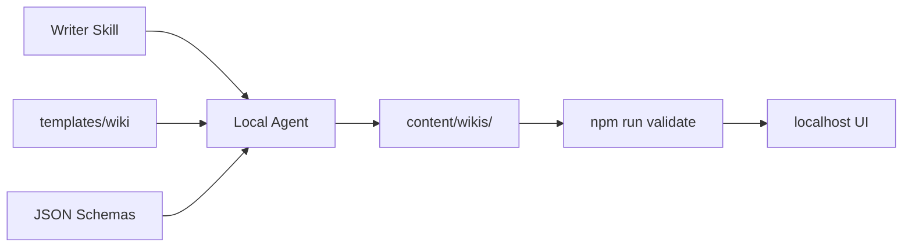

# Agent Harness

The SiliWiki harness is the combination of:

1. `skills/siliwiki-writer/SKILL.md`
2. `templates/wiki/`
3. `harness/schemas/*.schema.json`
4. `npm run validate`

## Recommended prompt to a local agent

```text
Read siliwiki-skill.md. Create a SiliWiki content pack for <topic> under content/wikis/<slug>. Follow docs/CONTENT_SPEC.md. Run npm run validate and report all warnings/errors honestly.
```

## Why a skill?

The skill acts as a content instruction manual. It makes the agent write durable structured knowledge rather than an unstructured answer in chat.

## Harness lifecycle



## Local-only guarantee

SiliWiki itself does not upload content. The only default server is bound to localhost. If you push or publish the repository, that is a separate user action.
