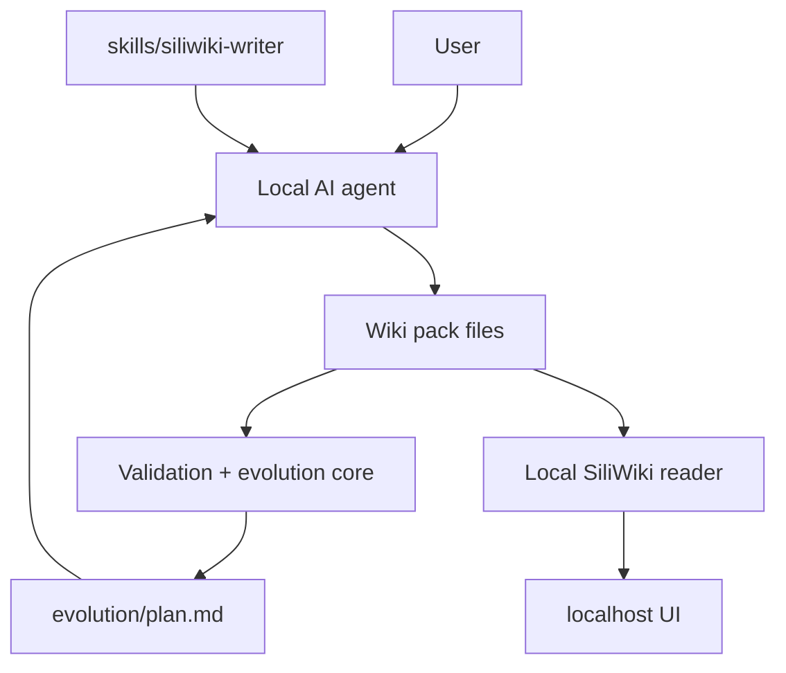
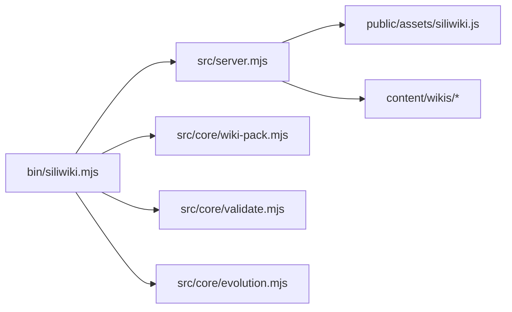
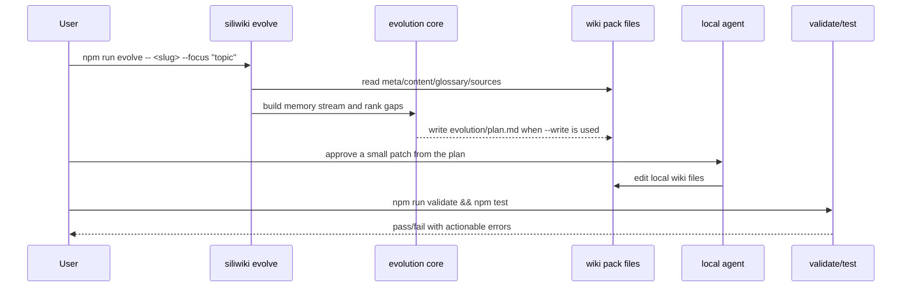

# Architecture

SiliWiki / 硅基笔记 is a local-first wiki workbench for agent-generated content. Its architecture has three layers:

1. **Content harness** — file conventions and validation rules for wiki packs.
2. **Agent harness** — the portable writer skill that tells a local agent how to write and evolve packs.
3. **Reader harness** — the NTU-style local web UI that renders wiki, glossary, sources, and diagrams.

## System architecture



The UI is local. The project does not require a hosted database or a cloud publishing pipeline.

## Runtime modules



- `src/core/wiki-pack.mjs` creates and locates wiki packs.
- `src/core/validate.mjs` checks slugs, nav anchors, glossary structure, and secret-looking risks inside packs.
- `src/core/evolution.mjs` converts local wiki files into a scored memory stream and writes a human-reviewable evolution plan.
- `public/assets/siliwiki.js` renders the local reader shell, glossary panel, Markdown, and Mermaid-lite SVG diagrams.

## Self-evolution data flow



## Wiki pack contract

A publishable pack should include:

```text
content/wikis/<slug>/
├── meta.json
├── content.md
├── glossary.json
├── raw/
│   └── sources.md
└── evolution/
    └── plan.md        # optional but recommended for self-evolving packs
```

The reader can render packs without an evolution plan, but self-evolving packs should keep one so the next agent knows what to improve and why.

## Validation boundary

SiliWiki deliberately keeps generation and trust separate:

- Agent output is a draft.
- `evolution/plan.md` is a reviewable proposal, not an automatic migration.
- `npm run validate` is required before considering a pack healthy.
- Human review is required for claims, references, and any potentially sensitive material.
