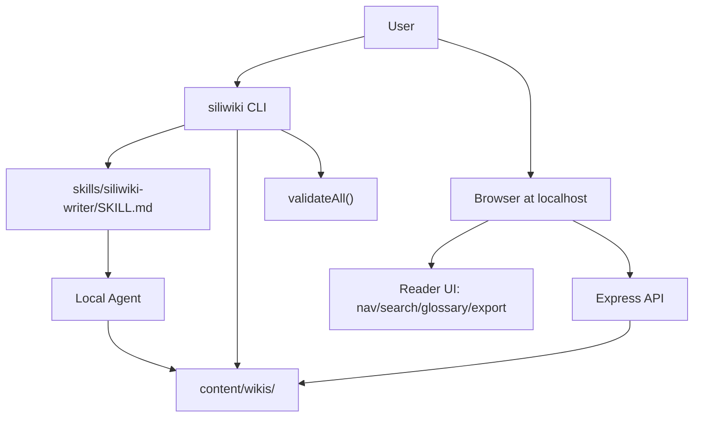
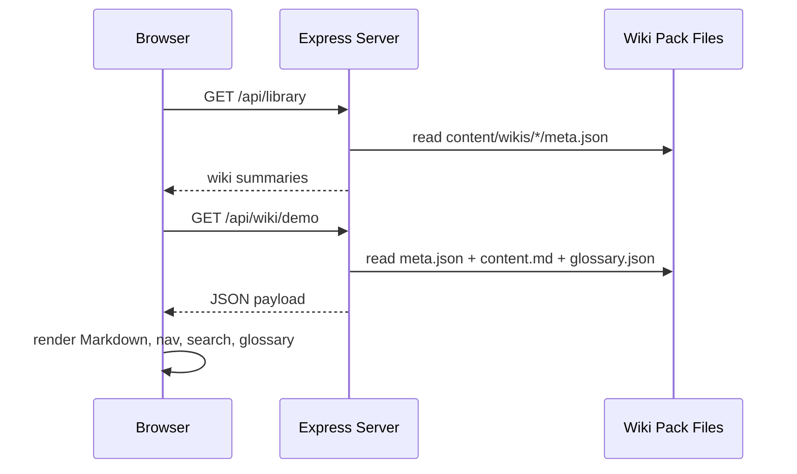
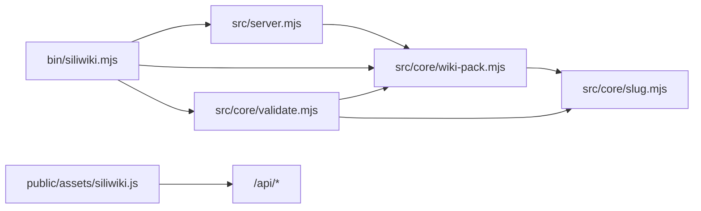

# SiliWiki Architecture

SiliWiki is intentionally small: a CLI, a local Express server, a browser UI, and plain-file content packs.

## System Architecture

The content never needs to leave the user's machine. Publishing is a separate decision controlled by the repo owner.

## Request Flow

## Package Dependency Graph

## Design choices

- **Plain files over database**: easier for local agents, diffs, and git.
- **Validation before rendering trust**: nav anchors, glossary references, and secret-looking files are checked.
- **No frontend build step**: the UI is browser ESM and CSS so installation stays simple.
- **Skill as harness**: agent behavior is constrained by a reusable skill rather than hidden prompt state.
