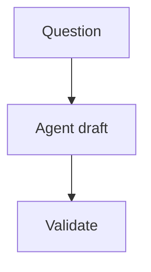

# SiliWiki Content Pack Specification

A SiliWiki content pack is a folder under `content/wikis/<slug>/` that can be rendered locally and improved by a local agent.

## Required files

```text
content/wikis/<slug>/
├── meta.json
└── content.md
```

## Recommended files

```text
content/wikis/<slug>/
├── glossary.json
├── raw/
│   └── sources.md
└── evolution/
    └── plan.md
```

## `meta.json`

Minimum:

```json
{
  "slug": "my-topic",
  "title": "My Topic",
  "updated": "2026-04-27",
  "nav": [
    {
      "chip": "1",
      "title": "Start",
      "open": true,
      "children": [
        { "anchor": "overview", "title": "Overview" }
      ]
    }
  ]
}
```

Rules:

- Folder name and `meta.slug` must match.
- `nav[].children[].anchor` must resolve to a Markdown heading id.
- Use explicit anchors for important sections: `## Overview {#overview}`.
- `updated` should change when a human-reviewed content update lands.

## `content.md`

`content.md` is the reader-facing note.

Recommended sections:

- Definition / one-sentence answer.
- Why it matters.
- System or concept diagram.
- How to use it.
- Known limitations.
- References or source notes.

Use Markdown plus Mermaid when a diagram clarifies the idea:

````markdown

````

## `glossary.json`

Glossary entries keep words stable across agent runs.

```json
{
  "version": "v0.1",
  "updated": "2026-04-27",
  "categories": [
    { "key": "core", "title": "Core", "color": "#a63d00" }
  ],
  "keywords": [
    {
      "slug": "wiki",
      "display": "Wiki",
      "aliases": ["主题笔记"],
      "category": "core",
      "short": "A maintained topic note.",
      "definition": "A SiliWiki wiki is a local content pack with content, glossary, sources, and validation rules.",
      "related": ["glossary"],
      "sources": ["raw/sources.md#siliwiki-design"]
    }
  ]
}
```

Rules:

- `slug` must be unique and URL-safe.
- `aliases`, `related`, and `sources` must be arrays when present.
- Important glossary entries should have source anchors.

## `raw/sources.md`

Sources make generated notes auditable.

Recommended format:

```markdown
# Sources

## source-anchor
- Type: paper | documentation | interview | observation | dataset
- Title: Stable source title
- URL: https://example.com
- Notes: Why this source matters for this wiki.
```

## `evolution/plan.md`

`evolution/plan.md` is the self-evolution plan generated by:

```bash
npm run evolve -- <slug> --focus "topic" --write
```

It is **human-reviewable** by design. It should explain:

- when the plan was generated;
- which wiki it applies to;
- what SiliLoop observed;
- which memories or gaps ranked highest;
- which local files the next agent may edit;
- what validation commands must pass afterwards.

中文规则：`evolution/plan.md` 不是自动发布脚本，而是给人和本地 AI 助手看的“下一步改进建议”。执行前要人工复查，执行后要跑验证。

## Validation

Run:

```bash
npm run validate
npm test
```

Validation currently checks:

- required files;
- slug consistency;
- nav anchor existence;
- glossary shape;
- secret-looking files and obvious credential patterns inside wiki packs.
