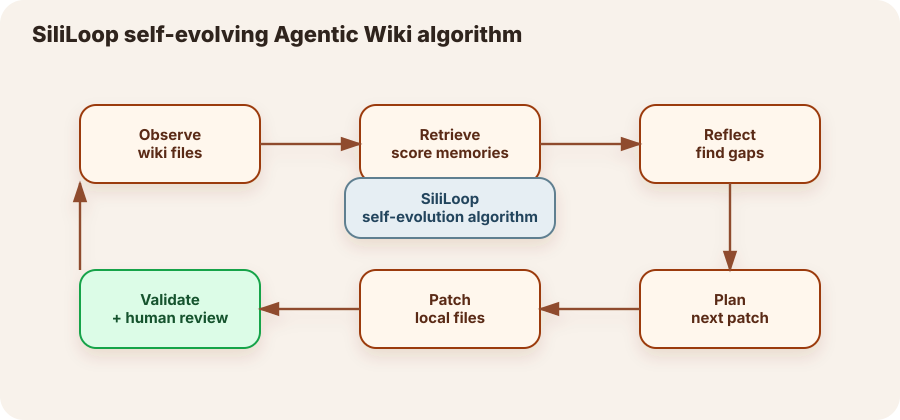
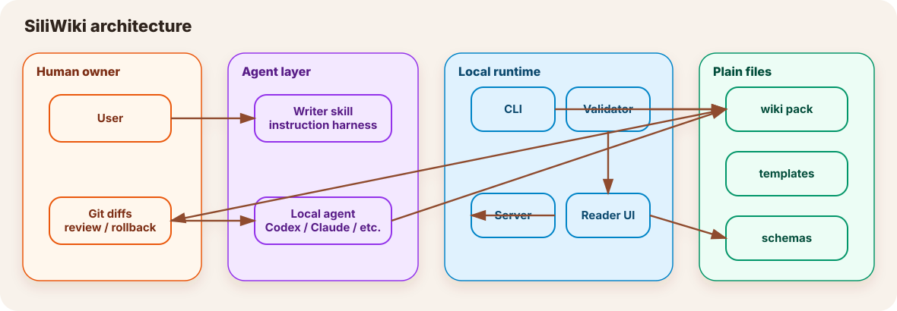

# Self-evolving Agentic Wiki / 自进化代理笔记

SiliWiki is a **local-first self-evolving Agentic Wiki**: a wiki pack is not just static Markdown. It is a small, auditable memory system that a local agent can read, improve, validate, and render back into the SiliWiki UI.

中文一句话：**硅基笔记把「AI 生成内容」规范成一套可复查、可引用、可验证、可持续进化的本地 wiki 工作流。**

## Why this matters

普通 AI 对话很容易变成一次性文本：聊天窗口里看起来不错，但下次很难复用、很难查证，也很难知道哪里应该更新。SiliWiki 把一次性文本拆成：

- `content.md` — 面向读者的解释正文。
- `glossary.json` — 统一概念、别名、短定义、相关词与来源。
- `raw/sources.md` — 可追溯来源登记。
- `meta.json` — 标题、目录、更新时间与 UI 元信息。
- `evolution/plan.md` — AI 下一轮应该如何改进这本 wiki 的可审核计划。

这样，本地 agent 不只是“写一篇文章”，而是在维护一个可长期生长的知识对象。

## SiliLoop algorithm

SiliWiki 的自进化机制叫 **SiliLoop**：

1. **observe** — 读取 `meta.json`、`content.md`、`glossary.json`、`raw/sources.md`，把 wiki 转成 memory stream。
2. **retrieve** — 按 recency、importance、relevance 给 memory 排序，优先处理最值得更新的内容。
3. **reflect** — 把缺口总结成可读的 reflection，例如“某个概念没有来源”“词条没有进入正文”“结构不足”。
4. **plan** — 生成下一轮安全编辑计划，明确目标文件、原因和 agent prompt。
5. **patch** — 本地 agent 只修改本地 wiki 文件，不直接替用户发布。
6. **validate** — 运行 SiliWiki 校验和人工复查，再决定是否信任新版本。



The loop deliberately separates **planning** from **patching**. A generated plan is human-reviewable; users can ask their preferred local agent to execute only the approved parts.

## CLI workflow

Generate a plan in the terminal:

```bash
npm run evolve -- self-evolving-agentic-wiki --focus "agent memory"
```

Write the plan into the wiki pack:

```bash
npm run evolve -- self-evolving-agentic-wiki --focus "agent memory" --write
```

The default output path is:

```text
content/wikis/<slug>/evolution/plan.md
```

Then ask your local agent to follow the bundled skill:

```bash
npm run skill > siliwiki-skill.md
```

Prompt example:

```text
Read siliwiki-skill.md and content/wikis/self-evolving-agentic-wiki/evolution/plan.md.
Execute only the highest-priority safe patch.
Preserve source anchors, glossary links, and validation requirements.
Do not remove uncertainty markers unless you can add a source.
```

Finally validate:

```bash
npm run validate
npm test
```

## Memory model

SiliWiki borrows the shape of agent-memory research but turns it into files that ordinary developers can inspect:

| Research idea | SiliWiki implementation |
| --- | --- |
| Memory stream | `makeEvolutionMemoryStream()` converts sections, glossary entries, source gaps, diagram gaps, and uncertainty markers into scored entries. |
| Retrieval scoring | `analyzeWikiEvolution()` ranks memory entries using recency, importance, and relevance to the requested focus. |
| Reflection | `formatEvolutionPlanMarkdown()` writes human-readable reflections and concrete next actions. |
| Skill library | `skills/siliwiki-writer/SKILL.md` acts as the portable instruction harness for local agents. |
| Validation gate | `npm run validate`, unit tests, package smoke tests, and human review prevent ungrounded edits from silently becoming accepted notes. |

## Safety boundaries

SiliWiki is intentionally conservative:

- It does **not** publish anything automatically.
- It does **not** upload user content to a hosted service.
- It does **not** treat generated edits as final truth.
- It does require source anchors for important claims.
- It does require a local validation pass before trusting evolved content.

## Architecture fit



The reader UI remains the NTU-style wiki shell. The new evolution layer sits beside the content harness: it analyzes local wiki packs, produces an evolution plan, and leaves the actual edit to a user-approved local agent.

## References

These references are used as design inspiration, not as copied implementations:

1. Joon Sung Park, Joseph O'Brien, Carrie Jun Cai, Meredith Ringel Morris, Percy Liang, and Michael S. Bernstein. **Generative Agents: Interactive Simulacra of Human Behavior.** UIST 2023. DOI: [10.1145/3586183.3606763](https://doi.org/10.1145/3586183.3606763).
2. Charles Packer, Sarah Wooders, Kevin Lin, Vivian Fang, Shishir G. Patil, Ion Stoica, and Joseph E. Gonzalez. **MemGPT: Towards LLMs as Operating Systems.** arXiv: [2310.08560](https://arxiv.org/abs/2310.08560), 2023.
3. Noah Shinn, Federico Cassano, Ashwin Gopinath, Karthik Narasimhan, and Shunyu Yao. **Reflexion: Language Agents with Verbal Reinforcement Learning.** arXiv: [2303.11366](https://arxiv.org/abs/2303.11366), 2023.
4. Guanzhi Wang, Yuqi Xie, Yunfan Jiang, Ajay Mandlekar, Chaowei Xiao, Yuke Zhu, Linxi Fan, and Anima Anandkumar. **Voyager: An Open-Ended Embodied Agent with Large Language Models.** arXiv: [2305.16291](https://arxiv.org/abs/2305.16291), 2023.
5. Akari Asai, Zeqiu Wu, Yizhong Wang, Avirup Sil, and Hannaneh Hajishirzi. **Self-RAG: Learning to Retrieve, Generate, and Critique through Self-Reflection.** arXiv: [2310.11511](https://arxiv.org/abs/2310.11511), 2023.
