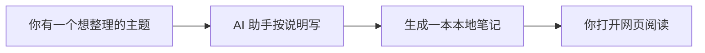
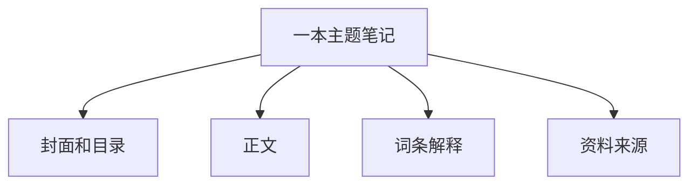

# SiliWiki / 硅基笔记小白使用说明

这份说明尽量不用专业词。你可以把 SiliWiki 理解成：**一个放在你电脑里的智能笔记书架**。

## 1. 它是干什么的？

你告诉 AI 助手：“我想整理一个主题。”

AI 助手按照一份固定的写作说明，把这个主题整理成一本本地笔记。然后你用 SiliWiki 打开它，就像打开一个小网站一样阅读。



## 2. 怎么开始？

复制下面几行：

```bash
git clone <项目地址>
cd siliwiki
npm install
npm run dev
```

然后打开：

```text
http://localhost:3000
```

如果你不懂这些命令，简单理解就是：下载、进入文件夹、准备好、打开本地页面。

## 3. 怎么让 AI 帮你写？

先取出“写作说明书”：

```bash
npm run skill > siliwiki-skill.md
```

然后把这份 `siliwiki-skill.md` 发给你的 AI 助手，再告诉它你想整理什么。

例子：

```text
请按照这份写作说明，帮我整理一本“电池回收入门笔记”。
读者是完全不懂技术的小白。
请写得通俗一点，重要词语做成词条，不确定的地方标注“待确认”。
```

## 4. 一本笔记里有什么？



你不需要记住文件名，只要知道：

- 封面和目录：让人知道这本笔记讲什么。
- 正文：真正解释内容。
- 词条解释：把容易混淆的词统一说明。
- 资料来源：记录这些内容从哪里来。

## 5. 怎么检查？

AI 写完后，先运行：

```bash
npm run validate
```

这一步相当于检查：目录有没有坏、词条有没有重复、内容里有没有明显不该放的东西。

## 6. 打开 V1 样例

启动后打开：

```text
http://localhost:3000/wiki/siliwiki-v1
```

这本样例已经改成小白版，并且里面挂了几张 Mermaid 图，用来解释整体流程。
