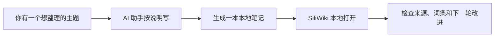
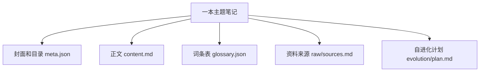

# SiliWiki / 硅基笔记小白使用说明

这份说明尽量不用专业词。你可以把 SiliWiki 理解成：**一个放在你电脑里的智能笔记书架**。

它现在的定位是 **Self-evolving Agentic Wiki / 自进化代理笔记**：AI 助手不只是帮你写一次内容，还能根据来源、词条、目录和待补问题，生成下一轮改进计划。

## 1. 它是干什么的？

你告诉 AI 助手：“我想整理一个主题。”

AI 助手按照一份固定的写作说明，把这个主题整理成一本本地笔记。然后你用 SiliWiki 打开它，就像打开一个小网站一样阅读。



## 2. 怎么开始？

复制下面几行：

```bash
git clone https://github.com/Yvnminc/SiliWiki.git
cd SiliWiki
npm install
npm run dev
```

然后打开：

```text
http://localhost:3000
```

如果你不懂这些命令，简单理解就是：下载、进入文件夹、准备好、打开本地页面。

## 3. 怎么让 AI 帮你写？

先取出“写作说明书”：

```bash
npm run skill > siliwiki-skill.md
```

然后把这份 `siliwiki-skill.md` 发给你的本地 AI 助手，再告诉它你想整理什么。

例子：

```text
请按照这份写作说明，帮我整理一本“电池回收入门笔记”。
读者是完全不懂技术的小白。
请写得通俗一点，重要词语做成词条，不确定的地方标注“待确认”。
```

## 4. 一本笔记里有什么？



你不需要记住所有文件名，只要知道：

- 封面和目录：让人知道这本笔记讲什么。
- 正文：真正解释内容。
- 词条表：把容易混淆的词统一说明。
- 资料来源：记录这些内容从哪里来。
- 自进化计划：告诉下一个 AI 助手应该优先补什么、为什么补、补完怎么检查。

## 5. 怎么检查？

AI 写完后，先运行：

```bash
npm run validate
```

这一步相当于检查：目录有没有坏、词条有没有重复、内容里有没有明显不该放的东西。

## 6. 怎么让笔记自己提出改进建议？

运行：

```bash
npm run evolve -- self-evolving-agentic-wiki --focus "agent memory"
```

如果你想把结果保存进这本笔记：

```bash
npm run evolve -- self-evolving-agentic-wiki --focus "agent memory" --write
```

它会生成：

```text
content/wikis/self-evolving-agentic-wiki/evolution/plan.md
```

你可以把这份计划交给本地 AI 助手，让它只执行最高优先级的一小步。这样每次改动都有理由、有来源、有检查。

## 7. 打开样例

启动后打开：

```text
http://localhost:3000/wiki/siliwiki-v1
http://localhost:3000/wiki/self-evolving-agentic-wiki
```

第一本是小白使用说明；第二本专门解释“自进化代理笔记”机制，并带有真实 references。

## 8. 右下角 AI 问答助手

打开任意一本 Wiki 后，右下角会出现 **AI 问答助手** 按钮。点开后可以直接问这本笔记里的内容，例如：

```text
这本 Wiki 的核心观点是什么？
帮我总结 glossary 里最重要的 5 个词。
这篇内容有哪些待补证据？
```

它的工作方式是：浏览器把你的问题发给本地/线上 SiliWiki 服务器，服务器读取当前 `content/wikis/<slug>/` 的正文和词条，再用 DeepSeek v4 flash 生成回答。API Key 只放在服务器环境变量里，不会发到浏览器。

本地启用：

```bash
export DEEPSEEK_API_KEY="你的 DeepSeek key"
npm run dev
```

线上部署（例如 Vercel）时，把 `DEEPSEEK_API_KEY` 配到项目的 Environment Variables 后再重新部署。没有配置 key 时，按钮仍会显示，但提问会提示服务器未配置。