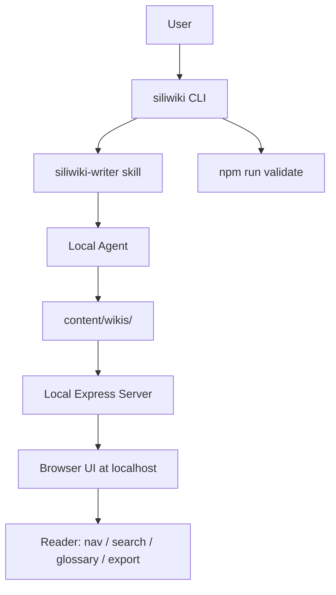
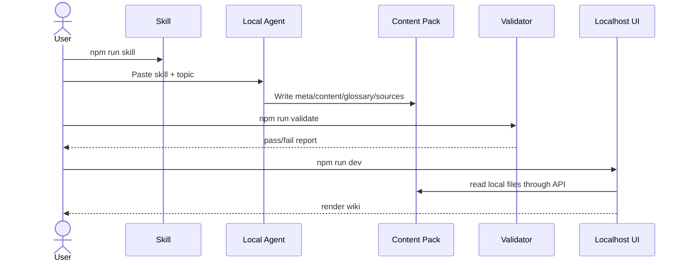

# SiliWiki / 硅基笔记 使用说明（V1）

这份文档说明 SiliWiki 第一版具体怎么用，以及用户、Agent、内容包、UI 之间如何协作。

## 一句话

**SiliWiki = 本地 Wiki UI + Agent 写作 Skill + 可校验内容包。**

用户不需要手动写完整网站。用户把内置 skill 给本地 Agent，Agent 按规范生成 `content/wikis/<slug>`，SiliWiki 在 localhost 上渲染。

## 1. 安装

```bash
git clone <your-siliwiki-repo-url>
cd siliwiki
npm install
npm run dev
```

打开：

```text
http://localhost:3000
```

## 2. 给本地 Agent 的 Skill

导出：

```bash
npm run skill > siliwiki-skill.md
```

然后把 `siliwiki-skill.md` 粘贴给本地 Agent，并补充你的主题需求。

建议 prompt：

```text
请阅读 siliwiki-skill.md，并在当前 SiliWiki 仓库中创建一本新的 wiki。
主题：<你的主题>
slug：<lowercase-slug>
目标读者：<读者>
要求：生成 meta.json、content.md、glossary.json、raw/sources.md，并运行 npm run validate。
```

## 3. 新建 Wiki 内容包

```bash
npm run new -- my-topic --title "My Topic"
```

目录：

```text
content/wikis/my-topic/
├── meta.json
├── content.md
├── glossary.json
└── raw/
    └── sources.md
```

## 4. Agent 生成内容

Agent 应写入：

| 文件 | 用途 |
|---|---|
| `meta.json` | 标题、版本、主题色、导航 |
| `content.md` | 正文主体 |
| `glossary.json` | 术语、别名、定义、关联、来源 |
| `raw/sources.md` | 来源登记和待核实点 |

## 5. 校验和预览

```bash
npm run validate
npm run smoke
npm run dev
```

打开：

```text
http://localhost:3000/wiki/my-topic
```

## 6. 架构图



## 7. 生成链路



## 8. V1 样例

仓库内置了一个中文 V1 样例：

```text
content/wikis/siliwiki-v1/
```

启动后打开：

```text
http://localhost:3000/wiki/siliwiki-v1
```

这个样例展示了 SiliWiki 第一版应该长什么样、怎么讲清楚流程、怎么定义 Wiki / Glossary、怎么放架构图和使用命令。
